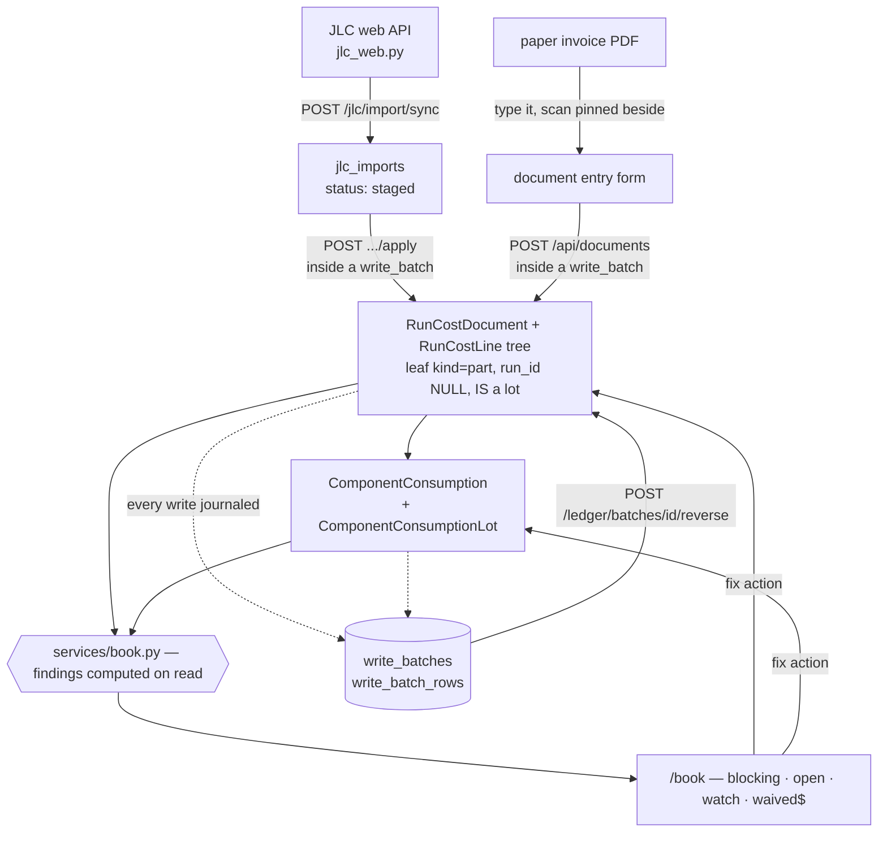
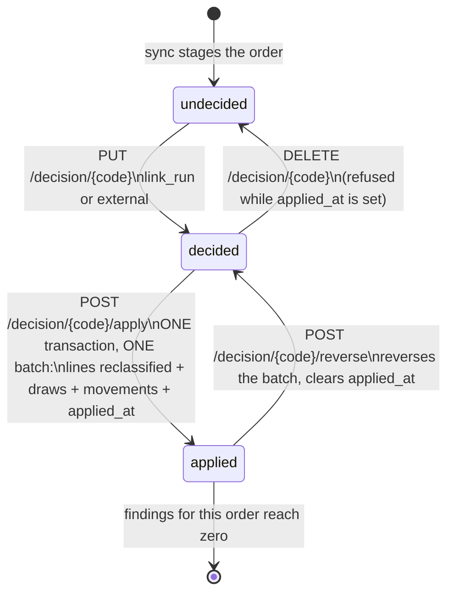

# Post-factum production costs — requirement + gap analysis

## The requirement (user, 2026-07-27)

> Add the option to add production-run costs **post factum**. Invoices arrive
> *after* the production run; I want to track how much production really cost
> versus what was expected. I want to add positions to the BOM — **per device
> and per run** — that were not in the initial BOM, plus other costs.

Read that as three distinct needs:

1. **Actuals, entered late.** A run's real cost is known only once invoices
   land, days or weeks after the boards exist. The platform must accept cost
   data arriving after the fact without disturbing what was planned.
2. **Plan vs actual.** Expected cost (computed today from historical pricing at
   the run's date) has to sit next to what was actually paid, per line, so the
   variance is visible rather than reconstructed by hand.
3. **Late BOM/cost positions at two scales.** Something bought that was never in
   the BOM: sometimes *per device* (a connector nobody drew, a rework part), and
   sometimes *per run* (stencil, freight, customs, assembly setup, scrapped
   panels). Both must be addable after the run, and per-device positions must
   multiply by quantity while per-run ones must not.

Reference prototype: `~/Projects/7S_MRP` — a JSON-backed Python MRP
(inventory / orders / invoices / recipes / reports) the user built earlier. The
analysis below compares it with what the platform already has.

Where conventions come out of this work, they belong in `api/CLAUDE.md`
(backend) — this file holds the requirement and the plan.

---

*Analysis below: 43 agents across both codebases, every claimed gap adversarially
verified against the platform source, then critiqued for completeness. All
file:line references were spot-checked by hand before being written here.*

## What 7S_MRP actually is

A single-user Python CLI (~8 modules, no HTTP layer, no tests) driven by an
`input()` menu, persisting to six JSON files. `data/{invoices,orders,recipes,events}.json`
are the source of truth; `stocks.json` and `report.json` are derived artefacts
rewritten from scratch on every startup. Live data: **35 invoices / 74 lines, 9
sales orders, 7 recipes, 140 events** (116 consumption, 23 production), 20 stock
items. Every join is a free-text item name — no ids, no referential integrity.

Four things it got genuinely right, none of which this platform has:

1. **Purchase documents are first-class** — supplier, date, currency and a
   per-invoice FX snapshot; every non-freight line becomes a costed stock lot.
2. **Landed cost** — lines named `shipping` / `import tax` are pooled and
   allocated pro-rata by line value into the other lines, so a part's recorded
   cost *is* its delivered cost.
3. **Cost is fact, not forecast** — `Batch.unit_cost` is what was paid, FIFO
   draws carry it up the BOM, and `Batch.invoice_id` ties a lot to its document.
4. **A company-level rollup exists** — invoice spend, production spend,
   weighted-average unit cost per product, units produced, revenue, profit.

And its weaknesses are exactly this platform's strengths: nothing is append-only
(derived values are overwritten on load), `Invoice.exchange_rate` is dead data
(1.0 on all 35 records — the real rate is read from the `exchange_rates` dict),
report invoice spend **double-counts freight by ~17 348 PLN (4.7%)**, production
spend counts sub-assemblies twice, `consume_item` can partially destroy stock
without rollback, and recipe "versioning" is a filename convention — nothing
records which BOM built a batch.

**So: port the model shape (document → lines → landed cost → rollup), not the
mechanism.**

## Similarity map

| Topic | 7S_MRP | Platform | Stronger |
|---|---|---|---|
| Purchase document | typed `Invoice` + `InvoiceItem`, supplier, FX snapshot | opaque PDF bytes on `RunAttachment` | **MRP** |
| Landed cost (freight/duty) | pooled, allocated pro-rata into unit cost | only a `per_run` cost line; never touches a part price | **MRP** |
| What a unit cost means | what was paid, per FIFO lot | supplier list price from the ladder at the run date | **MRP** |
| Lot → document traceability | `Batch.invoice_id` | none | **MRP** |
| Spend reporting | one all-history report | nothing above a single run | **MRP** |
| On-hand stock + consumption | batches, FIFO draw, availability check | three *supplier-side* pools, no own stock | **MRP** (out of scope here) |
| Reproducible historical pricing | recomputed and overwritten every startup | append-only `ComponentPriceHistory` + `ExchangeRateHistory`, resolved as-of | **Platform** |
| Multi-currency / FX | first value of a dict; dead rate field | `fx.rates_at` + `fx.convert` (USD pivot, returns `rate_known`) | **Platform** |
| per-device vs per-run basis | `process_cost` vs `shipping_cost`, both 0.0 in the data | validated `basis` enum, amortized, separate `per_run_fixed` bucket | **Platform** |
| Cost-baseline versioning | naming convention | `ProjectCostRevision`, commit-anchored copy-on-write | **Platform** |
| BOM source | hand-typed dict | kicad-cli extracted, matched to library components | **Platform** |
| Quantity breaks / MOQ | none | ladder `qty_from`, `ProjectCostItem.steps`, `order_qty`/`order_excess` | **Platform** |
| Audit discipline | full-file rewrites, no audit | Postgres + `AuditLog` + append-only history — **except the money path** | **Platform** |
| Plan vs actual | a boolean on 1 of 140 events | override *replaces* the estimate in the same field | **neither** |

## Reuse, do not rebuild

Verification refuted no gap, but it did find working machinery this feature must
sit on rather than duplicate:

- **As-of pricing + FX are complete**: `project_bom.run_pricing_date`,
  `ladder.history_points_at`, `fx.rates_at`, and
  `fx.convert(amount, cur, target, rates) -> (amount, rate_known)` which pivots
  through USD (`api/app/services/fx.py:70`). Do not invent a second FX path.
- **Commit-anchored revisions**: `ProjectCostRevision` +
  `cost_state.revision_for` / `items_for` / `revision_for_edit`. Keep for the
  **plan** side; actuals are facts, so they get append-only rows, not revisions.
- **per-device / per-run already works**: `ProjectCostItem.basis`
  (`api/app/models.py:726`) with quantity-break `steps` (`:731`), amortized into
  `cost_per_device`, plus a separate `per_run_fixed` bucket. Reuse the same
  vocabulary — and never add `per_run_fixed` to a run total, it is already inside.
- **Late positions partly exist**: `ProjectExtraBomItem` (per-device extras) and
  `ProjectCostItem` (`basis="per_run"`) already cover "a position that wasn't in
  the BOM" — what they lack is a document, a paid amount and a run scope.
- **A per-line override channel exists**: `run.overrides` keyed by line key,
  accepting `unit_price` / `qty_total` / `label` / `note` / `drop`, applied in
  `run_effective` (`api/app/services/project_bom.py:559-604`), reachable only via
  `PATCH /api/runs/{id}`. This is the de-facto actuals slot today.
- **A place for the PDF exists**: `RunAttachment` per run, MinIO-backed.

## Confirmed gaps (33 raw findings, merged to 10 themes)

| # | Gap | Why it matters here |
|---|---|---|
| **G1** | No purchase document, no actual cost line | Blocks all three needs — there is nowhere to put an invoice's contents |
| **G2** | No plan-vs-actual baseline: an override **overwrites** the estimate | Once you type the paid price, the expected price is gone — variance is unknowable |
| **G3** | No run-scoped late position with a basis | `ProjectExtraBomItem`/`ProjectCostItem` are project+revision scoped; "this run needed 3 extra connectors" pollutes every future run |
| **G4** | Actuals carry no currency | Invoices are USD/EUR/PLN; `overrides` has no currency field at all |
| **G5** | Actuals have no audit trail | `audit(db, "run.update", …)` is called **with no details** (verified, `production_runs.py:170`) — money changes leave no record of what changed |
| **G6** | Override keys are unstable line ids | A re-ingested BOM changes the key and the entered actual silently stops applying |
| **G7** | No landed-cost allocation | Freight/duty can only sit as a run-level lump; a part's cost never reflects delivery |
| **G8** | Cannot record what was actually bought | No purchased qty, no scrap, no yield — only the planned quantity exists |
| **G9** | No cost taxonomy | `basis` is the only classifier; fab / assembly / freight / duty / tooling / rework are indistinguishable free text |
| **G10** | No spend rollup, no export | Nothing above a single run: no per-project or per-period actual spend, no CSV |

Plus two pre-existing defects worth fixing regardless (both verified):
`delete_run` hard-deletes and calls `storage.delete_prefix` — attaching invoices
to a run today means **losing them if the run is deleted**; and `run.update`
audit rows carry no diff.

## Proposed schema

Two tables, four columns, one service, one thin router. Corrections marked
**[C]** come from the completeness critique and change the naive design.

### `run_cost_documents` — the inbound purchase document

```
id             int PK
project_id     int  FK projects.id            -- REQUIRED: documents are project-owned
run_id         int  FK production_runs.id NULLABLE   -- [C] nullable: survives run deletion,
                                              --     and hosts project-level costs
                                              --     (certification, tooling) with no run
doc_type       varchar(20)  default "invoice" -- invoice|proforma|receipt|credit_note|internal
supplier       varchar(200) default ""        -- free text, like ProjectCostItem.company
doc_number     varchar(100) default ""
doc_date       date         nullable          -- issue date = the FX resolution instant
paid_at        date         nullable
currency       varchar(10)  default "USD"
fx_rate_usd    float        nullable          -- rate as printed; NULL -> fx.rates_at(doc_date)
display_amount float        nullable          -- [C] converted total STORED at entry, because
fx_rate_display float       nullable          -- [C] fx.convert pivots through USD and
                                              --     Project.display_currency is editable
total_amount   float        nullable          -- as printed, reconciled against sum(lines)
tax_amount     float        nullable
notes          text, attachment_id int nullable (soft ptr -> run_attachments.id)
created_at     timestamptz
```
Partial unique index: `(project_id, lower(btrim(supplier)), doc_number) WHERE doc_number <> ''`
— stops the same invoice being entered twice.

### `run_cost_lines` — one actual, per line

```
id             int PK
document_id    int  FK run_cost_documents.id
run_id         int  FK production_runs.id NULLABLE  -- allocation target
position       int
kind           varchar(20)  -- part|fab|assembly|tooling|freight|duty|tax|rework|packaging|service|other
basis          varchar(20)  -- per_device|per_run   (per_device multiplies by the pinned qty)
label          varchar(300)
qty_invoiced   float        -- [C] what the invoice says (a 5000-piece reel)
qty_run        float        -- [C] what is allocated to THIS run (600 pieces)
unit_price     float        -- NET, in `currency`
currency       varchar(10)  -- "" inherits the document currency
allocate       varchar(20)  -- none|by_value|by_qty  (landed-cost carrier)
component_id   int nullable, mpn varchar(200)
plan_key       varchar(40)  -- "b<bom_line.id>" | "x<extra.id>" | "c<cost.id>" | ""
plan_kind      varchar(10)  -- bom|extra|cost|""    ("" = a genuine late position)
plan_ref       varchar(300) -- stable natural key captured at entry (refs/label/component_id)
notes          text
voided_at      timestamptz nullable      -- soft delete; rows are never removed
superseded_by_id int nullable            -- correction chain
created_at     timestamptz
```

`(qty_invoiced - qty_run) * unit_price` is **excess stock**, reported as its own
variance category — never charged to this run's per-device cost. **[C]**

### `production_runs` — four new columns

```
plan_revision_id integer      -- soft ptr -> project_cost_revisions.id : pins the item list
plan_frozen_at   timestamptz  -- pins the pricing instant (NULL -> run_pricing_date(run))
plan_qty         integer      -- [C] pins the volume: qty drives ladder tier AND amortization,
                              --     and is freely editable, so without this the baseline drifts
qty_good         integer      -- [C] units that actually passed; actual per-device divides by
                              --     THIS, not the planned qty. Can be filled automatically from
                              --     programming_runs (status='pass' per device) — see §12 of
                              --     docs/flasher/design.md
```

### Variance semantics (`api/app/services/run_actuals.py`)

- **Matching**: `plan_key` first, then `plan_ref` fallback (component_id → refs →
  case-folded label) with a `reattached: true` flag so a silent re-link is
  visible. `plan_kind == ""` ⇒ unmatched actual = a genuine late position.
- **States**: `invoiced | partial | uninvoiced | unmatched_actual | from_stock |
  excess` — a planned line with no invoice reads "not yet invoiced", never
  "0 paid".
- **Aggregation across documents** **[C]**: `actual_total = Σ line totals`;
  `actual_unit_price = actual_total / qty_run` (weighted average, so two partial
  deliveries at different prices behave correctly).
- **`delta_pct` is NULL when `plan_total == 0`** **[C]** — that is the
  requirement's headline case (a position never planned); report the absolute
  delta instead of an infinite percentage.
- **Negative money is legal** **[C]**: credit notes and retrospective discounts
  are negative lines; pro-rata allocation weights by **absolute** value, and a
  document whose lines sum to zero splits its carriers equally.
- **Landed cost** is derived on read (`allocate_landed`), producing
  `landed_unit_price` + `allocated_from`; the carrier row itself is never consumed.
- **Plan figures come from `project_bom.priced_bom` at `plan_frozen_at` with
  `plan_revision_id`, with overrides NOT applied** — the first time the
  un-overridden estimate is available anywhere in the platform.

### Endpoints (`api/app/routers/run_costs.py`, thin)

```
GET/POST   /api/runs/{id}/documents            GET  /api/runs/{id}/variance
PATCH      /api/run-documents/{id}             GET  /api/runs/{id}?baseline=plan
DELETE     /api/run-documents/{id}             GET  /api/runs/{id}/variance.csv
POST       /api/run-documents/{id}/lines       GET  /api/projects/{id}/spend?from=&to=
PATCH/DEL  /api/run-cost-lines/{id}            POST /api/run-documents/{id}/attachment
```

`ProductionRun.overrides` keeps working: `run_actuals.import_overrides` converts
each existing override into `run_cost_lines` on a synthetic `internal` document,
leaving the blob in place until the new panel ships.

## Build order

| Phase | Scope | Est. |
|---|---|---|
| **0 — safety** | audit details on `run.update`; pin `plan_revision_id`/`plan_frozen_at`/`plan_qty` + backfill; **make `delete_run` refuse to destroy financial documents**; surface `unpriced_lines`/`unknown_rates`/orphaned override keys | ~1 d |
| **1 — documents + lines** | both tables, migration, partial index, `services/run_actuals.py` (FX via `fx.rates_at`/`convert`, per-device × pinned qty, excess split), thin router, attachment link, `import_overrides` | 2–3 d |
| **2 — variance report** | matching + `state` machine + totals (`delta_per_device`, `by_kind`, excess, uninvoiced), `GET /variance`, `?baseline=plan`, extend the Jaravis run tool | 1–2 d |
| **3 — UI** | "Costs & invoices" panel in the run view + variance table; plus the free wins already missing there (editable qty/date, `note`/`drop`/`qty_total`, render `eff.added`) | 2–3 d |
| **4 — landed cost** | `allocate` by value/qty, `landed_unit_price` column | ~1 d |
| **5 — rollup + export** | `/projects/{id}/spend`, `variance.csv`, wire the already-written-but-unused FX rate editor in `web/src/api.ts` | 1–2 d |

Phases 0–2 (~4–6 d) satisfy all three needs over the API; phase 3 makes them
usable. Total ~8–13 d.

## Open questions

1. **Net vs gross** — are line prices always NET with document `tax_amount`
   informational, or do you need per-line VAT with a recoverable /
   non-recoverable split (i.e. does VAT ever land in product cost)?
2. **Landed cost default** — allocate freight/duty into part unit cost by
   default (as 7S_MRP did), or keep it a per-run bucket with allocation as a
   toggle?
3. **Corrections** — immutable supersede chain (old row voided, both visible),
   or edit-in-place with an audit diff?
4. **Multi-run invoices** — does one invoice ever cover two runs or stock for
   later? (The nullable `run_id` + `qty_run` design above assumes yes.)
5. **Yield source** — should `qty_good` be filled automatically from the
   flasher's `programming_runs` (devices that passed), typed by hand, or both?

---

## Component costing — settled model (2026-07-27)

Corrections from the user that overturn earlier assumptions:

- **JLC invoices are stockpile replenishment, not per-build.** Parts are bought
  to fill inventory so a batch *can* start; leftovers stay. So a purchase can
  NOT be booked as a run cost, and "allocate the invoice to a run" is wrong as
  the primary model.
- **Per-item prices will be entered**, so the per-device "kit line" fallback is
  dropped entirely.

### The rule

**Purchases go to a cost pool. A run pays for what it drew from the pool.**

The goal, stated by the user 2026-07-27, is **splitting invoice costs across
runs — not matching JLC's stock counts**. Components are also lost in
production (attrition), so the platform's remaining quantity will *never* agree
exactly with JLC's, and that is explicitly fine. Consequences:

- Quantities are a means of splitting money, not an inventory record. Precision
  is required on **value**, not on counts.
- Attrition is first-class: `component_stock_adjustments` writes off lost parts,
  optionally **charged to a run** (so its per-device cost carries the real loss)
  or to a project-level loss bucket.
- A residual pool balance is normal and visible; nothing forces it to zero.
- `jlc_stock_snapshots` (measured consumption from sync deltas) drops out of the
  critical path — still cheap and worth adding later, because
  `measured drop − BOM expectation` *quantifies* attrition instead of asking the
  user to estimate it.

Everything stays append-only and computed on read, like `run_effective`.

### Where consumption quantity comes from, best first

| Basis | Source | Availability |
|---|---|---|
| `measured` | drop in JLC stock between two syncs | **needs a new `jlc_stock_snapshots` table** — the sync currently replaces `jlc_stock_items` wholesale, so today this evidence is overwritten and lost. ~20 rows per sync; starts paying off immediately. |
| `bom` | `BOM qty × qty_good` | any project with a snapshot (V3 has five) |
| `allocated` | anchored total: `Σ purchases − current JLC stock = consumed to date`, split across runs by units produced | the only option for 2024–2025 history: no BOM, no stock history |
| `manual` | typed | corrections, scrap, non-JLC parts |

Every `component_consumptions` row stores its `basis`, so an allocation can
never be mistaken for a measurement later — the same discipline as the existing
`rate_known` / `price_basis` flags. A 2024 run reads *"components: 3 214 PLN
(allocated)"*; a 2027 run reads *"(measured)"*.

Valuation is a **moving weighted average per part**, not FIFO: JLC merges reels
and never reports which lot went into a build, so lot-picking would be fiction.
Lots are still stored, so purchase history stays visible and the method can
change later. Consumption rows snapshot `unit_cost_usd` at consumption time, and
because backfill inserts *older* purchases after newer rows, the average is
computed over the **event timeline, not insertion order**, with an explicit
audited "recompute" action.

### Tables

Invoice lines live in ONE table (`run_cost_lines`, §10): `kind="part"` with no
run means "into the pool"; any other kind is a direct run cost. No parallel
`component_purchases` table — the pool is just the part lines.

```
component_consumptions     -- what a run drew from the pool
  run_id FK, component_id, qty
  unit_cost_usd            -- moving average SNAPSHOTTED at consumption time
  basis                    -- measured | bom | allocated | manual
  created_at, note

component_stock_adjustments -- ATTRITION and reconciliation: loss in production,
  component_id, qty_delta,   -- miscount, opening balance
  reason, charge_run_id,     -- charge_run_id set => the loss lands on that run's cost
  actor, created_at
```

Run component cost = `Σ consumptions.qty × unit_cost_usd`. Services (PCB
assembly, enclosure modification, device assembly) stay per-run cost lines, as
the user proposed. The JLC tab gains, per part: JLC qty (authority) · our
remaining (replay) · paid average cost · list estimate · Δ% · stock value at
cost — plus a totals row, i.e. real capital tied up in the stockpile, which
nothing shows today.

### The invoices are image-only PDFs

Verified against 13 real invoices — see `clients/jlc-invoice-import/` for the
working parser and the full findings. Highlights that shape the importer:

- no text layer at all (one JPEG per page) → **OCR is mandatory**, and a tall
  invoice is one image referenced by several pages by the same xref (de-duplicate
  or every total doubles)
- columns are `Mfr. Part # | Description | QTY | Unit Price | Ext. Price(USD)` —
  **no LCSC code**, so matching goes MPN → component (reuse `jlc.find_market_match`
  with its `_norm_mpn`, and the existing `LCSC Part` / `mfg_pn` properties)
- a `Subtotal` / `Others` / `Grand Total` block: the charges between subtotal and
  grand total are real money outside the item table → they become the
  landed-cost carriers of §10
- the date is embedded in both the invoice number and the batch number, which
  cross-checks the OCR'd `DD/MM/YYYY`; `Batch No` (`POB0…`) is the idempotency key
- **13/13 reconciled, 238 line items, 0 needing review**, using three
  independent checks (row arithmetic, subtotal, grand total). The only initial
  failure was a genuine `Others $0.50` charge, not an OCR error.
- **`tesseract-ocr` must be added to `api/Dockerfile`** — it is not in the image.
- Supplier PDFs carry the company address, VAT number and email: `jlcpcb_invoives/`
  is now gitignored. Uploaded invoices belong in MinIO, never in the repo.

### Consequence for the retroactive V2 backfill

Component actuals for 2024–2025 are `allocated`, anchored on
`Σ purchases − current stock`, so the aggregate is exact and only the per-run
split is an estimate — labelled as such. Services and PCB/assembly invoices for
those runs are exact, since they are per-run documents. That is enough for
"what did a V2 dongle really cost", without inventing an inventory history that
was never recorded.

---

## Pending backfill (agreed 2026-07-27, must not be dropped)

The user's explicit instruction: **once the MRP analysis finishes, create ALL the
production runs that exist in the MRP** — not just the one V2 batch already
entered. Sequence, and why it is this order:

1. Import every JLC component invoice PDF into the shared pool, oldest first —
   the pool replays by event date, so a run cannot draw from an invoice dated
   after it (`clients/jlc-invoice-import/`, then `POST /api/cost-lines/resolve-parts`).
2. Create one run per MRP production batch (`data/events.json`, type
   `production`), with the batch's real date and quantity, and `qty_good` where
   the MRP records it.
3. Assign every MRP invoice: run-scoped for services/fab/freight, shared pool for
   components, explicit split with arithmetic when one invoice covers two
   products (piece-count split by default).
4. Report the invoices the history implies but that do not exist — enclosures
   (Italtronic `35.0207000.BL`, `05.0502530`), connectors (Mouser/Digikey
   `1461530150`), PCB fabrication — so the user can find them.
5. Build the reconciliation view: every invoice assigned, and per-project totals
   equal to invoice values, so money cannot disappear.

Procedure for each run: the `production-run-from-invoices` platform skill
(mirrored to `.claude/skills/kicad-production-run-from-invoices/`).

## Invoice positions are split, not retyped (2026-07-27)

The user's observation: an invoice routinely pays for several batches, and JLC's
assembly invoices collapse fees that their website itemises. So the unit of
assignment is the **position**, not the document — and there needs to be a place
to do that work. Hence a top-level **Invoices** view (`/invoices`,
`web/src/pages/Invoices.tsx`) rather than more controls inside a project.

### Model

`run_cost_lines` gained two columns (idempotent startup migration in `main.py`):

| column | why |
|---|---|
| `parent_line_id` | positions form a tree; a share or a sub-fee is a child row. Soft pointer, not a FK, because `RunCostDocument.lines` cascades delete-orphan and a self-FK inside a cascaded collection makes delete ordering fragile (same reasoning as `superseded_by_id`). |
| `project_id` | a share destined for a product whose batch does not exist yet. Previously such a remainder could only be described in `notes` — which is to say, lost. |

One mechanism covers both cases the user described: splitting a position across
runs, and decomposing a printed figure into the sub-fees it is made of
(`PCB + Assembly` → `Assembly` → `Stencil / Manual / Surcharge`; depth capped at 4).

### The invariant that makes it safe

**A line with live children is a header worth zero; only leaves carry money.**
Implemented once in `run_actuals.header_ids` and filtered on by `document_json`,
`pool_state` and `run_actuals`. This is the bug class that had already bitten
twice on this feature (part lines counted both directly and via the pool; the
`document.run_id OR line.run_id` filter), so it is a hard rule rather than a
convention:

- the parent keeps the printed figure, always — a split never rewrites what the
  supplier said;
- reconciliation compares the printed total against **top-level** lines, so
  splitting cannot make a document read unreconciled;
- over-allocation is refused (409); under-allocation is legitimate and reported
  as `residual`, because a remainder awaiting another product is a real state;
- children inherit the parent's currency, so residual arithmetic is single-unit;
- document-level `run_id` only claims lines that name no destination of their own
  — an invoice assigned to run A with a line allocated to run B was previously
  charged to **both**;
- voiding a line voids its subtree.

### Percentages

The operator may type a percentage; the browser converts it to an absolute amount
immediately and only absolutes are stored (user decision). A stored figure can
then never drift from a percentage re-derived against a changed base, and
"Balance last row" puts rounding in one place instead of leaking a cent across
a three-way split.

### The register

`GET /api/invoices` → `run_actuals.invoice_register`. One identity:

```
invoiced == to_runs + to_projects + to_pool + unassigned + residual   (gap_usd == 0)
purchased + adjustments - drawn == on_hand                            (pool.balanced)
```

`unassigned` is the money-disappearing detector: a non-part position on a shared
document naming neither a run nor a project. On the real data it immediately found
one — the `Others $0.50` charge on invoice 20146320202502102244558.

`pool_state` accumulates `value_bought` / `value_used` / `value_adj` alongside the
quantities purely so the second identity is exact instead of re-estimated from
today's average.

### Plan links

`plan_kind="cost"` + `plan_key=<cost item id>` + `plan_ref=<label>` ties an actual
position to the planned cost item it is the actual for; the view can also create
that cost item from the line. `plan_ref` is the durable anchor because cost items
are copy-on-write per commit revision, so the id can move.

### Verified against real data (2026-07-27)

34 automated checks through the API, plus: all six CE_Dongle_V2 runs unchanged to
the cent after the summing change ($19,164.67 total), register identity closing at
$30,726.99 with a $0.005 rounding gap, and the pool balancing at
$25,116.72 − $13,554.91 = $11,561.81.

## Populated boards, prepaid components, reclaimable VAT (2026-07-27)

The six missing JLCPCB fab invoices (found in `~/Documents/9Sigma/9S Zakupy`,
USD 38,391.17 grand total) turned out to bill the boards **populated**, each
carrying a `PrePaid Amount` — the components the customer had already ordered,
which the platform had already pooled from the matching `componentInvoice`.
Booking the grand totals would have paid for those components twice, roughly
USD 22,845 of double count.

Two user decisions:

1. **Net of prepaid.** Each board position is split: "fab + assembly" is charged,
   "components prepaid" is entered and excluded. Components keep reaching runs
   through the pool at the price actually paid for them.
2. **Import VAT excluded**, like every other reclaimable VAT here — the platform
   records net throughout.

### `allocate="excluded"`

Both needs are the same need: money that must be ENTERED (or the document cannot
reconcile against its printed grand total) but must be charged to NOBODY. That is
not the same as `unassigned`, which means "nobody noticed yet" and is a defect.
So the existing `allocate` column gained a fourth value, `"excluded"`, and the
register a matching bucket. The identity becomes:

```
invoiced == to_runs + to_projects + to_pool + excluded + unassigned + residual
```

`line_destination` checks `excluded` first; `pool_state` filters excluded part
lines out of purchases (that is what stops the prepaid double count);
`run_actuals` skips them. An excluded line is auditable — simply not entering the
money would leave the document failing to add up, which is strictly worse.

### Landed cost (`allocate="by_value"` / `"by_qty"`)

Implemented at the same time, having been a declared-but-dead column. A
freight/duty/tax line so marked is spread over the part lines of the same
document, adding value without adding quantity, so the moving average becomes
what the stock really cost to arrive. Guard: `line_destination` only claims the
pool bucket when the document actually has poolable part lines — `pool_state`
cannot spread a surcharge over nothing, and claiming the bucket anyway would lose
the money silently.

### Supplier originals

`run_attachments.run_id` became nullable and gained `document_id`, so a scan can
be filed with the document it evidences — including on a shared document, which
has no run. Document attachments are stored under a `documents/<id>/` MinIO
prefix, deliberately NOT the run's: `delete_run` wipes that prefix, and the
evidence for a money row has to outlive the run (the same reasoning that makes
`RunCostDocument` project-owned).

### What the Zakupy folder held

53 invoices. Imported: 6 JLC populated-board, 5 ITALTRONIC enclosure (+1
proforma), 3 LIFTECH assembly-labour, 2 PUDLO packaging, 1 Mouser antenna.
Deliberately NOT imported: BOTLAND / KONEKTOR5000 / XKOM / minikomputery (Flipper
Zero accessories and computers — not production), KSBR (monthly bookkeeping),
7SIGMA / 9SIGMA (intercompany), DHL and DIGIKEY/MOUSER general orders pending a
decision on what they cover.

### Quantities do not line up — open question

The fab invoices order Dongle V2 in runs of 450, 150, 150, 250, 250 (1250 total,
plus 525 turnkey and 350 earlier). The MRP-derived batches are 525 / 350 / 450 /
600 / 455 / 945 (3325). Only the 450 matches a batch exactly. LIFTECH assembled
1239 + 455 + 1000 = 2694 Dongles. Either more fab invoices are missing, or the
MRP batch quantities do not correspond to fab orders. Left unresolved rather than
guessed: only the exact match (450 -> Batch 3) and the V3 prototype were assigned
to runs; the rest sit at project level, visible.

## Reading an invoice: look at it, then check the MRP (2026-07-27)

The ITALTRONIC enclosure lines were imported wrong, and the way they were wrong is
worth keeping.

**What happened.** `pymupdf`'s text extraction returns an invoice's cells in
reading order, not column order, so a bare `35` appeared between the line total
and the item code `35.0207000.BL`. Two readings fit the printed total of
`1.560,00` equally well: 500 pieces at €4.80 less a **35** discount, or 325 pieces
at €4.80 flat. Arithmetic alone could not choose. **Rendering the page and looking
at it** settled it in one step — `35` sits in the DISCOUNT column, quantity is 500.

**Then the MRP settled the structure.** It records ONE item `35.0207000.BL` per
invoice, whose unit cost includes the per-unit digital print and the one-off print
set-up, with shipping as its own line:

| invoice | MRP unit € | arithmetic |
|---|---|---|
| 2024-10-23 | 3.029 | 1514.50 / 500 |
| 2025-03-31 | 3.536 | (1560 + 175 + 33) / 500 |
| 2025-09-01 | 3.470 | (1872 + 210) / 600 |
| 2025-11-25 | 2.880 | 2880 / 1000 |

That is the right structure: the print is applied TO an enclosure and the tooling
was bought FOR those enclosures — neither is stock in its own right. Importing
`D-PRINT` as its own `part` line created a phantom pool item with 1100 pieces, and
left the €33 tooling looking like unallocated cost.

**The fix generalises.** `allocate` no longer gates on `kind` (the old
`CARRIER_KINDS` list is gone, replaced by `SPREAD = ("by_value", "by_qty")`): ANY
non-part line the operator marks is spread over the same document's part lines.
Freight and duty were only the common cases; a per-unit surcharge printed as its
own position is the same thing. Print → `by_qty`, tooling and transport →
`by_value`. All four MRP figures now reproduce to four decimals, and orders placed
without print carry no print cost, because the spread is per-document (user
confirmation: "some orders were with print, some were without, just add the cost to
closest order").

**Also a plain bug:** the import derived each label as `note.split(",")[0]`, which
cut at the thousands separator — every enclosure line was labelled
`500 x EUR 3.029 = 1`. Never build a display label by splitting a formatted number.
`LinePatch` gained the missing `description` field so the repair could be applied
through the API rather than by hand in SQL.

**Landed cost differs from the MRP by design.** The MRP keeps shipping outside the
unit price; the platform spreads it, so its pool average is landed
($3.7349/enclosure across 3600 vs the MRP's goods-only figures). The goods-only
subtotal is what reconciles against the MRP.

### ITALTRONIC invoices the MRP knows and the platform does not

Three, with no PDF in the Zakupy folder:

| invoice | items |
|---|---|
| 2024-05-17 fv_itr-5135411-1 | 200 x 35.0207000.BL @ €3.26, shipping €33 |
| 2024-07-18 fv_itr-5149968-1 | 200 x 05.0502530 @ €6.52, 200 x P05050201P.BL @ €1.24, shipping €78 |
| 2024-09-18 fv_itr-5161628-1 | 1050 x 05.0502530 @ €6.52, 1050 x P05050201P.BL @ €1.24, 400 x 35.0207000.BL @ €4.66 |

`05.0502530` and `P05050201P.BL` are two further Italtronic part numbers the
platform has never seen — a second enclosure family, presumably the other product.

## Income: price per device on the run (2026-07-27)

Cost had no counterpart, so a batch could be fully costed and still not answer
"did we make money". `ProductionRun` gained the sale side: `sale_unit_price`,
`sale_currency`, `qty_sold`, `customer`, `order_ref`, `order_date`.

Three decisions worth keeping:

1. **Per device, not per batch.** The batch total is derived. A per-device price
   survives a quantity correction; a stored batch total silently becomes wrong the
   moment `qty_good` changes.
2. **Revenue charges on `qty_sold`.** Units BILLED, falling back to good, then
   planned, then ordered. A customer is invoiced for what shipped, which samples,
   held-back stock and scrap all separate from what passed test.
3. **FX at the ORDER date**, not today and not the run date when an order date is
   known — a sale is struck on a day. The register converts cost and revenue to USD
   so runs compare across projects and sale currencies.

`margin_pct` is gross margin over REVENUE, not markup over cost, because that is
the number a price decision is made against. The Invoices view's run table shows
cost, cost/device, price/device, revenue, margin and margin % in one row, and the
price cell opens the order editor with a live margin preview against real cost.

Mixed currencies are deliberately NOT silently combined in the editor's preview: if
the sale is in EUR and the cost in USD it leaves margin blank and says so, while the
register does the conversion properly.

## Enclosures priced per order, and a pool-average bug (2026-07-27)

Five BOM-only parts were added to the library (Dongle enclosure `35.0207000.BL`,
Aqua box `05.0502530` + printed panel `P05050201P.BL`, antennas `146153-0050` and
`146153-0150`). None can come from the schematic — U1 is an `ESP32-WROOM-32U`, whose
antenna plugs into the module's own connector, and a DIN-rail box has no footprint —
so they reach a BOM only as `ProjectExtraBomItem` rows.

Two fixes were needed before that could work:

1. **`consume_from_bom` ignored extra BOM items.** `project_bom` already counted
   them in the PLANNED figure, so an enclosure would have shown as expected cost and
   never been drawn from the pool. Plan and actual were asymmetric for exactly the
   parts that can only ever be extras.
2. **The moving average could explode.** Charging a run for stock the pool never
   held removed quantity but no value; the next purchase then divided a large value
   by a near-zero quantity and produced **$44.13 per enclosure against a $3.73
   part**. The average now has its own basis (`_avg_qty` / `_avg_value`) that never
   goes below zero, kept separate from the reported `qty` / `value_usd` because those
   must stay pure algebraic sums for the register's identity. The same bug had
   already inflated `TS3625A` (over-drawn 2600) to roughly double its invoice price.

### Result

| Batch | Units | Enclosure invoice | $/pc | Charged |
|---|---|---|---|---|
| 3 | 450 | 300517 2024-10-23 | 3.4361 | 1 546.27 |
| 4 | 600 | 300153 2025-03-31 | 3.9463 | 2 367.80 |
| 5 | 455 | 300393 2025-09-01 | 4.2776 | 1 946.30 |
| 6 | 945 | 300539 2025-11-25 | 3.5325 | 3 338.20 |

Batches 1 and 2 (875 enclosures) are deliberately NOT charged: the invoices that
supplied them — ITALTRONIC 2024-05-17 (200 @ EUR 3.26) and 2024-09-18 (400 @ EUR
4.66), plus TME 22 + 330 — are not in the platform. Drawing them anyway would price
at zero and, before the fix, corrupt every later average. The rule: an unpriced draw
means a missing invoice, not a free part.

Library average prices were set as manual ladder points: the Dongle enclosure from
the platform's own landed average (USD 3.7349), the two Aqua parts from the MRP's
weighted average in PLN (28.0293 and 5.3078) since no Aqua invoice is in the platform
yet — a PLN invoice figure is not silently restated in USD.

## Per-run corrections, pack sizes, and one part under two stock codes (2026-07-27)

Three related fixes, all from the same operator observation: the default BOM is not
what every batch actually used.

**Per-run overrides now apply to actuals.** `ProductionRun.overrides` already drove
the PLANNED side (`project_bom.run_effective`, keyed `b<bom line id>` /
`x<extra item id>`, with a `drop` flag). `consume_from_bom` now honours the same keys
and flag, plus `component_id` for a substitution and `qty_total` for a different
quantity. The early batches shipped with no carton — that is a fact about the batch,
not an error, and recording it as `{"x6": {"drop": true, "note": "…"}}` keeps the
decision visible where hand-deleting the draw row would not. The response returns a
`skipped` array so an absent line reads as deliberate. The same mechanism is the
answer for DNP corrections and part replacements.

**Pack sizes.** Pracownia Tektury bills cartons in hundreds: the printed `10 szt` at
37.90 PLN is 1000 boxes at 0.379 PLN each — which is exactly what the MRP recorded.
Stored as 10, a per-device draw is impossible. Restated into pieces, with the
arithmetic in the line notes. They also had to move from `kind="packaging"` to
`kind="part"` with no project: only part lines feed the pool, and everything else is
a direct run cost that is never drawn per device.

**One part, several stock codes.** `parts_stock` matched a pool row to the FIRST JLC
stock item sharing an identity. JLC lists `XL-1005SURC` under both C25503345 and
C965790, so the same LED appeared twice — once carrying the pool's money with zero
stock, once with 18,488 pieces flagged as having no invoice. A key now maps to a list
and quantities add; each row reports the `jlc_codes` it aggregated. This also merged
the `G6K-2F-Y-TR` relay with the library's `G6K-2F-Y-TR DC24` (component 318) once
that component existed: the invoices omit the coil voltage, and the supplier holds
2252 DC24 of that MPN and no DC5.

## Reading a populated-board invoice that names one lump sum (2024-09-30)

The 2024-09-30 JLCPCB invoice (2014632A2024091801471067) is the general case for
this vendor and the reason the tree exists. It prints **two positions** — 350 x
`Gerber_CE_DONGLE_V2_2024-09-17_P18` at USD 2102.68 and 200 x
`Gerber_CE_AQUA_2024-07-15_P19` at USD 1882.48 — plus freight, a discount, import
VAT, and one sentence recording that USD 2795.27 of components was **prepaid**.
The scan has no text layer, so it was read by rendering the page; both file names
and the prepaid figure came from looking at it, and the prepaid figure is
independently confirmed by arithmetic (grand total 5453.63 less invoice amount
2658.36).

Two products on one document means the document is **shared**: `project_id` and
`run_id` are cleared and every line names its own destination (`DocumentPatch`
gained `project_id` for exactly this — a document becomes shared when a second
product's lines land on it, not only at creation).

**A printed position decomposes into three kinds of money, and only one of them is
the run's to pay twice.** Each populated position was split into:

1. the JLCPCB order-page fee breakdown — setup, stencil, SMT assembly, manual
   assembly, hand-soldering, packaging, the surcharges. These are **assembly only**:
   they contain neither the bare board nor the prepaid components (operator
   confirmation, 2026-07-27). Charged to the run.
2. the prepaid component share, `allocate="excluded"`. This is the same money as the
   component invoice that already fed the pool, and the proof is that it is *already
   being charged*: run 5 draws USD 1988.50 and run 13 USD 1294.26 of components from
   the pool at moving average. Charging the invoice's prepaid line too would bill
   those parts twice.
3. the fabrication residual, charged to the run. **Derived, not printed** — this
   invoice states no separate bare-board line, so fab is what is left once fees and
   components are named. The line notes say so.

**Apportionment basis: extended price, for both the prepaid lump sum and freight.**
The invoice states one prepaid figure for both products, so pro rata is the only
basis the document supports; extended price is what doc 34 (2024-10-17) used, and
consistency across two invoices from the same vendor matters more than a
theoretically better proxy. Freight moved to the same basis, superseding the earlier
piece-count split (doc 3, since retired to zero with a note): DHL charges by weight,
and between two boards from one fab the dearer one is the heavier. The choice is
material only between runs — the excluded prepaid share changes what each run pays
even though it is charged to nobody.

**The order-page fee list systematically under-states the printed price.** Two
invoices now show it:

| Invoice | Board | Printed | Fees listed | Shortfall | Per board |
|---|---|---|---|---|---|
| 2024-05-18 | DONGLE P12, 250 | 1937.62 | 1736.02 | 201.60 | 0.8064 |
| 2024-05-18 | DONGLE P13, 275 | 2123.64 | 1903.13 | 220.51 | 0.8019 |
| 2024-09-30 | DONGLE P18, 350 | 2102.68 | 246.34 + 1474.86 prepaid | 381.48 | 1.0899 |
| 2024-09-30 | AQUA P19, 200 | 1882.48 | 270.06 + 1320.41 prepaid | 292.01 | 1.4600 |

On the May invoice the bare PCB was a **separate printed position** (USD 0.4257 and
0.4084 per board), so its shortfall cannot be the board and is genuinely
unidentified. On the September invoice the shortfall must contain the board, because
no separate position exists — but if fabrication still cost ~0.42/board, roughly
0.67/board is the same unexplained charge. That inference depends on the pro-rata
prepaid split and is **not** verified; what is verified is that a consistent
per-board amount, order 0.7–0.8 USD, appears on JLC populated-board invoices beyond
every fee their order page lists. Worth resolving at the vendor rather than
absorbing silently — it is ~5% of the assembled board cost.

## Three 7Sigma invoices, and the duplicate draws they exposed (2024-05/06/09)

Three purchase invoices billed to the predecessor entity, all delivered straight to
the assembly house (Pawel Kajda LIFTECH), all feeding the company-wide pool:

| Document | Date | Total | Contents |
|---|---|---|---|
| Italtronic FV CEE 300222 | 2024-05-17 | EUR 685.00 | 200 Dongle enclosures + transport |
| TME 1241349369 | 2024-06-21 | PLN 4090.70 net | 130 Aqua enclosures + 130 panels + 130 antennas |
| Italtronic FV CEE 300454 | 2024-09-18 | EUR 6466.60 | 1050 Aqua enclosures + 1050 panels + 400 Dongle enclosures |

**Read the discount column.** Invoice 300454 prints list prices of EUR 6.52 / 1.24 /
4.66 against a `DISCOUNT` column of 40 / 40 / 30, and the line totals are 60% / 60% /
70% of list — so the effective units are 3.912 / 0.744 / 3.262. Taking the printed
unit price at face value would have overstated the Dongle enclosure by 43%. The
30%-discounted 3.262 also reconciles against the 3.26 paid on invoice 300222 four
months earlier, which is the cross-check that the reading is right.

**Intra-EU reverse charge means the printed total IS the net cost.** Both Italtronic
invoices carry VAT code N41 "operazione non imponibile" with no VAT value, so unlike
a JLC import there is nothing to mark `excluded`. The TME invoice is the opposite
case: Polish domestic 23% VAT of 940.86 PLN is reclaimable, so it is recorded net at
4090.70 (matching how every other PLN document is stored). TME's prepayment chain —
proforma 1245134007 and advance invoice 1247036697, both dated the day before — is
the SAME money as the final invoice and must never be entered alongside it.

**Transport is landed cost, not a batch cost.** Both suppliers bill it as a line on
the parts invoice, so it is `allocate="by_value"`: spread across that document's part
lines, raising the pool unit cost of the parts it delivered rather than landing on
whichever batch happened to be next.

### The duplicate draws

Entering these invoices turned three previously-invisible defects into visible money.

**Aqua boxes and panels were drawn twice on every Aqua run** — once by
`consume_from_bom` and once by an earlier ad-hoc charging script, 2030 draws against
1015 devices. Both rows priced at zero, so no total ever looked wrong. The two are
distinguishable only by their note (`consume_from_bom` always writes
`BOM x <volume>`), and the general tell is a drawn quantity that is a clean multiple
of units built. Ten rows removed.

**Dongle Batches 1 and 2 had never drawn an enclosure at all.** Batch 1 has no
snapshot, so `consume_from_bom` can never run for it — its components come from the
JLC invoice's own `part` lines instead — and Batch 2's draws predate the extra-BOM
fix. Every device ships in an enclosure, so both are now charged one per device by
hand, with the reason in the note.

**Every draw of these four parts was priced against a pool that did not contain
these invoices**, all three of which predate every draw. Repricing is delete +
re-POST with `unit_cost_usd=None` in event-date order, so each draw blends the
average the next one sees. Net effect: **USD 9,385.71** of parts that had been
charged at zero now carry real cost, and the antenna sequence became legible — Aqua
Batch 1 (2024-10-09) draws at 1.7827 because only the 130 TME units existed then,
while Batch 2 (2024-10-17) draws at 1.2087 because DigiKey's cheaper 500 landed that
same day.

### What these invoices settle, and what they do not

| Part | Bought | Drawn | Balance |
|---|---|---|---|
| Aqua enclosure 05.0502530 | 1180 | 1015 | **+165 — complete** |
| Aqua panel P05050201P.BL | 1180 | 1015 | **+165 — complete** |
| Dongle enclosure 35.0207000.BL | 4200 | 4325 | −125 |
| Antenna 146153-0150 (Aqua) | 630 | 1015 | −385 |
| Antenna 146153-0050 (Dongle) | 3195 | 4325 | −1130 |

The Aqua enclosure gap is closed outright — it was never a 1402-box shortfall, it
was 1015 real devices plus a double draw. The Dongle enclosure is within 125 of
complete. The antennas remain the open item, ~1515 pieces across both variants.

## The enclosures moved into the schematic (2026-07-28)

The enclosures are now real symbols — Aqua `ENC1`/`ENC2` in snapshot 7, and the
Dongle's `ENC1` in commit a92e8973 (snapshot 8) — so their `ProjectExtraBomItem`
twins double-counted. The planned side proved it before the fix: run 13 listed
components 324 and 325 twice, once with refs `ENC1`/`ENC2` and once with no refs at
all. Three extra items removed; the Dongle runs (5, 7-11) re-pointed at snapshot 8 via
the new `RunPatch.snapshot_id`. Run 6 deliberately keeps no snapshot — its components
are charged directly from the JLC turnkey invoice, so giving it a BOM would invite a
second, duplicate draw.

Only the antennas and the cartons remain extra items, and permanently: nothing places
them on a PCB, because the ESP32-WROOM-32UE takes its antenna on the module's own
connector.

### An empty history snapshot was hiding every enclosure price

Moving the enclosure into the BOM surfaced a real defect. `history_points_at` picks
the latest price snapshot at-or-before the run date, and `_component_data` decides
whether to fall back to live points by testing whether the component is PRESENT in
that result. `record_price_history` had written an **empty** first snapshot for parts
created before they were priced — so for any date before the real price was recorded,
the chosen snapshot was the empty one, the component was present with an empty
ladder, the live-points fallback was skipped, and the line came back unpriced. Eleven
components were affected, every enclosure and antenna among them: a Dongle batch's
planned cost showed no enclosure while the part was plainly priced in the library.
Fixed by making only non-empty snapshots candidates. Planned per-device moved from
9.79-11.19 to 14.73-16.13 on the Dongle side and 8.95-9.17 to 21.35-22.04 on Aqua.

### Placeholder prices are sticky, by design

Components 324/325 were priced from the MRP's weighted average, labelled "no
invoice" because none existed. Now that three do, the library moved to the same
convention the other parts use — "Pool average (landed)", from `parts_stock`:

| Part | Was | Now |
|---|---|---|
| Aqua enclosure 05.0502530 | 28.0293 PLN (~7.34 USD) | **4.6047 USD** |
| Aqua panel P05050201P.BL | 5.3078 PLN (~1.39 USD) | **0.8686 USD** |
| Dongle enclosure 35.0207000.BL | 3.7349 USD | 3.7037 USD |
| Antenna 146153-0050 | 1.1986 USD | 1.1471 USD |
| Antenna 146153-0150 | 1.2087 USD | 1.2087 USD |

Because history is append-only, the correction applies **forward only**: the
placeholder remains the earliest recorded row, so every historical run still plans
against it, which is why Aqua's planned per-device still reads ~21.5 against an actual
of 11.93-17.78. That is the intended semantics of a price-at-a-date system. Applying
the correction retroactively means deleting a history row — a deliberate invariant
break, and the operator's decision rather than a robot's.

## Event-sourced stock: invoices, then runs (2026-07-28)

Operator decision: the ground truth is **invoices, then runs — a run cannot start
without the necessary components**, and stock must be verifiable at every point in
time. Four mechanisms deliver that, all replaying ONE event list (`_pool_events`:
purchases, draws, adjustments, date-ordered, ties adj < buy < use so a same-day
invoice covers a same-day run):

1. **The ledger** (`GET /api/parts-ledger`, and click-to-expand on any Parts stock
   row): every event with the running balance and moving average after it, plus a
   step chart of stock over time. Negative stretches are marked — each one is a
   missing invoice, an unrecorded loss, or a batch that shipped without the part.
2. **Hard-block enforcement**: a draw that would take stock below zero at ANY
   point from its date on is refused with the shortage list. Full-timeline, not
   point-in-time — inserting a historical draw must not push a later balance
   negative. `consume_from_bom` checks the whole batch atomically.
3. **Placeholder invoices**, for purchases that certainly happened but whose
   documents exist in neither archive: quantity = the replay's worst dip, price =
   the nearest real invoice, supplier `PLACEHOLDER (no invoice found)`, and a note
   saying the document is REPLACED (never supplemented) by the real one.
4. **Run overrides for "shipped without"**: `{"x10": {"drop": true, "note": …}}`
   records that a batch went out without a part — never delete the extra-item
   entry. Partial coverage is `qty_total` (Dongle Batch 4 got 550 cartons of 600).

No cost may be unassigned; transport on a parts invoice is always spread
`by_value` into the part prices (the register lints `unspread_transport`), and the
single deliberate exception remains `excluded` (prepaid components already pooled,
reclaimable VAT).

### What the first sweep under the new rules found and fixed

**Three more real invoices** (all billed 7Sigma): TME 1241103575 (2024-02-20 — the
prototype batch: 22 Dongle + 22 Aqua enclosures + 45 ant-0150, shipped to ZPUE
Kraków), TME 1241395494 (2024-07-16, 200 ant-0150), Mouser 81005659 (2024-09-17,
550 ant-0150, reverse charge). The 150 mm antenna is now NEVER short (+410 on
hand). TME's advance-invoice chains are the same money as the finals — never enter
both.

**Two placeholders**: 303 Dongle enclosures before Batch 1 (@ the real Italtronic
EUR 3.26), and 1235 Molex 146153-0050 before Batch 2 (@ the real weighted average
USD 1.147). The 0050 placeholder's note records the live alternative: the +410
unconsumed 0150 may mean the assembly house used Aqua antennas on Dongle boards,
which would shrink it to 825.

**Dongle cartons**: never short after encoding history — B1/B2 predate the first
carton purchase (drop), B4 drew the last 550 of 600 (qty_total), B5 shipped
without (drop), B6's draw re-dated to its invoice (goods arrived with the batch,
paper two days later), B7 has no 2026 carton invoice in either archive (drop).

**Two bugs the model surfaced**: an empty first `component_price_history` snapshot
shadowed live prices for 11 components (fixed: only non-empty snapshots are
candidates); and the moving-average basis removed value at the draw's snapped
price instead of its own average, leaving 1 phantom CH340B "worth" $125.66
(fixed: a moving average is invariant under draws).

**Pool-first planned pricing** closed the plan-vs-actual books: every run now
plans within ~$0.5–3 of actuals (Dongle Batch 1 aside — its plan is extras-only
because a turnkey run deliberately has no BOM), and what gap remains measures
labour, fab and freight rather than two price books disagreeing.

### Still open

The 19 remaining negative-stock parts are ALL JLC consignment components (worst:
0402WGF1200TCE −11,642; ESP32-WROOM-32UE-N4 −615) — missing JLCPCB parts-order
invoices, including the turnkey Batch 1 surplus that was charged to run 6 as a
lump sum and so never fed the pool part-by-part. The operator's JLCPCB
parts-order-history page (user-center/smtPrivateLibrary/partsOrderHistory) lists
every order under the same account with 7Sigma as payee; the official OpenAPI
wrapper has no endpoint for it, so the export has to come from the web UI. Those
orders land as normal purchase documents and the grandfathered negatives clear
one part at a time.

## The Gmail hunt (2026-07-28): one placeholder retired, the Aqua book closed

With the Gmail connector live, searching the operator's mail for the missing
suppliers found what the filesystem could not:

* **TME 1241249524 (2024-04-29) — the real invoice behind the enclosure
  placeholder.** It existed only as a Gmail attachment: 330 x 35.0207000.BL @
  14.48 PLN (~EUR 3.37 cross, consistent with Italtronic's 3.26 direct), shipped
  two weeks before Dongle Batch 1. The placeholder had inferred 303 pieces from
  the replay's worst dip; reality was 330. Placeholder deleted, real document
  entered, every Dongle enclosure draw repriced. c323 never goes short, +227 on
  hand.
* **Italtronic FV CEE 300350 (2024-07-18)** — the file sat unentered in the
  7Sigma directory; the mail thread pointed at it. 200 Aqua boxes + 200 panels at
  the 30%-discounted prices. **Aqua purchases now total 1402 boxes / 1380 panels —
  exactly the counts the MRP always claimed**, which retroactively validates the
  MRP's "no invoice" placeholder quantities as real.
* **Three near-misses, deliberately NOT entered**, all shipped to ZPUE (the
  prototype bench): TME 1241133656 (Mar 2024 — FTR-B3GA024Z relays + 22
  P05050201**F**.BL frameless panels, a different PN than production's P-variant),
  TME 1241622247 (Nov 2024 — WS2812B/USB-C dev parts), TME 1251129768 (Mar 2025 —
  chokes, CR2032, terminal blocks). Production-parts invoices only; dev-bench
  purchases are not pool stock. The Mar/2025 one also kills the last hope that the
  0050-antenna gap was a TME order — **PLACEHOLDER-ANT0050-2024 (1235 pcs) stands**
  as the one placeholder left.

Practicalities that will recur: TME e-invoice links die behind Cloudflare and the
Gmail connector exposes attachment names but not bytes — the operator downloads
the PDFs (three clicks) and they enter through the normal path. Advance/proforma
chains (TME zaliczka invoices) are the same money as the final and are never
entered. Invoices billed to 7Sigma but found only in mail are archived into
`7S Zakupy` under the standard naming before entry.

Still open: the 19 negative-stock JLC consignment parts. No OpenAPI endpoint
exposes the parts-order history (probed and confirmed "API not exists"); the web
page export remains the source.

## The full-book close (2026-07-28, second pass)

The JLCPCB parts-order history page turned out to be the master key. Sixteen orders
— the account's complete universe — reconciled against the platform's documents
found: OCR-mangled MPNs on ~50 lines (O-for-0, 5-for-S, truncated ESP32-WROOM-32UE-)
whose money sat in orphan pool identities while the linked identities ran negative;
a cancelled 7315-LED line still charged ($15.96); pre-order prices never settled
(caps repriced 0.0234 -> 0.0031 with $40.56 refunded; BC817 0.0204 -> 0.0176, $8.40);
the proforma order that really completed ($2,916.21, re-entered as doc 54); and two
2023 prototype orders. Two vendor substitutions were linked to their library
components (KH-6X6X5H-STM -> TS3625A, CC0402KRX7R9BB103 -> CL05B103KB5NNNC).
Residual deficits — Batch 1's turnkey surplus and JLC attrition padding — closed
with ZERO-COST opening balances, and every draw (302 rows) was deleted and re-added
oldest-first at the corrected pool: +$1,415 of real component cost surfaced.

Then the physical reconciliation the operator asked for: parts-stock rows where the
pool counted more than JLCPCB physically holds became attrition write-offs (36
parts, $515.71), charged to the consuming runs pro rata by drawn share — $405 to
runs, $110 of never-drawn development stock charged to nobody. TAJD107K016RNJ
(1,000 pcs, $373.80) is noted as most likely Batch 7's tantalum substitution for
T491D107K016AT rather than loss; same run pays either way.

The Gmail sweep also closed the labour books: LIFTECH 1/08/24 (5,052 PLN, found
unentered in 7S Zakupy) is Dongle Batch 1's assembly; doc 31's own Uwagi line
("1239szt DONGLE, 400szt AQUA") showed its Aqua share belonged to Aqua Batches 1-4,
now split pro rata; and the two long-missing Aqua board invoices (2024-06-30
$2,217.67, 2024-07-26 $3,002.48 — 125+190 populated = exactly Batch 1's 315) plus
the Feb-2024 prototype run ($902.04, charged to the projects) were entered from
OCR. The populated-board unit prices $11.33/$11.17/$9.41 at 125/190/200 pcs form
one quantity curve, which is the argument that they are fab+assembly on consigned
parts — if the JLC order pages for SMT02406201800460 / SMT02407151840885 show JLC
sourcing instead, run 12's PCB-part draws must be removed (open question; run 12
reads $28.65/dev vs ~$19 for its siblings).

**Final state: 53 documents, $124,150.20 invoiced, $0 unassigned, gap -$0.01, zero
negative stock, zero unreconciled, pool balanced.** All-runs gross margin 78.6% on
$363.7k revenue / $77.9k production cost. Open items: the LIFTECH Batch-7 assembly
invoice (faktura_1_7_2026_08-07-2026.pdf, Gmail attachment, awaiting download);
PLACEHOLDER-ANT0050-2024 (1,235 antennas, the one placeholder left); the run-12
turnkey question above.

## Run 12 was turnkey after all; the stock delta is not attrition (2026-07-28, final)

The operator read the JLC order pages: SMT02406201800460 and SMT02407151840885 both
carry a `Components` fee ($1,103.41 / $1,653.95) — the quantity-price-curve argument
was wrong, the June/July 2024 Aqua populated prices DO contain JLC-sourced parts.
Both populated lines are now split into the order-page fees (Components as `part`
charged to run 12, never pooled — the run-6 treatment), run 12's 27 PCB-part pool
draws were deleted (it keeps enclosure/panel/antenna, which live at LIFTECH), and
the whole closing pipeline was rebuilt from scratch: adjustments retracted,
opening balances re-derived (5 remain, down from 15 — run 12's phantom draws were
most of the former deficits), all 275 draws repriced. The recurring per-board
shortfall appears on these invoices too ($0.87 and $1.14/board, labelled
Unidentified as before).

**The pool-vs-JLC difference is NOT attrition and was not written off.** The first
attrition pass ($1,495) was retracted when the deltas were investigated per part:
they concentrate in ~200-230 board-sets of Dongle parts at JLC-held ZERO, and the
evidence names the consumers — `DC_LIDAR.V2_Y75` / `PCB1_Y42` (2026-04-02 invoice,
which even prints "the prepaid amount covers components from your inventory"),
`single_reworked_Y76` (2026-06-03), and the in-flight July-2026 production
(SMT026070663866, order Y88). Builds outside the platform consume the SHARED
consignment; charging Dongle/Aqua runs for their parts would be wrong. The deltas
stay VISIBLE in Parts stock until those builds get platform runs and invoices.
The G6K duplicate row had the same root (one unlinked purchase line) — linked to
component 318, the duplicate and its delta both vanished.

Labour books closed: LIFTECH 1/7/2026 (7,035 PLN, KSeF, Gmail attachment) is Dongle
Batch 7's assembly (doc 61). A **production dashboard** now heads the Invoices view:
revenue / cost / gross profit / margin / devices tiles, per-batch cost-vs-revenue
bars, and a "before these numbers are final" list derived live from the register
(placeholders, unpriced runs, negative stock, the consignment gap).

Final: 54 documents, $126,013.53, gap -$0.01, zero unassigned/unreconciled/negative,
pool balanced. All runs: cost $77.8k, revenue $363.7k, gross margin 78.6% (per-batch
69.9-84.2%). Open: DigiKey salesorder 98534392 (2026-04-09) — a PO acknowledgment
exists in Gmail but no invoice email ever arrived and no file exists locally (the
operator's "missing DigiKey invoice"); PLACEHOLDER-ANT0050-2024; the Y88 run.

## Production steps: one taxonomy for plan and actuals (2026-07-28)

The last structural piece: costs are now identified by vendor-neutral
production-step keys in three stages (`fab` / `pcba` / `final`), catalogued in
`services/cost_steps.py`. JLC's "Setup fee" and any future assembler's "NRE" are
the same `pcba:setup`; LIFTECH's "Montaz modulow" is `final:device`; Italtronic's
DIG PRINT is `final:enclosure_print`. The split dialog's templates come from the
catalog and stamp each share with its step, the planned cost items carry the same
keys (`ProjectCostItem.step_key`), and every run's actuals now include a per-step
planned-vs-billed table matched on the key — so "does the plan match what we were
finally billed" is answered per step, per run, automatically, for ALL costs added
to a run or project (user requirement). Unsplit positions stay honest as
`<stage>:general`; the remainder after itemizing becomes `<stage>:other` — which
turns the recurring JLC per-board mystery charge into its own trackable series.
63 historical lines were re-keyed by vendor alias; the comparison's first run
immediately caught a $10.50 mis-file (alias ordering) and two unmapped LIFTECH
wordings, both fixed.

### Full step coverage (2026-07-28, final sweep)

Two more stages complete the taxonomy at the operator's request: **`parts`**
(`parts:pool` — components bought into the shared pool; `parts:prepaid` — the
excluded prepaid share of turnkey board invoices; `parts:attrition` — losses
charged to a run) and **`logistics`** (`logistics:inbound` freight,
`logistics:duty` for excluded import VAT), plus `other:discount`,
`pcba:fixture` and `final:enclosure_mod` for the V3 plan. All 298 remaining
unkeyed lines were swept by rule (part->pool/prepaid, freight->inbound,
tax->duty, fab->fab:pcb, discounts by label), project 1's 13 planned items
mapped, and the run comparison gained synthetic materials rows — planned BOM
parts vs actual pool draws, and attrition — so a run's steps table now accounts
for EVERY dollar it carries. Run 5 reads plan-vs-billed to the cent on all
eleven pcba fees, the fab delta exposes the derived-fab-vs-planned gap, and
nothing is unclassified anywhere.

### Stage rollups, and the $2,102 they found (2026-07-28)

A coarse `<stage>:general` bill can't be compared step-by-step, so the run
comparison now rolls up: the general row's plan side becomes the SUM of that
stage's planned steps (minus any billed in detail, whose rows stay), and
planned-only step rows inside such a stage fold into the rollup so the same money
never signals twice. Each step row also names its sources — which documents
billed it and for how much — computed server-side alongside the totals.

The very first look at the new table showed run 9 with NO board money at all,
which led straight to a parked cost from the earlier import: the Dongle
fab+assembly and freight on the 2025-03-31 and 2025-08-11 board invoices sat on
PROJECT 2 (line-level project_id), left there while the boards-fabbed-vs-batch
question was open. Dated against the runs, the answer is unambiguous — Batch 4
and Batch 5 — and $2,102.39 moved onto them: B4 $12.05 -> $14.03/dev (75.4%),
B5 $12.36 -> $14.38/dev (76.3%). The V3 prototype board invoice stays on its
project, correctly. Register unmoved: $126,013.53, zero issues.

---

## JLC web API — verified findings, and two corrections to this document (2026-07-28)

Everything below was checked against the live account (37 order batches, 7
manufacturing invoices, 6 parts invoices), not inferred. It supersedes two
assumptions recorded earlier in this file.

### Correction 1 — "JLC never reports which lot went into a build" is FALSE

The moving-weighted-average decision above rests on the claim that *"JLC merges
reels and never reports which lot went into a build, so lot-picking would be
fiction."* JLC does report it. The manufacturing invoice's
`presaleDetailResultVOList[]` carries ONE ROW PER CONSUMED LOT, each naming the
purchase it came from:

| field | meaning |
|---|---|
| `smtOrderCode` | the assembly order that consumed it |
| `componentCode` | LCSC code (`C701344`) |
| `componentModel` | MPN |
| `componentNum` | quantity drawn **from this lot** |
| `settleGoodsPrice` / `componentMoney` | that lot's unit price / extended value |
| `orderBatchNo` / `presaleOrderNo` / `presaleGoodsKeyId` | **which purchase lot** |

On one invoice (W2026051200251365) 50 rows collapse to 21 distinct components:
**18 of the 21 were drawn from more than one lot**, at genuinely different
prices — `SP3485EN-L/TR` spread 50.1% across 3 lots, `GRM155R61H105KE05D` 28.5%,
`U262-161N-4BVC11` 25.3%, `LM2594M-5.0` 23.8%. One part drew from three lots
spanning 2.5x in price and 18 months in purchase date.

So lot accounting is not fiction, and a blended average is materially wrong for
most parts on most invoices. **User decision 2026-07-28: purchase lots become
the costing backbone**; the weighted average survives only as a derived display
number (computed as `money / qty`, never as a mean of unit prices, so it
multiplies back to the exact total).

Corollary: the documented `_avg_qty` / `_avg_value` clamping hack in
`pool_state` exists to compensate for having discarded lot identity. Under lot
accounting remaining value and quantity are exact per lot, so that clamp may be
deletable — to be confirmed before removal, not assumed.

### Correction 2 — OCR is superseded for JLC

The section *"The invoices are image-only PDFs"* concludes **OCR is mandatory**.
That was true of the PDF, and is no longer the route: the same invoices are
available as structured JSON from the web API, which is strictly better — exact
`componentMoney` figures instead of recognised glyphs, and per-lot consumption
that the PDF does not contain at all. `clients/jlc-invoice-import/parse_jlc.py`
is superseded for JLC. It is a standalone script the API never imports, so it is
left in place rather than deleted, but it is not part of the import path and
should not be extended. A future PDF-only vendor is served by manual entry in the
existing invoice UI until it is actually a real vendor.

### Correction 3 — `measured` basis no longer needs `jlc_stock_snapshots`

The basis table above says `measured` *"needs a new `jlc_stock_snapshots`
table"* because the sync overwrites `jlc_stock_items` wholesale and the
stock-delta evidence is lost. That table is now unnecessary for this purpose:
the invoice states consumption **directly and exactly**, per lot and per
assembly order. A delta between two stock snapshots is a strictly worse
estimate of the same fact. (Snapshots may still be wanted for other reasons;
they are simply no longer the route to `measured`.)

### The official partner API cannot serve any of this

The JOP-signed OpenAPI's whole surface is 20 endpoints (4 `component/`, 9
`pcb/`, 7 `tdp/`). There is no PCBA surface at all — every "SMT" token in the
official docs means SMD **stencil**, and `pcb/calculate` accepts only
orderType 1/2/3 (PCB, PCB+stencil, stencil), so an assembly order cannot even
be *placed* officially. There is no stock-movement endpoint at any permission
level. Confirmed against three independent reconstructions of the official docs.

Consequence: this data is reachable only via the **browser-session web API** —
undocumented, unversioned, plausibly ToS-grey, and needing periodic human
re-login. That cost is accepted deliberately, not overlooked.

### Auth (implemented in `api/app/services/jlc_web.py`)

Three legs, all required per call: session cookies from a real browser login
(`JLCPCB_SESSION_ID` is httpOnly, so `document.cookie` cannot produce it);
`x-xsrf-token`, the URL-decoded `XSRF-TOKEN` cookie; and `secretkey`, minted
from `/overseas-core-platform/secret/update` with a random uuid4 hex `keyId`
and a **30-minute TTL**.

Two failure modes that must not be conflated: HTTP **460** = session cookies
dead, a human must re-login; `success:false` with code 401/403 = only the secret
key aged out, so re-mint and retry once (automatic).

XSRF quirk: only the `overseas-pcb-order` service runs the CSRF filter that
issues the cookie — the site root, `overseas-core-platform` and the SMT service
all answer 200 without one. The client therefore bootstraps its own token from a
deliberately non-existent path under that prefix; the filter runs before
routing, so the 404 still sets the cookie, making the bootstrap side-effect-free.

### Endpoints that matter

```
POST /api/overseas-core-platform/orderCenter/invoiceOrder      {batchNum, orderPay:"yes"}
POST /api/overseas-core-platform/orderCenter/selectPersonBatch  (order batch list)
GET  /api/overseas-core-platform/orderCenter/selectPersonOrderDetail?batchNum=
POST /api/.../overseasSmtComponentOrder/presaleOrder/selectPresaleOrderList   (POB purchases)
POST /api/.../overseasSmtComponentOrder/presaleOrder/getInvoiceInfo           {orderBatchNo}
GET  /api/.../overseasSmtComponentOrder/myLibrary/getCustomerComponentStock
```
`selectPersonOrderDetail` names the BOM **file** but never its contents — the
quantities live only on the billing side.

### Three arithmetic identities — hold EXACTLY on all 7 invoices

Used as import gates: a payload failing any of them is not understood and must
not be booked (`services/jlc_invoice.py::checks`).

- **A** `Σ line.presaleMoney == header.presaleMoney`, and
  `totalMoney − presaleMoney == the batch's charged total`. Verified against the
  independent order-list endpoint on all seven: e.g. `9216.42 − 5896.42 =
  3320.00` and `11732.16 − 7072.03 = 4660.13`, both matching `totalFee` exactly.
- **B** `Σ consumption.componentMoney == presaleMoney` (e.g. 5896.42).
- **C** per assembly order: its consumption rows sum to that order line's
  `presaleMoney`; any consumption row whose `smtOrderCode` matches no money line
  is reported as an orphan rather than silently attached.

The invoice INCLUDES prepaid components while the batch charge EXCLUDES them —
they were already paid on the POB parts order. That is precisely the existing
`allocate="excluded"` semantics, now with an exact figure instead of a
hand-entered one.

### One invoice covers several assembly orders — so the link is per LINE

W2026070707162977 carries three assembly orders for three different boards
(`SMT026070663866-Y88`, `SMT026070663883-Y89`, `SMT026062262938-Y84`) plus two
bare-PCB lines; W2025101700561735 has two distinct `smtOrderCode`s in its
consumption rows. `orderCode` embeds BOTH the SMT order code and the board code
(`rsplit("-", 1)`), and `orderFileName` carries the design name
(`DC_GPS_V2_Y84`). A single order reference on the DOCUMENT therefore cannot
express the linkage, and a field on `ProductionRun` is redundant because
`run -> invoice` already exists. **User decision: an imported assembly order
proposes its run and a human confirms; it is never auto-assigned.**

### Component resolution: 19 of 21

Both independent paths — `jlc_stock_items.component_id` and the `LCSC Part`
property — resolved 19 of 21 codes on W2026051200251365 and **agreed on every
one**. The two misses are known: `C25503345` is the documented `XL-1005SURC`
aliasing case (also `C965790`, linked to component 218), and `C7223`
(`TAJD107K016RNJ`, $373.80) is genuinely absent from the library. Unresolved
codes import as `unlinked` — never auto-created, since library writes go through
draft proposals.

### JLC parts invoices carry NO fees, so landed cost == component price

All six checked POB invoices show `totalOperateFee`, `totalTariffFee` and
`totalCarriageFee` all zero, with `Σ goodsMoney == advanceChargeMoney ==
totalPayment`. This is structural, not luck: JLC never ships the parts to you —
they hold them for assembly — so freight and duty attach to the *manufacturing*
invoice when finished boards ship, never to the components.

Keep the landed-cost rule anyway (bind a draw to the lot's landed cost, not the
supplier's quoted price): it is currently an identity for JLC, and becomes
load-bearing the moment parts are bought and shipped for a non-JLC assembler.

### FX: there is no FX decision here

`settleCurrencyInfoVO.settleExchangeRate` is **1.0 on every invoice** because
the account settles in USD — it is the rate into the settle currency, so it
carries no information while billing stays USD. Store the raw value rather than
assuming 1.0, so a switch to EUR billing surfaces instead of silently
mispricing. The sibling fields are traps: `exchangeRate` (7.00 -> 6.75 -> 6.70)
is CNY-per-USD, JLC's internal RMB conversion, irrelevant to a USD payer; and
`euroExchangeRate` was frozen at 0.9595 across invoices eight months apart, i.e.
dead data. Neither is used. NBP-at-invoice-date remains the only FX in play.

### Built so far

- `api/app/services/jlc_web.py` — session client (encrypted singleton
  `jlc_web_sessions` row via `crypto.py`, same pattern as
  `Project.git_token_enc`), secret-key lifecycle, typed endpoint wrappers.
- `api/app/routers/jlc_web.py` — session set/clear/check + raw order and
  invoice reads. Reads stay RAW on purpose: a fetch must never write money rows.
- `api/app/services/jlc_invoice.py` — pure parser, no DB access. Emits the money
  lines, the per-lot consumption, per-assembly-order grouping, the three
  identity checks, and `component_totals()` (the weighted-average default row
  with its `lots` attached for the advanced view).

Not yet built, and deliberately blocked on adversarial review of the lot design:
the lot schema, the importer, and the history recompute.

### JLC's `number` is PANELS, not devices — and the factor is derivable, not guessable

The assembly line's `number` (and `recordsDetail.stencilNumber`) counts what JLC
produced, which is **panels when the order was panelised and boards when it was
not** — the user panelises some runs and orders singles for others, and nothing
in the payload says which. On W2026051200251365 `number = 250` while the
consumption is 1000 devices' worth of parts. Taking `number` as a device count
understates the batch 4x and inflates every per-device cost by the same factor.
There is no panelisation field anywhere in `selectPersonOrderDetail`.

This never affects DRAWS: consumption arrives in absolute piece counts, so the
pool is charged correctly regardless. It affects only run matching and per-device
figures. **`number` must never be trusted as a device count.**

The factor does not need to be searched for. The run's snapshot BOM knows each
part's per-device quantity, so every part votes independently:

```
implied_k = consumed_qty / (jlc_number x bom_qty_per_device)
```

Verified on W2026051200251365 against snapshot 8: **19 of 19 BOM-resolvable
parts returned k = 4** (spread 4.0000–4.0400, the excess being real attrition),
and 250 x 4 = 1000 = run 11's quantity exactly. The two non-voting parts are
precisely the two that fail library resolution (`C25503345` alias, `C7223`
absent) — consistent, and itself a useful signal.

Consequences for the import workflow:

- **Run assignment and panel-factor detection are ONE step.** A wrong candidate
  run yields scattered non-integer votes; the right one yields unanimity. This is
  strictly stronger than comparing quantities, because a wrong run may
  coincidentally share a quantity but cannot coincidentally make 19 parts agree
  on one integer.
- **Panelisation as X x Y is only a plausibility filter**, not the search space:
  any k is expressible as k x 1, so the constraint barely narrows anything. The
  BOM narrows it.
- **Dates shortlist candidate runs** before the arithmetic runs.
- **The same computation yields the per-part variance**: excess over the exact
  multiple is measured attrition/setup waste (C1518208 11006 vs 11000 = +6;
  C25271 1010 vs 1000 = +10).
- **Escalate to the user, never guess, when**: votes disagree (wrong run,
  substitution, DNP/variant mismatch), or the run has no snapshot BOM at all
  (run 6 / Dongle Batch 1 has `snapshot_id` NULL).

### `smtPriceInfo` pre-itemises the assembly charge

`recordsDetail.smtPriceInfo` on an orderType-4 order breaks the assembly price
into `materialMoney`, `speciesMoney`, `padMoney`, `smtProjectMoney`,
`smtSteelMoney`, `manualWeldProjectMoney`, `manualWeldMoney`,
`xrayInspectionMoney`, `packageMoney`, `fixtureMoney`, plus named
`smtPersonalFees[]` (this account's includes "Conformal Coating (cleaning
included)"). These map onto the existing `cost_steps.py` `pcba:*` keys, so the
split done by hand today in `SplitLineDialog` can be imported already itemised —
which is what lets `pcba:other` shrink to a genuine residual instead of
absorbing everything unexplained.

### The INVOICE is not the settled truth — the ORDER PAGE is

Discovered by diffing the API against the 27 JLCPCB documents already in the
platform (2026-07-28). Two POB documents disagreed with `getInvoiceInfo`:

| POB | invoice | platform | delta |
|---|---|---|---|
| POB0202410181631270 | $46.80 | $6.20 | -$40.60 |
| POB0202509301912457 | $4263.08 | $4254.68 | -$8.40 |

Neither is an error. Both are deliberate hand reconciliations, recorded in the
line notes: *"unit settled 0.0234 -> 0.0031 per the order page"* and *"unit
settled 0.0204 -> 0.0176 per the order page ($8.40 refunded, see the
supplement/refund emails of 2025-10)"*. **The platform was more correct than the
invoice.**

The settled figures are available from the API — not on the invoice, but on the
parts ORDER endpoint, `presaleOrder/selectPresaleOrderList` ->
`presaleGoodsRecords[]`, whose `goodsPrice` / `goodsMoney` / `goodsPaidMoney`
match the hand corrections exactly (0.0031 -> $6.24, and 0.0176 -> $52.80).

**Rule: take lot quantity and price from the ORDER page, never from the
invoice.** Use `getInvoiceInfo` only for document identity (invoiceNo, date) and
the printed total, and flag a divergence rather than resolving it silently — a
refund or re-settlement after invoicing is normal, not an anomaly. This turns
"protect the user's manual corrections from the importer" into "never make the
error", which is strictly better because notes are free text and cannot be
relied on as a do-not-touch flag.

Sub-order fields that matter: `orderStatus` (30 = completed, 40 = cancelled) and
`settlePresaleNumber` — the SETTLED quantity, which is the lot size. A real
example from POB0202410181631270:

```
C965790  XL-1005SURC  presaleNum=20000  goodsMoney=0.0  paid=8.20  settleNum=0  status=40
```

20 000 pieces ordered, **zero settled, $8.20 paid**. Quantity must come from
`settlePresaleNumber` (else a 20 000-piece phantom lot is created) and the
payment must be booked as a fee against no parts (else $8.20 is charged to a lot
of nothing). Note this is the same `XL-1005SURC` as the documented
C25503345/C965790 aliasing case.

### Matching key for idempotent import: `doc_number`, not `external_id`

Verified across all 27 existing JLCPCB documents: `run_cost_documents.doc_number`
already holds JLC's own `invoiceNo` (`2014632A...` for W batches,
`20146320...` for POB) and matched the API exactly, with manufacturing totals
agreeing **to the cent** (9216.42, 11732.16, 347.17 — all zero delta).

`external_id` is NOT usable as the key: empty on 7 documents, lowercase on one
(`w2024091801471067`), and carrying a typo on another
(`POB00202510222305546`, doubled zero).

The same diff found **four manufacturing invoices absent from the platform
entirely** — W2026070707162977 ($2950.34), W2026052002244804 ($2396.43),
W2026061307172241 ($1457.65), W2026061419035862 ($547.11) — roughly $7 351 of
unrecorded JLC money that the import surfaces on day one.

### VERIFIED: `presaleGoodsKeyId` joins consumption to purchase — reported lot binding works

The adversarial review flagged this as the single unverified link that could
invalidate the lot design: the consumption side (`presaleDetailResultVOList`) and
the purchase side (`presaleGoodsRecords` on the order page) are different shapes,
and `presaleGoodsKeyId` was confirmed only on the consumption side. If the
purchase side identified goods rows differently, `lot_source='reported'` would be
unreachable and every draw would silently degrade to inferred FIFO.

Checked on W2026051200251365 against the 215 purchase goods rows across all 16
POB batches: **50 of 50 consumption rows matched a purchase goods row by
`presaleGoodsKeyId`, and all 50 agreed on `componentCode` as well.** Zero
unmatched.

So the lot chain is complete and verified end to end:

```
purchase goods row (presaleGoodsKeyId, settled price/qty from the ORDER page)
      |  presaleGoodsKeyId
consumption row (componentNum drawn for a given smtOrderCode)
      |  smtOrderCode
assembly order line -> run
```

FIFO remains the fallback for a non-JLC assembler that reports only a unit
count, and must be recorded as inferred so it is never mistaken for reported.

### Phase 0 done (2026-07-28) — dedup indexes + the 37-batch dry run

Shipped, in `api/app/main.py`:

- `component_consumptions.import_ref varchar(120) NOT NULL DEFAULT ''` — provenance
  of an imported draw. Empty on every hand-made row, so the index below
  constrains only what an importer wrote and can never reject existing data.
- `uq_consumption_import` (partial UNIQUE on `import_ref WHERE <> ''`) — the
  FIRST uniqueness constraint `component_consumptions` has ever had. It closes,
  in Postgres, the class of bug that double-drew components 324/325 across five
  Aqua runs.
- `uq_run_cost_doc_external` (partial UNIQUE on `(supplier, external_id)`).
- Both created by `_ensure_dedup_indexes()`, each in its OWN transaction, with a
  failure LOGGED together with the offending duplicate rows. This is deliberately
  outside the big column-add block: that block shares one transaction under a
  bare `except: pass`, so a failure there silently skips everything after it.
  Checked first — zero duplicates existed, both indexes created clean.

**Dry run of the three-tier match ladder over all 37 batches** (read-only,
`external_id` -> `doc_number` -> `amount+-0.01 & date+-7d`, each tier needing a
unique hit):

```
new       24     $14,990.37 of JLC money the platform has never seen
conflict  11     matched, but every one already carries hand work
no_invoice 2     cancelled batches with no invoice at all
adopt      0     <-- nothing is importable as-is
```

**Zero documents are cleanly adoptable.** All 11 matches carry split children
and/or allocated lines (doc 19: 20 children + 25 allocated; doc 2: 26 + 24). The
review predicted this exactly — *"if most land in conflict, phase 2's UI is the
project, not the fetch"*. So phase 2 is a conflict-resolution surface, and
`header_only` retro-keying is the default for the backlog, not an edge case.

Also note the match ladder needed all three tiers: 6 matched on `external_id`,
5 only on `doc_number` (their `external_id` is blank). Amount+date matched
nothing that the first two tiers had not already caught — retained as a
diagnostic, not load-bearing.

**The dry run immediately caught an over-strict gate in `jlc_invoice.py`.**
`presaleDetailResultVOList` arrives as JSON **null** — not absent, not `[]` — on
any invoice with no private-library consumption (bare-PCB and stencil-only
orders). The first version of `schema_check` treated null as a missing container
and refused 8 legitimate batches worth $785. Corrected to distinguish:

- key **absent** -> violation (renamed or removed field)
- key present but null/empty -> normal
- the real invariant is an **IFF**: consumption rows exist if and only if
  `presaleMoney > 0`. That catches a renamed quantity field without tripping
  over an empty invoice.

Verified after the fix: 35/35 invoiced batches pass, and all five attack
scenarios are still refused (componentNum renamed, presaleMoney renamed,
quantities silently /4, rows nulled while money present, container key deleted).

### Cutover: 2023-06-27 (user decision 2026-07-28) — lot accounting applies to ALL history

There is no phased cutover. The earliest document is 2023-06-27, the earliest
run and draw 2024-05-18, and the dataset is small (275 draws, 241 candidate lot
lines, 5 stock adjustments), so lots are authoritative from the first invoice
and no plan-vs-actual discontinuity exists to explain. User: *"you can rewrite
all costs and prices as long as they are real [...] make sure that everything
agrees with JLC invoices and lots."*

Note for the record: the review's phrasing *"historical plan prices are not
restated (they cannot be; draws are frozen)"* conflates two different numbers.
**Draws are frozen** (`ComponentConsumption.unit_cost_usd` is snapshotted).
**Plans are not** — `project_bom._component_data` recomputes them on read from
`pool_state`'s `avg_usd` as-of the run date, so changing the average's derivation
moves every historical planned cost automatically. Both are acceptable here; the
distinction just has to be stated correctly.

### `goodsPaidMoney`, NOT `goodsMoney`, is a lot's cost — $1,623.23 understated today

Matching the 209 existing JLCPCB part lines against JLC's 215 purchase goods
rows: 135 matched on quantity AND price, 13 matched quantity with a differing
price, 27 had no JLC row for their `(POB, componentCode)`, 31 sat on non-POB
documents and 3 carried no LCSC code.

The 13 price mismatches are systematic. Every JLC purchase row carries TWO
amounts, and they are not the same number:

```
C435867  settleNum=5257  goodsPrice=0.018  goodsMoney=72.02    goodsPaidMoney=94.63
C81010   settleNum=1051  goodsPrice=0.57   goodsMoney=352.72   goodsPaidMoney=599.07
C701344  settleNum=1050  goodsPrice=2.82   goodsMoney=2325.33  goodsPaidMoney=2961.00
```

`goodsPrice x settlePresaleNumber == goodsPaidMoney` — what was actually paid.
`goodsMoney` is the goods-only value, excluding JLC's sourcing fee, and it is
what the platform recorded (72.02/5257 = 0.0137; 2325.33/1050 = 2.2146).

The fee exists ONLY on `presaleType='buy'` sub-orders (JLC sources the part for
you), never on `presaleType='stock'` — which is exactly why 135 lines matched
perfectly and 13 did not:

| presaleType | rows | goodsMoney | goodsPaidMoney | fee |
|---|---|---|---|---|
| buy | 27 | 4349.99 | 5978.21 | **+1628.22** |
| stock | 188 | 23665.86 | 23660.87 | -4.99 (rounding) |
| | | | | **+1623.23** |

**A lot's landed unit cost is therefore `goodsPaidMoney / settlePresaleNumber`.**
Using `goodsMoney` under-costs 5.5% of a $29,639 component spend, concentrated
in the expensive parts (ESP32 -$635.67, CH340B -$246.35 / -$119.50 / -$80.40).

Two rows have `settlePresaleNumber = 0` with money paid — $349.39 for
T491D107K016AT and $16.01 for XL-1005SURC, $365.40 total for zero parts. These
must book as a fee against no lot; dividing by the settled quantity is a
division by zero and treating `presaleNumber` as the quantity invents stock that
was never delivered.

### Import must precede the lot ledger (reordering of the reviewed plan)

The review sequenced phase 1 (lot ledger over existing data) before phase 2 (JLC
import). The user's acceptance criterion — *everything agrees with JLC invoices
and lots* — inverts that, because today the platform's JLC purchase data is both
incomplete and mispriced: 24 manufacturing invoices worth $14,990.37 are absent
entirely, 27 part lines match no JLC purchase row, and the 13 `buy` lines are
understated by $1,623.23. A lot ledger built on that reconciles to nothing.

So: import and reconcile purchases first (with `lot_ref` = `presaleGoodsKeyId`
and cost = `goodsPaidMoney / settlePresaleNumber`), then build the ledger over
data that already agrees with JLC, then recompute draws.

### Importer planner built (`api/app/services/jlc_import.py`) — dry-run only, writes nothing

Pure planning module: index purchases into lots, propose a run + panel factor,
match against existing documents, report blockers. No write path exists yet, by
design — a plan is a dict that can be diffed, shown, and re-derived from a cached
payload forever.

Verified against the live account: **215 purchase lots** indexed by
`presaleGoodsKeyId` — 211 real, **4 fee-only** (cancelled sub-orders that were
paid for: T491D107K016AT $349.39 and three XL-1005SURC rows at $16.01 / $8.20 /
$3.36, $376.96 for zero delivered parts). Total paid $29,639.08, containing
$1,246.27 of sourcing fee on the real lots; $1,246.27 + $376.96 = $1,623.23,
reconciling with the understatement figure above.

Independent confirmation that `goodsPaidMoney` is the right basis: the ESP32's
landed unit across seven purchases reads 2.82 / 2.8609 / 2.8609 / 2.82 / 2.79 /
3.0142 / 3.0169 — a tight band. The platform's stored 2.2146 for the 2024-07 lot
is the lone outlier, and it is exactly the one order with a fee.

**Run proposal = panel-factor derivation.** Every consumed part votes
`consumed / (jlc_number x bom_per_device)`; unanimity identifies both the factor
and the run. Three bugs were found and fixed by printing the candidate ranking
instead of trusting the top row:

1. **Quantity was checked AFTER sorting.** All five Dongle runs share snapshot 8,
   so all score identically (19/19, k=4) and the winner was decided by query
   order. `qty_matches` is now part of the sort key, and a tie across runs
   returns `ambiguous` rather than a guess.
2. **Dates were not used at all.** `SMT025101662104` (Nov 2025, implying 1000
   devices) was proposed as run 11 with HIGH confidence — but run 11 is Batch 7,
   dated 2026-05-28, a **204-day gap**. Auto-linking it would have charged
   $11,732.16 to the wrong batch. Date proximity now ranks alongside quantity,
   and a gap over `MAX_DATE_GAP_DAYS` (120) downgrades to `date_conflict`.
3. **`run_date` and `doc_date` are `String(20)` ISO text, not date columns.**
   Subtracting a real `date` raises TypeError, which made every date gap read as
   unknown and would have thrown in `match_document`'s amount+date tier the first
   time it was reached (masked until then because tier 2 always matched first).
   `_as_date()` now coerces text/date/datetime uniformly.

Distribution over all 43 assembly orders in history:

```
high            7    proposable with confidence
date_conflict   1    quantity fits but the dates do not
ambiguous       2    two runs equally consistent (runs 14 and 15, both 125 pcs)
low             9    needs a human
none           24    no consumption to test against (JLC supplied every part)
```

Plus one **cross-order collision** the per-order check cannot see: run 8 is
proposed by both `SMT025031861942` (Mar 2025) and `SMT025072962223` (Jul 2025),
each a unique quantity match on the only 600-piece batch. Detecting this needs a
pass ACROSS orders, not within one — the applier must refuse to link a run that
another pending order already claims.

### JLC served projects outside the platform — "ignore the order, keep the stock movement"

User, 2026-07-28: *"jlc was used by me to run other projects than those added to
the platform. some might not even be possible to match. best option would be to
ignore some of the assembly orders, while keeping track about the stock changes —
those stock changes would not be assigned to a project, but would just allow us to
track the stock levels changes."*

This is a first-class import outcome, not a failure mode, and it needs **no schema
change**. The reason is that there are TWO independent identities and only one of
them concerns stock:

1. **Invoice allocation** — `invoiced == runs + projects + pool + excluded +
   unassigned + residual` (`invoice_register`, `summary.gap_usd`). This records
   where invoiced MONEY was directed. A stock movement does not touch it: the
   money was booked `to_pool` when the purchase was entered and stays there.
2. **Pool stock** — `purchased +/- adjustments - drawn == on_hand`. Adjustments
   are already a first-class leg (`pool.adjustments_usd`).

So an ignored assembly order becomes `ComponentStockAdjustment` rows with negative
`qty_delta` and **`charge_run_id` NULL**: the stock and its value leave the pool,
nothing is charged to any run or project, and both identities still close. The
existing 5 `opening_balance` rows (+6368 pieces, all unassigned) prove the path.

`ComponentConsumption` is NOT the right vehicle — its `run_id` is `NOT NULL`, and
making it nullable would weaken a constraint that currently guarantees every draw
has an owner.

Three requirements for this to be honest rather than merely functional:

- **A distinct `reason`: `external_project`.** A negative adjustment otherwise
  reads as attrition, which this document treats as a real signal ("components get
  lost in production"). Consumption by another project is not loss. Conflating them
  inflates the apparent attrition rate and hides genuine losses.
- **An explicit `unit_cost_usd` on the adjustment.** `pool_state` honours it when
  set and falls back to the running average otherwise, so setting the real lot cost
  makes the value leave at what was actually paid rather than at a blend.
- **Break `pool.adjustments_usd` down by reason in the register.** Otherwise
  "lost in production" and "used on another project" collapse into one figure and
  neither question can be answered.

Under lot accounting the adjustment binds to lots as well: the reviewed
`component_consumption_lots` already carries `lot_adjustment_id` beside
`consumption_id` for exactly this, so an ignored order decrements the correct lots
at their real prices and remaining-stock figures stay exact.

Consequence for the run-matching results above: of 43 assembly orders, 24 had no
consumption to test and 9 scored "low" — a substantial share of those are
external projects. With "ignore + book the stock movement" as an explicit outcome,
the 7 high-confidence links become a COMPLETE answer for the platform's own runs,
rather than a 16% match rate that looks like a failure.

### Cross-order pass + the external outcome, implemented and dry-run tested

`jlc_import.plan_orders(db, invoices)` decides all assembly orders TOGETHER,
because collisions are invisible per-order. Verified on the real 43:

```
external      24    no consumption at all — JLC supplied every part
link_run       6    high confidence, one run each
needs_human   13    real signal, not conclusive
runs claimed more than once:  none
```

The collision case resolves as intended: run 8 was claimed by
`SMT025031861942` (13 days from the run) and `SMT025072962223` (120 days). The
nearer keeps the run and carries a note that it was contested; the further is
demoted to `collision` with the rival named and the gap quoted, so the human sees
why. `link_run` therefore drops from 7 to 6 — the 7th was the loser of that
collision, and auto-linking it would have double-charged run 8.

**The 24 `external` orders generate ZERO stock movements**, which is the correct
and initially surprising result: `confidence='none'` means no consumption rows at
all, i.e. JLC supplied every part from their own stock. Nothing left our pool, so
there is nothing to record. "External" and "moves our stock" are independent.

The interesting population is the 13 `needs_human` orders that DID consume our
stock. Simulating "book them all as external":

```
228 stock movements
$10,341.57 leaving the pool with no owner
0 movements failed to resolve a lot price   <- the presaleGoodsKeyId join holds across ALL history
```

Concentrated in two orders — `SMT025101662104` ($5,209.92, the 204-day
date_conflict) and `SMT025072962223` ($3,115.57, the collision loser) — which
together are 80% of the value. So the human review is a handful of high-value
decisions, not a long tail.

**A hazard the UI must prevent:** if "external" becomes the easy way to clear the
queue, $10.3k of genuine project cost silently leaves run costing. Every such
decision must show the value it removes and the parts it covers, so choosing
external is deliberate rather than a way to make a warning disappear. The two
biggest are precisely the ones most likely to belong to a real run.

### Applier built (`api/app/services/jlc_apply.py`) — with real dry-run and conservation gates

The only module here that writes money. Three properties, verified:

**1. Conservation is asserted inside the transaction, and a regression rolls back.**
`_assert_identities` re-runs `invoice_register` after every write and refuses on a
non-zero `summary.gap_usd` or a false `pool.balanced`. Checked ABSOLUTELY, not
relative to the "before" snapshot — importing on top of a pre-existing gap would
make the cause unfindable.

**2. `dry_run=True` runs the identical code path and rolls back**, so a preview is
trustworthy by construction rather than by a parallel re-implementation. Verified
on `POB0202510222305546` (27 lots, $203.41):

```
gap_usd    before -0.0141      after -0.0141      <- conservation held
pool_bal   before True         after True
to_pool    before 60,667.01    after 60,870.42    (delta +203.41 = document total, exactly)
purchased  before 60,667.01    after 60,870.42    (delta +203.41)
rollback verified: identities identical to baseline, document count unchanged at 54
```

**3. Idempotency is enforced by the database plus a near-duplicate refusal.**
Exact matching alone was NOT enough, and the dry run proved it: the real database
holds `POB00202510222305546` (a doubled zero) for `POB0202510222305546`, and doc 9
carries a blank `external_id` with the reference inside its `doc_number`. An
exact-match importer reports both as new and creates a SECOND document for a
purchase already in the pool.

`find_near_duplicate` normalises case and strips leading zeros off the numeric
tail, and returns `status="probable_duplicate"` WITHOUT writing. It refuses rather
than merging — a fuzzy key must never silently join two financial records. Result
across all 16 POB orders: 13 `exists`, **2 `probable_duplicate` (refused)**, 1
genuinely new (`POB0202306271929542`, one line, $0.00).

Also fixed while wiring this up:

- `run_cost_lines.lot_ref varchar(120)` added to BOTH the model and the startup
  DDL loop, plus `ix_run_cost_line_lot`. It had been referenced from the review
  without ever existing.
- `AuditLog.entity_id` is `String(100)`, not an integer. The hand-rolled audit
  writer passed an int; replaced with the canonical `routers/util.audit`, which
  stringifies it. Services importing that helper is an existing pattern
  (`importer.py`, `jaravis.py`).
- `_component_index` resolves LCSC -> component preferring an entry that CARRIES a
  component id, per the documented `XL-1005SURC` case where first-write-wins once
  costed 16,800 LEDs at zero.

### The JLC manufacturing invoice equation, derived (not assumed)

A first attempt at mapping the invoice produced residuals on 29 of 35 invoices,
$24,990.53 unexplained, with signs in BOTH directions — the signature of
simultaneously double-counting one term and missing another. Working it out from
the payloads instead:

```
totalMoney = productMoney + carriageMoney + tariffChargesMoney
             + serviceCharges - discount

productMoney == sum(invoiceListResponseList[].totalMoney)
subTotalMoney = productMoney + carriageMoney - discount
```

Verified on all 35: **residual $0.00 on every one.**

Three facts that mattered, each of which was costing money in the first attempt:

1. **`presaleMoney` is INSIDE the line total, not additional to it.** The assembly
   line reading $7,038.51 already contains $5,896.42 of prepaid components; the
   remaining $1,142.09 is the assembly work. Adding the prepaid figure as its own
   top-level line inflated that invoice by $5,726.80. It is therefore modelled as
   an `allocate="excluded"` CHILD that carves the line up, with a sibling child
   holding the chargeable remainder — the parent keeps what the invoice printed
   and becomes a header worth zero, which is the codebase's existing rule.
2. **Freight, tariff, service charge and discount are HEADER figures.** Per-line
   freight does NOT sum to the header value (251.88 vs 264.42 on a real invoice),
   so reading them per line silently loses money.
3. **`serviceCharges` is real.** A PayPal fee, zero on most invoices, and the ONLY
   term explaining the final two that would not close — deltas of exactly $1.00
   (W202104050803838) and $6.49 (W202504100224773).

Freight and tariff are booked as DIRECT costs, not `by_value` carriers: a carrier
spreads over poolable part lines in the same document, and a manufacturing invoice
has none — its components arrived through their own POB purchase. Neither is given
a run automatically, because freight on a multi-order batch is not divisible by any
rule the invoice supports.

Also corrected: `kind="fee"` is not a valid `RunCostLine.kind`
(`run_costs.KINDS`); money paid against no goods books as `"other"`.

### IMPORT EXECUTED (2026-07-28) — $14,990.37 of unrecorded JLC money now in the platform

First real writes. 24 documents created (23 manufacturing + 1 parts), 12 skipped as
already present, 0 refused. Value exactly matched the figure predicted from the
dry run hours earlier: **$14,990.37**.

Register before -> after:

```
document_count        54  ->  79
total_usd     126,013.53  ->  141,003.90   (+14,990.37)
unassigned_usd      0.00  ->   14,929.57
excluded_usd                    35,726.79
gap_usd          -0.0141  ->  -0.0041      identity still closes
pool_balanced       True  ->  True
issues: unreconciled 0 | negative_stock 0 | unspread_transport 0 | unassigned 23
```

The $60.80 between $14,990.37 imported and $14,929.57 unassigned is the prepaid
`excluded` portion of the new documents — the identity accounts for every cent.
A single-document check made the mechanism visible: W2026070707162977 imported at
$2,950.34 and produced exactly $2,950.32 unassigned plus the $0.02 excluded child,
matching its `presaleMoney` of $0.02.

**`unassigned` is now 23 documents / $14,929.57, and that is the honest state**, not
a defect introduced by the import: those invoices have never been allocated to a
run. Allocating them is the propose-then-confirm step, and per the run-proposal
analysis the high-confidence links all belong to documents that ALREADY existed —
the newly imported ones are older prototype batches and, per the user, projects
that were never in this platform at all. Most will resolve as `external`.

Method note worth keeping: every applier was exercised through `dry_run=True`
across all 35 invoices BEFORE any real write, and the dry run's predicted document
count, line counts and value all matched the real run exactly. The dry run is the
same code path, so it is a prediction rather than an estimate.

### Decision UI built (option A, 2026-07-28)

Staging + decision model, so the UI is not a live scraper:

- `jlc_imports` — one row per fetched payload, keyed `(kind, external_id)`, raw
  response kept verbatim (JLC's shape is undocumented, so the payload IS the
  evidence, same discipline as `JlcStockItem.raw`). Re-syncing refreshes rather
  than appends.
- `jlc_order_decisions` — one row per `smtOrderCode`, keyed on JLC's own code so a
  decision survives re-fetch, re-import and document deletion. `outcome` is
  `link_run | external | pending`; `panel_factor` is stored because it is DERIVED
  from BOM votes rather than given.

`api/app/routers/jlc_import.py`: `POST /sync` (stages only — never writes a cost
row, so a scrape of an unversioned API cannot move money unattended),
`GET /queue`, `GET /staged`, `PUT|DELETE /decision/{code}`, `GET /preview/{id}`
(runs the REAL write path with `dry_run=True` and rolls back, so previewed numbers
are predictions rather than estimates).

Two guards in the router worth keeping:

- **One run per assembly order, one order per run.** Linking a run another order
  already claims returns 409 naming the rival. This is the cross-order collision
  made unrepresentable rather than merely detected.
- **An applied decision cannot be cleared** (409) — the ledger and the decision
  would disagree. Reverse the money first.

`web/src/components/invoices/JlcImportPanel.tsx`, mounted in `pages/Invoices.tsx`.
Design decisions that matter:

- **The evidence is shown, not summarised.** "confidence: high" is not checkable by
  a human; "1 ESP32 and 11 caps per device" is. So the per-device table is the
  primary justification on screen, and it works — the three high-confidence Dongle
  orders read 1.0 ESP32 / 1.0 CH340B / 1.0 LM2594 per device, and the Aqua order
  reads 3.0 relays and 10.02 terminals. Obviously right at a glance.
- **The panel factor is labelled as derived**, with the raw JLC count beside it,
  because JLC's number is panels when panelised and nothing in their data says so.
- **The cost of choosing "external" is ON the button** (`−$X from run costs`). That
  decision removes real stock value from run costing, so it must be deliberate
  rather than the quickest way to clear a warning.
- The candidate table exposes every run's votes, implied devices, date gap and
  whether the quantity fits, so a disagreement with the proposal is inspectable.

Queue state at build time: 43 orders, all pending, $51,193.16 invoiced and
$25,700.75 of drawn stock awaiting decisions. Note `pending_invoiced_usd` is
deliberately NOT called "unassigned" — that word has a precise meaning in
`invoice_register` and much of this value sits on documents already allocated.

### Lot ledger built; repricing REFUSED four times — and the refusals were right

`api/app/services/lots.py` — a fourth REPLAYER over `run_actuals._pool_events`,
never a fourth builder, so it cannot drift from `pool_state`. Verified: 247 lots,
`value_bought` **$60,667.01, matching `pool_state` to the cent**.

Design points that matter:

- **Remaining quantity is never stored** — computed as bought minus bound.
- **Remaining VALUE is `value_bought - Σ(bound)`, never `qty_remaining x unit`.**
  A lot's landed unit is derived on read (line + its share of any carrier), so it
  changes whenever freight is added later, while bound draws stay frozen.
  Multiplying would drift; subtracting cannot.
- **Averages are taken over OPEN lots only**, with value left in closed lots named
  as `stranded_usd` rather than floored away, so it can never poison a denominator.
- `component_consumption_lots` binds a draw to the lots it consumed. `source`
  distinguishes `reported | fifo | manual | unallocated | legacy_average`, so an
  inference can never be mistaken for a fact.

**Then the repricing was attempted, and the conservation gate refused it four
times. Each refusal exposed a real, separate defect:**

1. `gap $-1,236.60` — repricing LINES alone. The document's printed total stayed
   put, so lines no longer summed to it.
2. `gap $+402.39` — correcting document totals too. Verified the totals were ALSO
   entered from `goodsMoney`: they match JLC's goods figure to within rounding and
   sit **$1,638.99 under what was actually paid**. But now the totals moved by more
   than the lines did.
3. `gap $+396.28` — after fixing two broken references (doc 9 had a BLANK
   `external_id`; doc 15 had `POB00202510222305546`, a doubled zero — both found
   earlier by `find_near_duplicate`). Unmatched lots fell from 66/$6,289 to
   9/$2,748. The remainder was fee-only cancelled purchases with no line.
4. `gap $-2,313.34` — after adding lines for unmatched lots. Now over-adding,
   because some lots DO have lines that merely differ in quantity (hand-split).

**Nothing was written.** Verified after all four: gap $-0.0041, pool balanced,
574 lines, zero `jlc.import.reprice` audit rows.

**Conclusion: patching this data in place is the wrong approach, and the user's
original instinct — "remove the OCR'd invoices and rewrite it all" — is right.**
The existing POB documents disagree with JLC in three interacting ways (unit
prices from `goodsMoney`, totals from `goodsMoney`, and lines missing entirely),
and every partial correction breaks conservation in a different direction.
`apply_parts_document` already produces internally consistent documents from JLC
in one step. So the next move is DELETE the 13 existing POB documents and
re-create them, rather than reconcile them field by field.

Two things to check before that delete: whether any POB document carries hand
splits or run allocations that would be lost (they are pool purchases, so most
should not), and that `component_consumptions` referencing those lots survive —
draws point at runs and components, not at documents, so they do, but they will
be unpriced until re-bound.

Two corrections DID land and are kept, both safe and independently useful:
`run_cost_documents` 9 and 15 now carry their real `external_id`, so the importer
can match those purchases at all.

### POB documents REBUILT from JLC (2026-07-28) — replace, do not reconcile

After four refused attempts to patch the data in place, the 16 POB purchase
documents were deleted and re-created from the settled JLC orders in ONE
transaction. This is what the user asked for at the outset ("remove the OCR'd
invoices and just rewrite it all") and it is simply the right shape: the existing
rows disagreed with JLC in three interacting ways, and `plan_parts_document`
already produces an internally consistent document in one step.

Safe because the POB documents carried **zero hand splits and zero run
allocations** — verified before deleting. They are pure pool purchases, so
nothing irreplaceable existed on them. (The W manufacturing documents, which DO
carry splits and allocations, were not touched.)

Result:

```
gap_usd        -0.0041  ->  0.0272     identity still closes
pool_balanced     True  ->  True
total_usd  141,003.90  ->  142,651.58  (+1,647.68, totals corrected to what was PAID)
to_pool     60,667.01  ->   61,937.70  (+1,270.69 into the component pool)
lines with lot_ref:  1  ->  211 of 235 part lines
```

The 24 part lines without a `lot_ref` are the cancelled/fee rows, which correctly
have no lot. The ESP32 now reads its real prices across seven lots — 2.82 /
2.8609 / 2.8609 / 2.82 / 2.79 / 3.0142 / 3.0169 — with the 2024-07 outlier of
2.2146 gone.

**Attachments survive.** `RunAttachment.document_id` is a soft pointer, not an FK,
so the three PDFs on POB documents outlived the delete and were re-pointed to the
new document ids in the same transaction. Filenames already embed the POB number,
so the mapping is deterministic and checkable.

### Downloading the official invoice PDFs — endpoint found, parameters not

`GET /api/overseas-pcb-order/v1/newOrder/downInvoicePDF` exists (200, not 404) but
returns `{"code": 500, "message": "System error"}` for every parameter shape
tried: `batchNum`, `+language`, `+type`, `invoiceNo`, `batchNum+invoiceNo`,
`+orderPay`. Related endpoints seen in the bundle: `/v1/newOrder/invoice`,
`/v1/newOrder/invoiceLayout`, `/v1/fileCommon/downloadInvoiceGerman`,
`/balance/downLoadTransferInvoice`. The UI strings ("It will take about 30 seconds
to generate the stamp", "The invoice download failed. Please try again or print
the invoice directly.") indicate a server-side stamped PDF rather than a
client-side render, so a real file should be obtainable.

Guessing the parameters is not converging. The one-step fix is the same trick that
solved the session problem: in the browser, open an invoice, click **Download
Invoice**, and copy that request as cURL — it settles the parameter shape
immediately. Until then the 15 official PDFs already attached remain the
accountant-facing documents, and `orderCenter/invoiceOrder` supplies every field
needed to render a faithful copy of the rest.

### Panelisation is STATED by JLC — `selectPersonOrder` (2026-07-28)

The user supplied a working request for an endpoint the earlier probing missed,
and it resolves the panel-factor problem completely:

```
POST /api/overseas-core-platform/orderCenter/selectPersonOrder
     {"batchNum": "W...", "paySuccess": true}
```

`unionOrderInfoVOList[].myOrdersRecord.detail` carries, for SMT orders
(`orderType 4`), `smtDetail.pasteNumber` and `smtDetail.produceOrderCode` — the
PCB order they were built from — and for PCB orders (`orderType 0`),
`pcbDetail.panelX` / `panelY`.

**Devices = `pasteNumber x panelX x panelY`.** Verified on W2025101700561735:
P29 is 2x2, so SMT025101662104 built 250 x 4 = **1000 devices**; P30 is 1x1, so
SMT025101662116 built **250**. Both agree exactly with the BOM-vote derivation,
which is a strong mutual confirmation — two independent methods, same answers.

Coverage: **44 of 44 assembly orders**, against 19 of 43 by BOM voting. It also
works where voting cannot — orders whose parts are not in the library, and runs
with no snapshot BOM. Some factors would never have been guessed: k=5, k=7 and
k=14 on prototype orders.

So the panel factor is now READ, and the BOM vote is demoted to a cross-check
(disagreement means the run link is wrong, which is exactly the signal wanted).
`panelX`/`panelY` is absent when the PCB order sits in a different batch — a
re-order assembles boards fabricated earlier — and that must read as *unknown*,
never as 1.

Also learned from the same capture: the `secretkey` header was sent as
`64656661756c744b65794964`, hex for the ASCII string **`defaultKeyId`**. The
header is validated far more for presence than for content, which explains why a
stale key is a soft failure.

Full protocol reference now lives in **`docs/jlcpcb-web-api.md`**.

### Panelisation wired into matching — auto-matches 6 -> 10 (2026-07-28)

`selectPersonOrder` panelisation is now cached at sync time (`JlcImport.panel_info`,
JSONB) and drives `propose_run_from_devices`, with the BOM vote demoted to a
CROSS-CHECK. Result over the 43 assembly orders:

```
high            10   auto-matched, e.g. "JLC states 350 devices; run 5 recorded 350, 0d apart"
no_run_matches  13   no run has that quantity  -> almost certainly the external projects
date_conflict   13   quantity fits but the batches are years apart
collision        6   two orders want the same run
factor_conflict  1   JLC and the BOM disagree on the panel factor
```

Three refinements the real data forced:

- **`pasteNumber` (built) is NOT the invoice's `number` (billed).** Real cases:
  50 pasted / 45 billed, 200 / 187, 25 / 22. JLC assembles a few spares and bills
  what passed. The queue must display the pasteNumber-derived device count, or the
  figure on screen contradicts the proposal's own reasoning — which it did until
  fixed.
- **A run's `qty` is GOOD units; JLC's device count is units BUILT**, so the match
  is asymmetric: built-slightly-more is a normal yield loss (1000 built -> 945
  good, `YIELD_TOL` 12%), while built-fewer-than-good is impossible and must never
  match.
- **`factor_conflict` is a real outcome, not a bug.** SMT025090262482: JLC states a
  4-up panel while the BOM implies 3. Two independent sources disagreeing means
  the run link cannot be trusted, so no proposal is made. This is precisely the
  value of keeping the BOM vote after the authoritative source arrived.

The 13 `no_run_matches` are the expected shape of the user's statement that JLC
also built projects never tracked here: they are mostly small, old, and match no
batch quantity at all. Those resolve as `external`.

### All 44 assembly orders decided by MANUAL mapping (2026-07-28)

Auto-matching was abandoned on the user's instruction — the algorithm kept
fighting the data. The design FILE NAME on each order plus the panelisation-
derived device count plus the customer sales invoices settle it unambiguously,
and a person reading those three facts decides in seconds what a matcher
struggles with.

**The sales invoices were the missing key.** `~/Documents/9Sigma/9S Sprzedaż`
and `~/Documents/7Sigma/7S Sprzedaż` hold the Columbus Energy invoices, WITH a
text layer (no OCR). Parsed with pymupdf: `Data wystawienia`, `Zamówienie`,
`Z dnia:` and `CE_<PRODUCT> / <qty> / szt.` line items.

| order date | Dongle | Aqua | documents |
|---|---|---|---|
| 2024-10-04 | 420 | 100 | ZAL 00001/10/2024 -> FV 00001/11/2024 |
| 2025-03-11 | 500 | 100 | ZAL 00001/03/2025 -> FV 00001/04/2025 |
| 2025-07-23 | 455 | — | ZAL 00001/07/2025 -> FV 00001/09/2025 |
| 2025-09-29 | 1000 | 250 | ZAL 00001/09/2025 -> FV 00001/12/2025 |
| 2026-03-13 | 500 | — | ZAL 00001/03/2026 |

This resolved the one genuinely ambiguous order: **SMT025072962223** (600
devices, assembled 2025-08-11) looked like a 24% yield loss against Batch 5's
455. The July 23 order for exactly 455 Dongles shows it is not loss at all —
**600 were built for a 455 order, i.e. 145 spares.** Order July, build August,
run recorded September.

Result: **16 orders linked to 14 runs, 28 marked external.** Every run's delta is
POSITIVE (built >= recorded), which is the only physically possible direction; a
negative delta would mean an order is missing.

```
Dongle B1  550/525 (+25, two orders)   Aqua B1  325/315 (+10, two orders)
Dongle B5  600/455 (+145, spares)      Aqua B2-B5  exact
Dongle B6 1000/945 (+55)               V3 runs      exact
```

Two structural facts confirmed, both of which the earlier one-order-per-run model
got wrong:

- **A batch can be assembled across SEVERAL JLC orders** — Dongle Batch 1 as
  250 + 300, Aqua Batch 1 as 125 + 200.
- **`run.qty` is what was SOLD, not what was built.** Batch 5 sold 455 of 600
  built. So `qty` vs `qty_sold` vs devices-built are three different numbers and
  the model must keep them apart.

The 28 external orders name products that were never in this platform:
SamplingScope, DC-Lidar, DC_LIDAR_V2, Compass_v1, DC_GPS_V2, LED_V2,
single_reworked/single_original, and assorted Gerber_PCB1-4 prototypes.

### Lot-bound draws written (2026-07-28) — 306 measured draws, 411 bindings, 100% reported

`jlc_apply.apply_draws` replaces BOM forecasts with JLC's actual consumption:
one `ComponentConsumption` per (run, part) carrying the qty-weighted average,
with one `ComponentConsumptionLot` child per JLC row.

```
draws            360   =  306 measured + 54 bom
lot bindings     411   =  411 reported, 0 inferred   <- the presaleGoodsKeyId join held for ALL of history
register       gap 0.0272, pool balanced
re-run          wrote 0 (idempotent via uq_consumption_import)
```

The 54 surviving `bom` draws are parts JLC never reported — locally bought
enclosures, antennas and the like, which never pass through the private library.
Superseding is scoped to (run, part identity) PRESENT IN JLC'S LIST precisely so
those are left alone.

**Two bugs of my own, both caught by the capacity gate:**

1. **`check_lot_capacity` ran AFTER the write.** `lot_state` reads
   `component_consumption_lots`, so a post-flush check sees the very bindings it
   is validating and counts them twice — every order then appears to overdraw by
   exactly its own size. Nine of twelve orders were refused on this. Moved before
   the write.
2. **The dry run skipped the capacity check entirely** (`if not dry_run`), so it
   validated everything EXCEPT the thing that then failed. A dry run that omits
   the decisive check is worse than none, because it manufactures false
   confidence. Now always checked.

**Open: negative stock rose from 1 part to 6.** Not a conservation break (the
register still closes) but a real identity problem:

```
C25503345  XL-1005SURC        -21,512   <- the documented alias, now biting hard
C15195     CL05B103KB5NNNC     -4,200   <- pre-existing; JLC supplied it, we never bought it
C2837531   KH-6X6X5H-STM         -401
C110548    T491D107K016AT        -201
```

`C25503345` is the case `api/CLAUDE.md` already warns about: JLC's consumption
rows name one LCSC code while the purchases sit under another for the same
physical part. Measured draws made it visible at full size because they cite
JLC's code verbatim, where BOM draws used the library's. The fix is the same as
the KH-6X6X5H-STM one — map both codes to a single `component_id` — but it must
be the user's call which component is canonical.

Lot coverage is **47.9%** of drawn value, which is the honest figure: the
denominator still contains pre-lot draws for the 2024 batches (JLC supplied every
part) and the 54 non-JLC parts.

### `componentSource` — the authoritative answer to "who supplied this part"

User question 2026-07-28: are JLC-supplied parts flagged on BOM positions, or
added to the pool and removed again? **Neither, and neither would be right.**

- Adding them to the pool records a purchase that never happened: money enters
  with no invoice and the register's identity breaks.
- A flag on the BOM line cannot work either, because it is not a property of the
  line. It is a property of **(order, part)** — JLC decides per batch, and the
  same capacitor can come from your consigned library in March and from JLC's own
  stock in November.

`getSmtOrderDetail` -> `smtBomResult[].componentSource` states it per order:
`preSale` (yours), `shop` (JLC's, and charged), `preSaleAndShop` (both). Verified
on SMT026051162772: 20 `preSale`, 1 `shop` (TS3625A 2002 @ 0.0283 = $56.66),
1 `preSaleAndShop` (C7223, $0.61).

**This is the fix for the remaining negative stock.** TS3625A read as a shortage
because a BOM forecast drew 2002 from the pool while JLC had supplied all of them
from their shop. The rule is: draw only what `componentSource` says came from the
private library; book `shop` quantities as a direct run cost at JLC's `extPrice`.

Inferring this from "drawn but never purchased" is NOT equivalent and is
dangerous — that heuristic deleted legitimate `KARTON-*` packaging draws
(cardboard from Pracownia Tektury, unresolved `component_id`, nothing to do with
JLC) because a NULL component id was mistaken for "never bought". Restored from
backup. `component_id IS NULL` means UNRESOLVED, never UNPURCHASED.

Also in the same payload: `lossNumber` per part (JLC's real attrition — 14 LEDs,
10 per 0402 resistor, 1 ESP32 on that order), and `serviceRecordVos[]` itemising
the assembly fee for `cost_steps`.

### Negative stock cleared 6 -> 1 using JLC's own BOM (2026-07-28)

`getSmtOrderDetail` -> `smtBomResult` was fetched for all 16 linked assembly
orders: **441 rows — 290 `preSale`, 135 `shop`, 16 `preSaleAndShop`**, with
**$6,290.53** of parts JLC supplied and charged for.

$6,044 of that sits on the four 2024 orders, which is exactly why those four
returned NO consumption data: the consigned library barely existed yet, so JLC
supplied nearly everything.

**Deliberately NOT booked as extra cost lines.** An assembly line's `totalMoney`
already bundles JLC's parts with their labour, so adding them again would double
count. The value of `smtBomResult` here is knowing WHICH draws are unfounded, plus
visibility into how much of an assembly fee is parts rather than work.

Two rules were applied, in this order:

1. **`componentSource == 'shop'`** -> JLC supplied the whole quantity from their
   own stock, so a pool draw for it is a phantom. Voided 3.
   (`preSaleAndShop` is excluded: part of it DID come from the pool, and the
   measured draw already records exactly that portion.)
2. **Absent from JLC's BOM for that order entirely** -> the part was not on the
   board as JLC built it, so a BOM forecast for it is unfounded. Voided 7 —
   including all four C15195 draws (4,200 pieces of a part never purchased) and
   run 11's 1,000 T491D107K016AT.

Rule 2 is guarded by `lcsc <> ''`, which is what keeps packaging safe: `KARTON-*`
cartons have no LCSC code and are not JLC parts, so they are never candidates.
That guard is the direct lesson from deleting them earlier on a NULL
`component_id`.

Result:

```
negative stock   6 -> 1   (only KH-6X6X5H-STM -401 remains)
draws            350 = 306 measured + 44 bom
lot bindings     411, all reported
register         gap 0.0272, pool balanced, 0 unreconciled
packaging        intact
```

The survivor is the KH-6X6X5H-STM / TS3625A substitution pair on run 13
(2024-09-30). Both codes now map to component 7 and purchases total 6,654 against
a 401 draw, so the shortage is a REPLAY-ORDER effect rather than a missing
purchase — worth tracing through `_pool_events` before assuming data is absent.

### Imported manufacturing lines were ALL marked `excluded` — $14,443 charged to nobody

Found while checking whether run costs were actually landing. Every line on the
24 imported manufacturing documents carried `allocate='excluded'` — `fab`,
`assembly`, `freight` and `tax` alike — including on W2026052002244804 whose
`presaleMoney` is ZERO, so no excluded line should exist at all. Only the prepaid
component slice is legitimately excluded.

The register still CLOSED throughout, because `excluded` is a valid bucket in the
identity. That is the important lesson: **conservation holding does not mean the
money is in the right place.** `gap_usd == 0` proves nothing was lost, not that
anything was classified correctly.

Corrected 115 lines to `allocate='none'`, then classified by decision:

- Orders decided `link_run` -> the line carries that `run_id`.
- Documents whose orders are ALL decided `external` (16 of them, 99 lines) ->
  `allocate='excluded'` with a note naming the reason. This is the honest use of
  `excluded`: money recorded so the document reconciles, charged to nobody
  BECAUSE the project is not tracked here — as opposed to `unassigned`, which
  means nobody has looked yet.

```
unassigned   14,800.22 -> 1,162.19
excluded                  50,104.58
to_runs                   27,393.71
gap_usd          0.0272 (unchanged), pool balanced
```

The residual $1,162 across 10 documents is: the four cancelled-order fees
($376.96 paid for zero parts) and old 2022-2023 PCB-only orders that carry no
assembly order at all, so the external-project sweep skipped them — they need the
same treatment once confirmed they are external.

### Register clean; lot toggle shipped (2026-07-28)

```
unreconciled 0 | unassigned 0 | negative_stock 0 | unspread_transport 0
gap_usd 0.0272 | pool balanced
```

Three fixes got there:

1. **Remaining unassigned swept to `excluded`** (50 lines, $1,162) — user-confirmed
   external projects, including the four cancelled-order fees.
2. **The substitution was made DURABLE.** `KH-6X6X5H-STM` -> component 7 is now set
   on `JlcStockItem`, which `_component_index` reads FIRST — so it survives a
   re-import. Patching the draw rows did not: the last re-import silently undid it
   by resolving the MPN to its own component 319, and the -401 came straight back.
   A correction that only lives in data the importer rewrites is not a fix.
3. `_pool_events` replay confirmed the balance never actually went negative once
   both codes resolve to one component.

**Per-device costs, the real validation:**

```
Dongle V2   B1 16.45  B2 13.81  B3 14.43  B4 14.33  B5 16.35  B6 12.36  B7 14.28
Aqua V2     B1 21.75  B2 19.60  B3 19.93  B4 19.42  B5 19.98
V3 protos   Run#1 54.95 (10 pcs)
```

Tight bands within each product, first batches dearest (setup), the largest batch
cheapest. Scattered figures would have meant misattribution; this is what correct
looks like. **Open issue: run 11 carries `sale_unit_price` 320 (the Aqua price)
where a Dongle is 220 — its margin is wrong.**

**Lot toggle** (`RunCostsPanel.tsx`): a GLOBAL checkbox, persisted in
`localStorage` under `costs.showLots`, that turns `map` into `flatMap` — one
averaged row becomes N flat sibling rows, one per purchase lot, each showing its
POB order and `reported`/`fifo` provenance. No disclosure triangles, per the
user's spec. It splits only when `lots.length >= 2`, or a single-lot draw would
render an identical duplicate.

`GET /runs/{id}/consumption` now returns `lots[]` per draw, so both views come
from one fetch and the parent's qty-weighted average always equals the sum of its
children — verified 79.4605 == 79.4605 on a 3-lot part. Switching the toggle can
never change a total.

---

# The import workflow, redesigned for the UI (2026-07-28)

## Why

The user asked, after the backfill closed: *"in the future would i be able to do all your
modifications with the UI? i have suspicion that it only works because you have direct
database access."* The suspicion is correct.

$14,990 of documents, 306 measured draws, 411 lot bindings and 44 order decisions were
written by eleven one-off Python scripts run inside the api container, plus direct SQL
UPDATEs. The engine is real and tested — `jlc_apply` refuses correctly, `_assert_identities`
rolls back on regression, the dry run predicted document count, line counts and value
**exactly**. What does not exist is a way to press the button.

Verified 2026-07-28: the **only** applier reachable over HTTP is
`jlc_apply.apply_manufacturing_document(..., dry_run=True)` at
`api/app/routers/jlc_import.py:198`. A grep for `jlc_apply.|lot_state|check_lot_capacity|unallocated_draws|coverage(`
across `api/app` returns zero callers outside the two service modules themselves.

Wired to no endpoint at all:

| Service function | File:line | What it does | Script it replaced |
|---|---|---|---|
| `apply_parts_document` | `api/app/services/jlc_apply.py:145` | creates a POB purchase document; every leaf line **is** a lot | `import_all.py` |
| `apply_manufacturing_document` | `jlc_apply.py:237` | creates a W assembly document + line tree | `import_all.py` |
| `apply_draws` | `jlc_apply.py:601` | measured, lot-bound consumption | `draws_apply.py` |
| `apply_external_movements` | `jlc_apply.py:342` | stock leaving for an untracked project — **never executed once** | — |
| `reprice_from_jlc` | `jlc_apply.py:399` | drift detector; refused four times, never applied | — |
| `lot_state` / `unallocated_draws` / `coverage` / `check_lot_capacity` | `api/app/services/lots.py:45,167,184,211` | the entire lot layer | — |
| `document_blockers` | `api/app/services/jlc_import.py:1018` | "can this document be regenerated safely" | pre-check in `rebuild_pob.py` |

Three more gaps are structural rather than missing routes:

1. `plan_manufacturing_document(inv, decisions)` (`jlc_import.py:198`) takes a second
   argument. The one live caller passes one (`routers/jlc_import.py:196`). That omission is
   exactly why all 115 imported manufacturing lines landed `run_id=NULL` and needed
   `fix_alloc.py`.
2. `plan_manufacturing_document` computes `external_line_id` per line
   (`jlc_import.py:252,266,273,294`); `apply_manufacturing_document` throws it away
   (`jlc_apply.py:286-322`). The line→order join therefore exists only in `label` text,
   which is why `fix_alloc.py` and `mark_external.py` had to reverse-engineer it.
3. `apply_draws` needs `lot_lines: dict[lot_key -> RunCostLine.id]`. **No function in the
   codebase produces it.** It is four lines. Without it every binding degrades to
   `source='unallocated'` at JLC's quoted price instead of the lot's landed cost
   (`jlc_apply.py:683`).

And `JlcOrderDecision.applied_at` (`models.py:674`) is read in three places and written by
nothing — all 44 rows are `NULL` despite the money having moved.

The hard lesson governs the whole design: **conservation holding does not mean
classification is correct.** Every imported manufacturing line was once `allocate='excluded'`
— $14,443 charged to nobody — and the register still read `gap_usd 0.0272`, `pool balanced`,
`0 issues`, because `excluded` is a legal bucket in the identity. A design that only
guarantees the sums is a design that would have shipped that incident.

---

## The shape

**"Import" is not the object. The object is a closed book.** Every dollar has a chosen owner,
every draw cites a purchase, every part identity resolves, every supplier order has a
decision. The permanent home is `/book` — a reconciliation dashboard listing **open findings
with their fix actions**. JLC sync, raw-invoice entry and BOM draws are three producers of
rows on that list. You never finish an import; you drive the open-findings count down.

Three structural decisions, and the conflicts they settle:

**D1 — Findings are COMPUTED; only waivers are STORED.** `services/book.py` derives them on
read, exactly as `run_actuals.invoice_register` (`run_actuals.py:1267`), `pool_state`
(`:532`) and `lots.lot_state` (`lots.py:45`) already do. `lots.py:12-16` argues this case for
itself and it applies verbatim. A findings table would be a cached aggregate that the next
backfilled purchase silently invalidates.

**D2 — Documents stay live on create; reversibility comes from a write journal, not a draft
state.** *Conflict with the document-centric design, settled here:* a `draft` state must be
filtered out in **nine** replayer call sites — `run_actuals.py:509` (`_pool_events` draws),
`:826` (per-run consumption), `:834` (line→document join), `:1282` (register's own document
query), `:1351` (register `drawn_by_run`), `:1384`, `:1398`, and `lots.py:172`, `:190`. One
missed site produces a draft line that inflates a run's per-device cost while `gap_usd` reads
0 and `pool.balanced` reads true — a *new* instance of the exact failure class this design
exists to kill. The journal touches zero replayers.

**D3 — Run linking is global, not per-document and not per-batch.** *Conflict with the
staged-pipeline design, settled here:* collisions are only visible across documents. Run 8
was claimed by `SMT025031861942` (13 days) and `SMT025072962223` (120 days), in different W
batches four months apart. A per-document order pane rebuilds exactly the per-order blindness
that nearly double-charged it.

### The convergence



### The one state machine that matters



`undecided` and `decided` are both **blocking findings** (`order_undecided`,
`decision_unapplied`). The gap between "I decided" and "the money moved" is the single most
important thing this design makes visible, because today it is invisible in both directions.

### New columns

Each statement goes in its own `with engine.begin()` block, following the
`_ensure_dedup_indexes` precedent at `api/app/main.py:113-125` — **not** the shared
transaction under the bare `except: pass` at `main.py:326-329`, where one failure silently
skips every statement after it. Failures are logged, and `GET /api/health/schema` reports
which landed.

```sql
-- classification, made checkable                                     (A1, A3, R1)
ALTER TABLE run_cost_lines ADD COLUMN IF NOT EXISTS
  exclude_reason varchar(40) NOT NULL DEFAULT '';
-- Make the historical incident lint on day one instead of inheriting it as green:
UPDATE run_cost_lines SET exclude_reason = 'legacy_unstated'
  WHERE allocate = 'excluded' AND exclude_reason = '';

-- the vendor's own line identity, computed at jlc_import.py:252 and discarded today
ALTER TABLE run_cost_lines ADD COLUMN IF NOT EXISTS
  external_line_id varchar(120) NOT NULL DEFAULT '';
CREATE INDEX IF NOT EXISTS ix_run_cost_line_extline
  ON run_cost_lines (external_line_id) WHERE external_line_id <> '';

-- what the paper printed, beside what we recorded                    (K2, K3)
ALTER TABLE run_cost_lines ADD COLUMN IF NOT EXISTS printed_qty        double precision;
ALTER TABLE run_cost_lines ADD COLUMN IF NOT EXISTS printed_unit_price double precision;
ALTER TABLE run_cost_lines ADD COLUMN IF NOT EXISTS printed_total      double precision;
ALTER TABLE run_cost_lines ADD COLUMN IF NOT EXISTS discount_pct       double precision;
ALTER TABLE run_cost_lines ADD COLUMN IF NOT EXISTS
  uom varchar(10) NOT NULL DEFAULT 'pcs';        -- pcs|pack|reel|roll|m|kg|set
ALTER TABLE run_cost_lines ADD COLUMN IF NOT EXISTS
  pack_size double precision NOT NULL DEFAULT 1;

-- VAT treatment is a choice, not an implication                      (K4)
ALTER TABLE run_cost_documents ADD COLUMN IF NOT EXISTS
  tax_regime varchar(20) NOT NULL DEFAULT 'unknown';   -- net|reclaimable|cost|unknown
ALTER TABLE run_cost_documents ADD COLUMN IF NOT EXISTS gross_amount double precision;
-- prepayment / proforma / placeholder chains recorded, not deleted   (E3, K6)
ALTER TABLE run_cost_documents ADD COLUMN IF NOT EXISTS supersedes_document_id integer;
ALTER TABLE run_cost_documents ADD COLUMN IF NOT EXISTS superseded_by_id       integer;

-- draws become VOIDABLE instead of deletable                         (B2, ops 8/9)
ALTER TABLE component_consumptions ADD COLUMN IF NOT EXISTS voided_at timestamptz;
ALTER TABLE component_consumptions ADD COLUMN IF NOT EXISTS
  void_reason varchar(40) NOT NULL DEFAULT '';

-- adjustments get an idempotency key                                 (op 7)
ALTER TABLE component_stock_adjustments ADD COLUMN IF NOT EXISTS
  import_ref varchar(120) NOT NULL DEFAULT '';
CREATE UNIQUE INDEX IF NOT EXISTS uq_stock_adj_import
  ON component_stock_adjustments (import_ref) WHERE import_ref <> '';

-- JLC's per-(order,part) sourcing truth, fetched by nothing today    (J1, R5)
ALTER TABLE jlc_imports ADD COLUMN IF NOT EXISTS bom_info jsonb;
```

**`voided_at` on draws is load-bearing and touches exactly seven read sites.** All seven gain
`M.ComponentConsumption.voided_at.is_(None)`; this list is the checklist, not a footnote:

- `run_actuals.py:509` — `_pool_events` draw side
- `run_actuals.py:826` — per-run consumption in `run_actuals()`
- `run_actuals.py:1351` — `drawn_by_run` in `invoice_register`
- `lots.py:172` — `unallocated_draws`
- `lots.py:190` — `coverage`
- `run_costs.py:657` — `list_consumption`
- `production_runs.py:245` — the `component draws` count in the run-delete blocker

`component_ledger` (`run_actuals.py:644`), `check_shortages` (`:732`) and `parts_stock`
(`:1089`) read through `_pool_events` and need no change. The partial unique index
`uq_consumption_import` (`main.py:89-97`) is **not** made void-aware: a re-import after a
deliberate void must stay a no-op, not resurrect the row.

Also change `jlc_apply.py:713` — `db.delete(old)` on a superseded forecast becomes
`old.voided_at = utcnow(); old.void_reason = 'superseded_by_measured'`. Restoring a forecast
then costs one UPDATE instead of a re-insert from a snapshot.

`write_batch_id` back-pointers are **not** added to the five money tables. `write_batch_rows
(table_name, row_id)` already answers "which batch made this row", with an index.

### New tables

```sql
-- ------------------------------------------------------------------ undo journal
CREATE TABLE IF NOT EXISTS write_batches (
  id                   serial PRIMARY KEY,
  kind                 varchar(40)  NOT NULL,   -- jlc.parts.import | jlc.mfg.import |
                                                -- jlc.decision.apply | doc.create | doc.replace |
                                                -- doc.classify | lots.bind | draws.void | reverse | …
  source_ref           varchar(200) NOT NULL DEFAULT '',   -- W… / POB… / SMT… / doc:14
  actor                varchar(100) NOT NULL DEFAULT '',
  summary              jsonb,                    -- human sentence + counts + $ deltas
  identity_before      jsonb,                    -- jlc_apply.identity_snapshot()
  identity_after       jsonb,
  created_at           timestamptz  NOT NULL DEFAULT now(),
  reversed_at          timestamptz,
  reversed_by_batch_id integer
);
CREATE INDEX IF NOT EXISTS ix_write_batch_kind ON write_batches (kind, created_at DESC);

CREATE TABLE IF NOT EXISTS write_batch_rows (
  id         bigserial PRIMARY KEY,
  batch_id   integer NOT NULL REFERENCES write_batches(id) ON DELETE CASCADE,
  table_name varchar(60) NOT NULL,
  row_id     integer     NOT NULL,
  op         varchar(10) NOT NULL,   -- insert | update | delete
  before     jsonb,                  -- NULL for insert; the full prior row otherwise
  after_hash varchar(64)             -- sha256 of the row AFTER the write; NULL for delete
);
CREATE INDEX IF NOT EXISTS ix_wbr_batch ON write_batch_rows (batch_id);
CREATE INDEX IF NOT EXISTS ix_wbr_row   ON write_batch_rows (table_name, row_id);

-- ------------------------------------------------------------------ waivers
CREATE TABLE IF NOT EXISTS book_waivers (
  id           serial PRIMARY KEY,
  finding_key  varchar(200) NOT NULL,   -- deterministic; changes when the FACTS change
  finding_type varchar(60)  NOT NULL,
  value_usd    double precision NOT NULL DEFAULT 0,   -- what this waiver is hiding
  reason       varchar(40)  NOT NULL,   -- accepted_temporarily | wont_fix |
                                        -- known_missing_doc | legacy_backfill
  note         text         NOT NULL DEFAULT '',
  expires_at   varchar(20)  NOT NULL DEFAULT '',      -- ISO date; '' only for wont_fix
  actor        varchar(100) NOT NULL DEFAULT '',
  created_at   timestamptz  NOT NULL DEFAULT now()
);
CREATE UNIQUE INDEX IF NOT EXISTS uq_book_waiver ON book_waivers (finding_key);

-- ------------------------- documents that SHOULD exist and don't, and ones that never will
CREATE TABLE IF NOT EXISTS book_expectations (
  id                       serial PRIMARY KEY,
  supplier                 varchar(200) NOT NULL DEFAULT '',
  doc_number               varchar(100) NOT NULL DEFAULT '',
  doc_date                 varchar(20)  NOT NULL DEFAULT '',
  amount                   double precision,
  currency                 varchar(10)  NOT NULL DEFAULT 'PLN',
  state                    varchar(20)  NOT NULL DEFAULT 'missing',  -- missing | never_entering
  why                      text NOT NULL DEFAULT '',
  evidence                 text NOT NULL DEFAULT '',   -- "Gmail 2024-08-03, TME e-invoice link"
  satisfied_by_document_id integer,
  actor                    varchar(100) NOT NULL DEFAULT '',
  created_at               timestamptz NOT NULL DEFAULT now()
);

-- --------------------------------------------- part aliases: the durable home (R2, B1, J2)
CREATE TABLE IF NOT EXISTS component_aliases (
  id           serial PRIMARY KEY,
  kind         varchar(10)  NOT NULL,   -- lcsc | mpn
  value        varchar(200) NOT NULL,
  component_id integer      NOT NULL,
  note         varchar(500) NOT NULL DEFAULT '',
  actor        varchar(100) NOT NULL DEFAULT '',
  created_at   timestamptz  NOT NULL DEFAULT now()
);
CREATE UNIQUE INDEX IF NOT EXISTS uq_component_alias ON component_aliases (kind, value);
```

`book_expectations` exists because a document that is **absent** generates no finding to
waive. LIFTECH 1/08/24, Italtronic 300350 and TME 1241249524 were found only by Gmail search;
their absence was the whole problem. `state='missing'` produces an `expected_document_missing`
finding with an age; `state='never_entering'` (the ZPUE dev-bench purchases) produces none but
stays listed, so it is never re-litigated. Creating a document whose `(supplier, doc_number)`
matches stamps `satisfied_by_document_id` and the finding disappears.

### The journal capture mechanism — stated, because it is the riskiest new code

`services/journal.py` (NEW), ~120 lines:

```python
@contextmanager
def batch(db, kind, source_ref="", actor="", summary=None): ...
```

It stamps `db.info["wb"] = {...}` on entry. Two SQLAlchemy `Session` event listeners, active
only when `db.info.get("wb")` is set:

- `before_flush` — records `session.deleted` (full row as jsonb → `before`, `op='delete'`) and
  `session.dirty` (prior values via `inspect(obj).attrs[c].history.deleted` → `before`,
  `op='update'`).
- `after_flush` — records `session.new` (ids now assigned, `op='insert'`, `before` NULL) and
  computes `after_hash = sha256(json(mapped columns))` for every `insert` and `update` row.

Rows accumulate in `db.info["wb_rows"]`. On clean exit the context manager writes the
`write_batches` header (with `identity_before` / `identity_after`) and the rows. On any
exception — including `jlc_apply`'s own `db.rollback()` + `ApplyRefused`
(`jlc_apply.py:221-225`, `:325-329`, `:723-727`) — the buffer is discarded and no batch row is
written, so a refused apply leaves no trace.

**Hard rule: no bulk `query(...).delete()` or `.update()` inside a journal batch.** They
bypass the unit of work and are invisible to the listener. The only existing bulk DML is
`services/jlc.py:185`, which moves no money and is never inside a batch.

---

## Walkthrough A — a JLC batch arrives

You open `/book`. There is no import button to find; you look at what is open.

**1. The verdict header.** Three `count-tile`s (`styles.css:2094`):

```
   BOOK IS OPEN               14 findings                    $2,310.44
   3 blocking · 6 open        4 watch · 1 waived ($40.60)    money with no chosen owner
```

Three verdicts, never two: `OPEN` (any unwaived blocking, `err`), `WORK OUTSTANDING` (any
open, `warn`), `CLOSED` (only watch left, `ok`). **Waived dollars are printed in the header
next to the count.** A waiver is the one mechanism that overrides everything else; it gets the
same treatment as the `external` button, one level up.

**2. The bucket bar** — `dash-bars` (`styles.css:2875`, `ProductionDashboard.tsx:117-136`),
where the computed width % is the sanctioned inline style:

```
runs $27,393.71 ████████████  projects $412  pool $9,110  excluded $1,162 ▾  unassigned $0  waived $40.60
```

`excluded` renders `warn`, never `muted` grey (`Invoices.tsx:378-380` does that today), and
expands into `excluded_by_reason`. `adjustments` expands by reason too, so "lost in
production" and "used on another project" can never collapse into one figure (A4). `gap_usd`
is a small tile below, not the headline. **Composition is the primary number** — a sum check
cannot distinguish which addend received the money, which is precisely how $14,443 hid.

**3. Sources strip** — one `meta-card`, four rows:

```
JLCPCB web session   ● verified 2h ago                    [check] [re-paste cookies]
JLCPCB parts orders  16 staged · 0 new                    [sync]
JLCPCB assembly      37 staged · 2 new                    [sync]
Raw invoice                                               [enter a document]
```

Session state is `absent | configured | verified | dead`, from `jlc_web.session_status`
(`services/jlc_web.py:191`). Configured is not working. HTTP 460 renders a `banner-warn` with
the paste-the-whole-`Cookie`-header instructions, because `JLCPCB_SESSION_ID` is httpOnly and
`document.cookie` cannot produce it. A `success:false` 401/403 never appears — the client
re-mints the secretkey itself.

**4. Sync.** `POST /api/jlc/import/sync` (`routers/jlc_import.py:38`) stages payloads and
writes no money. It now also stages `kind='parts'` rows from `jlc_web.list_parts_orders`
(`jlc_web.py:523`) — routed today, staged never — and caches `smtBomResult` into
`jlc_imports.bom_info`. The high-water refusal inside `sync_stage` (`jlc_import.py:755`)
already refuses a shrinking count; the report line shows both numbers.

**5. Two blocking findings appear at the top.**

```
● BLOCKING  document not imported          W2026071900123456 · $3,204.11 · 2026-07-19
            staged 4 minutes ago, no cost document exists
            [preview]  [import]  [record as never entering]
```

`[preview]` opens a modal rendering the parsed line tree with the *existing* `treeOrder` /
`depthOf` (`Invoices.tsx:67-102`, `:80`), plus a **gates strip**:

```
document equation  total = product + carriage + tariff + service − discount   residual $0.00  ✓
schema attacks     componentNum renamed ✓  presaleMoney renamed ✓  qty /4 ✓  rows nulled ✓  container deleted ✓
consumption IFF    presaleMoney $1,204.00 > 0 and 47 consumption rows present   ✓
sub-order coverage stockList 12 · buyList 3 · overseasShopList 0 · idleOrderList 0 — reconciles ✓
duplicate ladder   external_id miss → doc_number miss → amount±0.01/date±7d miss  → NEW
capacity           SKIPPED — this document creates no draws
identity           gap 0.0272 → 0.0272 · pool balanced → balanced
per-run delta      run 14: $9,410.22 → $11,410.33 (+$2,000.11); no other run moves
```

Every gate is named. Gates that did **not** run print `SKIPPED` in `warn`. This is the F2 fix:
one `if not dry_run` around `check_lot_capacity` once made the preview validate everything
except the thing that then failed, and no policy prevents that recurring — a self-describing
preview does. The **per-run delta** row is there because posting a back-dated purchase
reprices every later draw through the date-ordered replay; buckets alone cannot show it.

**6. Import.** `POST /api/jlc/import/documents/W…/apply`. A `dialog.confirm`
(`components/Dialog.tsx:36-42`, tone `danger`) states the value and the buckets it creates.
The finding disappears and is replaced by whatever the document now owes.

**7. The decision queue — a finding class, not a separate screen.**

```
● BLOCKING  assembly order has no decision    SMT026071962111 · $3,204.11 invoiced
            $1,204.00 of consigned stock consumed · 47 parts
            [decide…]
```

`[decide…]` expands in place into `JlcImportPanel`'s `Evidence` (`JlcImportPanel.tsx:302-367`)
moved wholesale, plus the four columns D4 says the human actually uses:

| design file | devices | order date | matching sale |
|---|---|---|---|
| `DC_GPS_V2_Y84` | **1000** — *JLC states*, 250 panels × k=4 | 2026-07-19 | Columbus Energy 2026/0412 — 945 |

Three quantities always as three labelled columns with signed deltas: `built 1000 · billed 940
· sold —`. The raw JLC count sits beside the derived device count with its source labelled
(`JLC states` vs `BOM vote`); when `panelX/panelY` is absent because the PCB order sits in
another batch, it renders **unknown** and blocks the proposal rather than defaulting to 1.

The candidate table is always the full ranking — run · votes · implied devices · **date gap in
days** · qty fit · rival chip. Three bugs were found by printing the ranking instead of
trusting the top row. A tie renders `ambiguous` and offers no default. `factor_conflict` shows
both disagreeing sources and proposes nothing. Beyond 120 days renders `date_conflict` in
`err`.

The external button carries its price on its face:

```
[ link to run… ]     [ external project — removes $1,204.00 from run costing ]
```

with a `dialog.confirm`, tone `danger`, a typed reason, the part list, and a session running
total of value marked external. `JlcImportPanel.decide(…, "external")` (`:76-94`) has **no**
confirmation today. There is no bulk "mark all external" anywhere.

**8. The finding mutates rather than vanishes.**

```
● BLOCKING  decision recorded but not applied    SMT026071962111 → run 14
            would: allocate 6 lines $2,000.11 to run 14 · write 47 measured draws
                   binding 47 lots at landed cost · void 47 BOM forecasts
            [preview]  [apply]  [clear decision]
```

`[preview]` → `POST /api/jlc/import/decision/{code}/apply?dry_run=true` shows the
before/after bucket delta and the per-run delta. `[apply]` runs it for real: one transaction,
one `write_batch`, `_assert_identities` (`jlc_apply.py:67`) rolls back on regression,
`applied_at` stamped.

**9. Two follow-on findings appear.**

```
● OPEN   component source unknown            SMT026071962111
         47 draws assume JLC consumed YOUR consigned stock.
         JLC's own BOM result for this order has not been fetched.     [fetch componentSource]
```

Then, after fetching:

```
● OPEN   draws for parts JLC supplied itself   SMT026071962111 · 3 draws · 2,002 pcs · $56.66
         componentSource = 'shop': TS3625A 2002 …
         scope filter lcsc <> ''  —  0 rows skipped by the guard
         [show rows]   [void these 3 draws]
```

`[show rows]` enumerates them with name, quantity and value before anything happens. `shop`
parts are never booked as extra cost lines — the assembly line's `totalMoney` already bundles
JLC's parts with their labour. `preSaleAndShop` is left alone: part of it did come from the
pool and the measured draw already records exactly that portion. The action **voids**; nothing
deletes.

**10. Verify.** The header reads `0 blocking`. The per-device series renders beneath it:

```
Dongle   B1 16.45  B2 13.81  B3 14.43  B4 14.33  B5 16.35  B6 12.36  B7 14.28  B8 14.51
Aqua     B1 21.75  B2 19.60  B3 19.93  B4 19.42  B5 19.98
```

A new batch outside its product's band is an **open** finding, not a silent number. Tight
bands per product are the acceptance test; scattered figures mean misattribution.

---

## Walkthrough B — a paper invoice from a supplier with no API

Same page, no wizard. `[enter a document]` from the Sources strip. The scan is uploaded first
and pinned in a right-hand column — the invoice is the anchor, everything typed is a claim
about it.

**1. Header.** Supplier (alias-autocompleting from `cost_steps.VENDOR_ALIASES`,
`services/cost_steps.py:102`), doc number, doc type (`invoice | proforma | credit_note |
placeholder`), date, currency, printed total, gross.

Setting currency `PLN` + a date resolves FX live via `GET /api/fx/nbp`
(`run_costs.py:820`, currently unreachable from the browser):

```
FX pinned:  NBP table A · 2026-06-14 · 1 USD = 3.7412 PLN     [override]
```

Non-USD with no rate will not submit. JLC's `settleExchangeRate` (always 1.0),
`exchangeRate` (CNY per USD) and `euroExchangeRate` (frozen at 0.9595 across eight months)
are stored raw and used by nothing.

**2. Tax regime — a required radio, three named cases:**

- `net` — intra-EU reverse charge. The printed total **is** the cost. Nothing excluded.
- `reclaimable` — Polish domestic 23%. Record net; VAT becomes an `excluded` line with
  `exclude_reason='reclaimable_vat'` prefilled, and the arithmetic tie
  `Σ excluded(reclaimable_vat) == gross − net` is a save gate.
- `cost` — import VAT / duty. Real money; a `duty` line, not an exclusion.

Gross / net / recorded show side by side as you type.

**3. Duplicate probe fires on blur of `doc_number`** — `POST /api/documents/check-duplicate`,
the three-tier ladder generalised from `jlc_import.match_document` (`jlc_import.py:975`):

```
⚠  TME proforma 1245134007 — 940.86 PLN — 2026-06-13   (tier 3: amount ±0.01, date ±7d)
   This may be the advance invoice for the same money.
   [ this SUPERSEDES that document ]   [ different money, continue ]
```

Supersede writes `supersedes_document_id` / `superseded_by_id`; the superseded document drops
out of the register the way `proforma` already does (`run_actuals.py:1381`). The chain is
recorded, not deleted.

**4. The line grid** — `NewInvoiceCard`'s grid (`Invoices.tsx:924-1164`) with the restatement
columns. Per row: `kind` · `step` · label · **printed qty / uom / pack size / printed unit /
discount % / printed total** · **pieces / piece price** · `charge to` · `lot ref`.

```
Pracownia Tektury      printed  10 pack @ 37.90 = 379.00 PLN
  uom [pack] pack size [100]  →  1000 pcs @ 0.379 = 379.00 PLN  ✓
  kind: part — only part lines feed the pool, and a per-device draw needs pieces, not cartons

Italtronic 300454      printed  50 @ 6.52 list, DISCOUNT 40  = 195.60 EUR
  discount [40]%              →  50 @ 3.912 = 195.60 EUR  ✓
```

Save gate: `printed_qty × printed_unit_price × (1 − discount_pct/100) == printed_total ==
qty × unit_price`, to the cent, and `qty == printed_qty × pack_size`.

**Stated plainly: that rule catches K2 and does NOT catch K3.** `10 szt @ 37.90 = 379.00`
multiplies out perfectly at pack size 1, and so does `1000 @ 0.379`. The rule is blind to the
restatement. So `uom` is a **required select on every `kind='part'` line**, and choosing
anything but `pcs` forces `pack_size > 1` and shows the restated arithmetic. The backstop for
an operator who picks `pcs` anyway is `negative_stock` — already blocking — because a carton
line recorded as 10 pieces goes negative on the first per-device draw, plus the **open**
finding `purchase_below_demand` (total pieces purchased for a part < BOM qty per device ×
units built across all runs), which fires before any draw exists.

**5. Part identity is required for `kind='part'`.** No MPN, no LCSC, no component → the row
refuses to save, because `run_actuals._key` (`run_actuals.py:60-74`) falls through to `"?"`
and blends every identity-less part into one pool entry with one blended average. As you type
an MPN a fuzzy match runs against the library and against existing pool identities:

```
ESP32-WROOM-32UE-   →  no exact match
                       did you mean ESP32-WROOM-32UE (component 141, 6 lots, $2.79–3.02)?
                       [ use component 141 ]  [ create an alias ]  [ create a NEW pool identity ]  ← warn
```

"New pool identity" is a warning, never the default. That is the whole of K1's remaining
exposure: ~50 OCR'd MPNs once sat in orphan pool identities while the real identities ran
negative — a self-cancelling pair that keeps every total right.

**6. Lot refs.** A leaf part line **is already a lot**: `lots._lot_key` keys on the purchase
line's id (`lots.py:40-42`), not on `lot_ref`. So a hand-typed supplier part line is bindable
the moment it exists. `lot_ref` on `LineIn` / `LinePatch` / `ChildIn` is for the supplier's own
batch number, and for the JLC path where `presaleGoodsKeyId` is how `apply_draws` finds the
line. *This corrects an assumption carried through the design review:* the raw path did not
need `lot_ref` to be bindable — it needed a **binding endpoint**, which is what `lots.py`
never had.

**7. Freight.** A `freight` or `duty` line on a document with poolable part lines defaults to
`allocate='by_value'` — the documented hard rule, unreachable from the UI today (the tree
renders a read-only `pool (spread)` branch at `Invoices.tsx:709-718` for a state it cannot
create). The row shows which lines received the spread. On a manufacturing document with no
part lines the control is `none` and the row must name a run or project.

**8. `excluded` requires a reason** from a closed list: `prepaid_components` ·
`reclaimable_vat` · `external_project` · `cancelled_order_fee` · `dev_bench` ·
`duplicate_superseded` · `other` (free text ≥ 20 chars). And a **document whose value is 100%
excluded is a blocking finding** requiring a second typed confirmation naming the project it
belongs to — that is the exact shape of both the $14,443 incident and the 16 documents
`mark_external.py` swept.

**9. The running reconciliation pill** (`Invoices.tsx:944-946`) is a save blocker: `positions
1,204.00 · printed 1,204.00 ✓`. Non-zero residual refuses — no rounding tolerance.

*One override, deliberately:* a residual under 0.05 in the document currency may be accepted
with a stored `residual_accepted` note, which becomes an **open** finding. Grosze rounding on
a Polish invoice is real, and a gate that cannot be satisfied honestly gets satisfied
dishonestly — the operator adjusts a quantity until it turns green and every downstream
identity passes forever. Above 0.05 there is no override.

**10. Save, resolve parts.** The resolve alert prints **all three** outcomes — `resolved /
unresolved / unlinked`. `unlinked` was added because it silently under-costs every run
(`run_actuals.py:413-418`) and hid 1750 DIP switches; the current alert prints two of three
(`Invoices.tsx:270-274`).

**11. Bind the draws.** `POST /api/lots/autobind?dry_run=true` shows FIFO's proposal with
`source='fifo'` on every binding — inference, labelled as inference, never mistakable for
JLC's `reported`. The vocabulary already exists in `models.py:576-582` and nothing has ever
written `fifo` or `manual`.

**The pricing authority is stated, not implied:** a draw's value is
`ComponentConsumption.qty × unit_cost_usd` (`run_actuals.py:827`, `:1352`). When bindings
exist, the parent's `unit_cost_usd` is **recomputed as the qty-weighted average of its
children**, so `Σ(binding.qty × binding.unit) == draw.qty × draw.unit` always. This is
asserted in `POST /api/consumption/{id}/lots` before commit. Without it `coverage_pct` climbs
toward 100% while the run is charged one number and the lot layer records another, and both
identities pass.

**12. The book closes.** `0 blocking`. The per-device chart gets a point for the new assembly
house's run, and if it lands outside the band you find out on the same screen.

---

## The endpoint surface

Every write runs inside `journal.batch(...)` unless the Reversal column says otherwise.

### The book

| Method | Path | Wraps | Status | Preview | Reversal |
|---|---|---|---|---|---|
| GET | `/api/book` | NEW `book.summary` over `invoice_register` `run_actuals.py:1267`, `lots.coverage` `lots.py:184`, `decision_queue` `jlc_import.py:823`, `parts_stock` `run_actuals.py:1089` | NEW | read | — |
| GET | `/api/book/findings?class=&severity=&type=&document_id=&include_waived=` | NEW `book.findings` | NEW | read | — |
| POST | `/api/book/waivers` | NEW | NEW | — | `DELETE /api/book/waivers/{key}` |
| DELETE | `/api/book/waivers/{key}` | NEW | NEW | — | re-create |
| GET/POST/PATCH/DELETE | `/api/book/expectations` | NEW | NEW | — | PATCH/DELETE |
| GET | `/api/health/schema` | NEW — which startup DDL landed (G3) | NEW | read | — |

### The journal

| Method | Path | Wraps | Status | Preview | Reversal |
|---|---|---|---|---|---|
| GET | `/api/ledger/batches?kind=&limit=` | NEW `journal.list_batches` | NEW | read | — |
| GET | `/api/ledger/batches/{id}` | NEW — header + rows + staleness verdict | NEW | read | — |
| POST | `/api/ledger/batches/{id}/reverse?dry_run=true` | NEW `journal.reverse` | NEW | `dry_run=true` | itself a batch |

### Lots — the module with zero HTTP callers today

| Method | Path | Wraps | Status | Preview | Reversal |
|---|---|---|---|---|---|
| GET | `/api/lots?component_id=&open=&q=&as_of=` | `lots.lot_state` `lots.py:45` | NEW | read | — |
| GET | `/api/lots/coverage` | `lots.coverage` `lots.py:184` | NEW | read | — |
| GET | `/api/lots/unallocated-draws` | `lots.unallocated_draws` `lots.py:167` | NEW | read | — |
| POST | `/api/consumption/{id}/lots` | NEW `lots.bind` + `check_lot_capacity` `lots.py:211` **before** the write | NEW | `dry_run` | batch `lots.bind` |
| DELETE | `/api/consumption-lots/{id}` | NEW | NEW | — | batch `lots.unbind` |
| POST | `/api/lots/autobind?run_id=&component_id=` | NEW `lots.autobind_fifo`; every binding `source='fifo'` | NEW | `dry_run=true` default | batch `lots.autobind` |

### JLC — the missing half

| Method | Path | Wraps | Status | Preview | Reversal |
|---|---|---|---|---|---|
| POST | `/api/jlc/import/sync` | `jlc_import.sync_stage` `jlc_import.py:755` — extended to stage `kind='parts'` and cache `bom_info` | EXISTS `routers/jlc_import.py:38` | — | idempotent restage |
| GET | `/api/jlc/import/queue` · `/staged` | `decision_queue` `jlc_import.py:823` | EXISTS `:57`, `:83` | read | — |
| PUT/DELETE | `/api/jlc/import/decision/{code}` | — | EXISTS `:98`, `:172` | — | DELETE; refused while `applied_at` set (`:177-180`) — dead code today, live here |
| POST | `/api/jlc/import/parts/{pob}/apply` | `jlc_apply.apply_parts_document` `jlc_apply.py:145`, plan from `jlc_web.list_parts_orders` `jlc_web.py:523` + `get_parts_invoice` `:542` + `index_parts_orders` `jlc_import.py:74` + `plan_parts_document` `:132` | **NEW** | `dry_run=true` | batch `jlc.parts.import` |
| POST | `/api/jlc/import/documents/{external_id}/apply` | `apply_manufacturing_document` `jlc_apply.py:237`, **passing `decisions`** to `plan_manufacturing_document` `jlc_import.py:198` | **NEW** | `dry_run=true` | batch `jlc.mfg.import` |
| GET | `/api/jlc/import/preview/{external_id}` | same, read-only alias | EXISTS `:187` | it is the preview | — |
| POST | `/api/jlc/import/decision/{code}/apply` | `apply_draws` `:601` + `apply_external_movements` `:342` + line reclass by `external_line_id` + `applied_at` | **NEW** | `dry_run=true` | batch `jlc.decision.apply` |
| POST | `/api/jlc/import/decision/{code}/reverse` | `journal.reverse` on that batch | **NEW** | `dry_run=true` | — |
| POST | `/api/jlc/orders/{code}/fetch-bom` | `get_person_order` `jlc_web.py:424` → `smt_order_nums` `:481` → `get_smt_order_detail` `:498` → `jlc_imports.bom_info` | **NEW** | — | evidence only, not batched |
| POST | `/api/jlc/import/decision/{code}/void-shop-draws` | NEW; `componentSource='shop'` and absent-from-BOM, guarded `lcsc <> ''` | **NEW** | `dry_run=true` default | batch `draws.void` |
| GET | `/api/jlc/import/reprice-drift` | `reprice_from_jlc` `jlc_apply.py:399` with `dry_run=True` hard-coded, **no apply route** | **NEW** | read-only by construction | — |
| GET/PUT/DELETE | `/api/jlc/web/session` · POST `/session/check` | `jlc_web.session_status` `:191`, `set_session_cookies` `:156`, `check_session` `:564` | EXISTS `routers/jlc_web.py:50,55,68,76` — **zero client functions** | — | PUT again |

### Documents and lines

| Method | Path | Wraps | Status | Preview | Reversal |
|---|---|---|---|---|---|
| POST | `/api/documents` · `/api/projects/{id}/documents` | `_create_document` `run_costs.py:313`; `LineIn` `:26` gains `lot_ref`, `external_line_id`, `exclude_reason`, `printed_*`, `uom`, `pack_size`, `discount_pct`; `DocumentIn` `:85` gains `tax_regime`, `gross_amount`, `supersedes_document_id` | EXISTS `:299`, `:307` | the form's gates | batch `doc.create` |
| PATCH | `/api/run-documents/{id}` | `update_document` `:395` — **no `updateDocument` in `api.ts`**, so a wrong date, currency or supplier is unfixable in the browser today | EXISTS | — | batch `doc.patch` |
| DELETE | `/api/run-documents/{id}` | `delete_document` `:410` — **hardened**: refuses when `document_blockers` `jlc_import.py:1018` is non-empty or any `ComponentConsumptionLot.lot_line_id` points into it | EXISTS | — | batch `doc.delete` |
| POST | `/api/run-documents/{id}/replace` | NEW; precondition `document_blockers`; re-points `run_attachments.document_id` and re-binds `component_consumption_lots.lot_line_id` old→new by `lot_ref`; old lines voided, never deleted | **NEW** | `dry_run=true` lists exactly what is lost | batch `doc.replace` |
| POST | `/api/run-documents/{id}/classify` | NEW; **document-scoped** set of `{line_id: {allocate, exclude_reason, run_id, project_id}}`, one batch | **NEW** | `dry_run=true` enumerates rows + total | batch `doc.classify` |
| POST | `/api/documents/check-duplicate` | NEW, generalises `match_document` `jlc_import.py:975` | **NEW** | read | — |
| POST | `/api/run-documents/{id}/resolve-parts` | `resolve_part_lines` `run_actuals.py:306` — **gains `dry_run`**, because it currently WRITES `component_id`, `lcsc` and `notes` (`:405-425`) | EXISTS `:372` | `dry_run=true` | batch `doc.resolve` |
| POST | `/api/cost-lines/resolve-parts` | same, all documents | EXISTS `:386` — no client fn | `dry_run` | batch |
| POST | `/api/run-documents/{id}/lines` · PATCH/DELETE `/api/run-cost-lines/{id}` · POST `/split` | `:427`, `:537`, `:557`, `:445` | EXISTS | — | batch `line.*` |

### Draws and adjustments

| Method | Path | Wraps | Status | Preview | Reversal |
|---|---|---|---|---|---|
| POST | `/api/runs/{id}/consumption` | `add_consumption` `run_costs.py:710`; `ConsumptionIn` `:144` gains `lots[]` and `import_ref`; `basis` validated against `{measured,bom,allocated,manual}` (unvalidated free text today); **`measured` refused without `import_ref`**; `check_lot_capacity` added alongside `check_shortages` `:714` | EXISTS | `dry_run` | batch `draw.create` |
| POST | `/api/runs/{id}/consumption/from-bom` | `consume_from_bom` `run_actuals.py:1464`; gains `bind` and `parts[]` | EXISTS `:744` | `dry_run` | batch `draw.frombom` |
| POST | `/api/consumption/{id}/void` | NEW — the default path | **NEW** | — | batch `draw.void` |
| DELETE | `/api/consumption/{id}` | `delete_consumption` `:759` — restricted to `import_ref=''` rows with no bindings | EXISTS | — | batch `draw.delete` |
| POST | `/api/stock-adjustments` | NEW unscoped; `AdjustmentIn` `:155` `project_id` nullable; `REASONS` `:173` gains **`external_project`**, which 422s today and blocks op 7 even by hand | **NEW** | `dry_run` | batch `adj.create` |
| GET | `/api/projects/{id}/stock-adjustments` · DELETE `/api/stock-adjustments/{id}` | `:771`, `:802` — **no client functions**; the endpoint's own docstring (`:803-805`) says retraction is required | EXISTS | read | DELETE |

### Aliases and FX

| Method | Path | Wraps | Status | Preview | Reversal |
|---|---|---|---|---|---|
| GET/PUT/DELETE | `/api/parts/aliases[/{kind}/{value}]` | NEW. PUT writes `component_aliases` **and** `JlcStockItem.component_id`; `jlc_apply._component_index` `jlc_apply.py:756` and `run_actuals.resolve_part_lines` `:306` read aliases first; `services/jlc.py:178` re-applies them after `db.query(M.JlcStockItem).delete()` at `:185` | **NEW** | — | batch `alias.set` |
| GET | `/api/fx/nbp?currency=&date=` | `nbp_rate` `run_costs.py:820` — no client fn | EXISTS | read | — |

---

## The screens

### Extract before extend — the first commit, ~0.5 session

Each is 2–3 copies today and this work would make it 3–4:

| Extract to | Current copies |
|---|---|
| `components/Modal.tsx` | `SplitLineDialog.tsx:189-190,365`; `OrderDialog.tsx:77-78,167`; `PlanLinkDialog.tsx:89-90,120` |
| `components/StepSelect.tsx` | `Invoices.tsx:747-766`; `SplitLineDialog.tsx:243-257`; `CostsTab.tsx:332-350` |
| `components/DestinationSelect.tsx` | `Invoices.tsx:720-741`, `:1044-1059`; `SplitLineDialog.tsx:272-289`; + the `dest.split(":")` decode at `Invoices.tsx:214,956` |
| `components/ExpandableRow.tsx` | `Invoices.tsx:602-799`; `JlcStock.tsx:368-417` |
| `lib/costTree.ts` | `depthOf` / `treeOrder`, `Invoices.tsx:67`, `:80` |
| `lib/splitMath.ts` | `allocated`/`residual`/`balanceLast`/`splitEvenly`, `SplitLineDialog.tsx:99-134` |

`<DestinationSelect>` is where the `exclude_reason` sub-select lives, so the requirement lands
everywhere at once. It must cover every `run_actuals.line_destination` branch
(`run_actuals.py:171`) per `web/CLAUDE.md:182-190`, including the `pool (spread)` case the UI
renders but cannot create.

Two existing defects not to copy: `<p className="empty">` at `JlcImportPanel.tsx:153` is
unstyled (`.empty` exists only as `.data td.empty`, `styles.css:320`), and
`JlcImportPanel.tsx:306,332` plus `RunsTab.tsx:171,268,402` use bare `table.data` without
`data-fixed`, violating `web/CLAUDE.md:125-156`.

### `/book` — new page, `src/pages/Book.tsx`

Added to `App.tsx:101-120` and the nav at `:71-99`. `/import` currently hosts `ImportStation`,
the **retired YAML library importer** (`ImportStation.tsx:5-9`); relabel it "Library import"
and move it to `/library-import`, freeing the word. There is deliberately **no `/intake`
wizard** — a wizard models import as the object, and a wizard ends while a mis-classification
does not.

| Panel | Shows | Reuses |
|---|---|---|
| Verdict header | `OPEN` / `WORK OUTSTANDING` / `CLOSED`; blocking · open · watch · **waived count and dollars** | `count-tile` `styles.css:2094`; `StatusPill` `Ui.tsx:37` with `open`/`closed`/`waived` added to `STATUS_TONES` `Ui.tsx:20-35` |
| Bucket bar | runs / projects / pool / **excluded (warn, expands by reason)** / unassigned / waived; adjustments expand by reason | `dash-bars` `styles.css:2875`, `ProductionDashboard.tsx:117-136` |
| Sources strip | session state + `last_ok_at`, staged counts, sync, `[enter a document]` | `meta-card` `styles.css:1059`; `banner-warn` `:1413` |
| Findings list | severity · class · title · detail · value · age · actions; blocking first then value desc; per-column filters free | `DataTable.tsx:39-183` — no invoice or JLC screen uses it today, and it is the right vehicle |
| Evidence expansions | per finding type — see below | `ExpandableRow`; `row-expand` `styles.css:2759` |
| Per-device series | one small multiple per product, band shaded | hand SVG, `PartLedgerPanel.tsx:31-84`, colors via CSS-var classes `styles.css:2850-2857` |
| Recent writes | last 10 `write_batches` with $ delta and `[undo]` | `dialog.confirm` tone `danger` |

Evidence expansions, by finding type:

- `order_undecided` → `JlcImportPanel`'s `Evidence` (`JlcImportPanel.tsx:302-367`) plus design
  file name, device count with source, order date, sales reference; full candidate ranking.
- `part_line_unresolved` / `unlinked` → fuzzy candidates, `[link]`, `[create alias]`.
- `draw_unallocated` → open lots for that component with remaining **qty and value** from
  `GET /api/lots`, the FIFO proposal, manual binding.
- `negative_stock` → the ledger replay from `PartLedgerPanel.tsx:31-84`, mandatory first stop —
  the last survivor (`KH-6X6X5H-STM −401`) was a replay-order artefact, not missing data.
- `exclusion_unjustified` → the line, its document, its amount, the reason select.
- `document_fully_excluded` → every line, the total, and the required project name.

### `components/invoices/DocumentEntry.tsx`

`NewInvoiceCard` (`Invoices.tsx:924-1164`) lifted out of `Invoices` per `web/CLAUDE.md:81-83`
and extended: tax-regime radio, FX strip, duplicate banner, printed/uom/pack/discount columns,
`lot_ref`, part-identity fuzzy match, `basis` selectable (hardcoded `per_run` at
`Invoices.tsx:977` today, so the "5 PLN/board" case `effective_qty` exists for
(`run_actuals.py:79-97`) is unreachable), and the reconciliation pill (`:944-946`) promoted
from hint to save blocker. Attachments via `Originals` (`:856-920`) unchanged, pinned right.

`SplitLineDialog`'s `Row` (`SplitLineDialog.tsx:42-52`) gains `mpn` / `lcsc` /
`component_id` — `ChildIn` already accepts them (`run_costs.py:65-67`) — plus `basis` and
`exclude_reason`.

### `Invoices.tsx` and `RunCostsPanel.tsx` after this

`Invoices` keeps the register, the line tree and per-run economics. It loses `NewInvoiceCard`
and `JlcImportPanel` (≈350 lines). `ProductionDashboard.tsx:63-93` and `Invoices.tsx:441-465`
render the same `reg.issues` twice in different words; both are replaced by a link to `/book`.

`RunCostsPanel`'s document form (`:122-135`, `:302-334`) is deleted — three doors create one
document today and only one can add lines. Its per-document line list (`:394-492`) becomes
read-only with a deep link, because it is a strictly weaker copy of the Invoices tree: no
tree, no split, no step select, no destination select. Its `Draw part (MPN)` / `Write off`
boxes (`:573-606`) are reframed as corrections and made component-resolving rather than
MPN-string-matching. Keep and lift the `showLots` toggle (`:494-572`) — the only lot-level UI
that exists — and fix its raw `localStorage["costs.showLots"]` (`:57-59`, `:505`) to use
`useStickyState`.

### Conventions

No new CSS beyond `.book-*` table-width modifiers and one `.finding-sev-*` tone class, both
from `var(--ok/--warn/--err)`, both verified light and dark (`web/CLAUDE.md:7-32`). Every
table `data data-fixed <modifier>` with `nth-child` widths summing to 100% and `title` on
truncatables. `useDialog()` for every destructive action. All calls through `api.ts` with the
`AbortController` + `isAbortError` + `<Spinner/>` + `<ErrorBanner/>` pattern. `useStickyState`
for the findings filter and the expanded row only — the staged import lives server-side
(`useStickyState.ts:12-14`).

---

## Reversibility

This is the gap that produced eleven scripts. The mechanism is uniform: **every write endpoint
opens a `write_batch`, the session listeners journal row-level `before` snapshots and
`after_hash`, and `POST /api/ledger/batches/{id}/reverse` puts it back.**

Reversal, in exactly this order:

1. Refuse if `reversed_at` is set.
2. Refuse if any journaled row's **current hash ≠ its stored `after_hash`** — someone edited
   it since. The refusal names the rows. Silently discarding a later hand edit to satisfy an
   undo is how the `KH-6X6X5H-STM` substitution was destroyed twice.
3. Refuse if any row this batch inserted is referenced by a later batch (a lot line a later
   draw bound to). The refusal names the blocking batch: *"reverse batch 214 first."* The
   dry-run response lists the full chain in reverse order, so the operator is never left to
   work out a dependency graph by hand.
4. Replay backwards: `insert` → delete; `update` → restore `before`; `delete` → re-insert
   `before`.
5. Re-assert identities against **this batch's `identity_before`**, not against zero.
   `_assert_identities` checks absolutely and deliberately (`jlc_apply.py:67-75`) — correct
   for a forward import, wrong for an undo, because reversing on top of a pre-existing gap
   would otherwise be permanently blocked.
6. Write a `write_batch(kind='reverse')` and stamp `reversed_by_batch_id`. A reversal is an
   ordinary batch, so it is itself reversible.

`document_blockers` (`jlc_import.py:1018`) is **not** the reversal gate. It refuses on any
line with `run_id` or `project_id` set — and this design's central improvement is that
manufacturing lines now land *with* `run_id` from the decision, so using it would make every
manufacturing batch irreversible the instant it was applied. `document_blockers` gates
`replace` only, where the document survives and hand work must be preserved.

| Write | Batch kind | Reversal restores | Refused when |
|---|---|---|---|
| Parts document import (`jlc_apply.py:145`) | `jlc.parts.import` | document + lines deleted; **orphaned `component_consumption_lots.lot_line_id` nulled in the same transaction**; attachments re-pointed. Today `DELETE /api/run-documents/{id}` (`run_costs.py:410`) orphans them and `lot_state` silently drops them (`lots.py:116-117`) | a later batch bound draws to these lots |
| Manufacturing document import (`:237`) | `jlc.mfg.import` | document + line tree deleted | a row was edited since (hash) |
| Decision apply | `jlc.decision.apply` | line `allocate` / `run_id` / `exclude_reason` from `before`; created draws voided and their bindings cascaded (`models.py:581`, a real FK); created adjustments deleted; **the BOM forecasts it voided un-voided**; `applied_at` cleared | a later batch bound or edited those draws |
| Draws only (`:601`) | `jlc.draws` | draws voided; forecasts un-voided. Today the only route back is `consume_from_bom` for the whole run, which `check_shortages` then refuses | — |
| External movements (`:342`) | `jlc.external` | adjustments deleted. Also replaces the string-match dedup (`note LIKE '%code%'`, `jlc_apply.py:355-359`) with `uq_stock_adj_import` — a constraint, not a text scan | — |
| Shop / absent draw void | `draws.void` | `voided_at = NULL`. **Void, not delete** — `void_shop.py` and `void_absent.py` deleted 10 rows irreversibly | — |
| Lot bind / autobind | `lots.bind` / `lots.autobind` | bindings deleted, parent `unit_cost_usd` restored | — |
| Document create / patch / delete | `doc.*` | full field or row restore | bindings or draws reference its lines |
| Document classify (scoped) | `doc.classify` | every line's prior `allocate` / `exclude_reason` / `run_id` | — |
| Document replace | `doc.replace` | new document deleted, old lines un-voided, attachments and lot bindings re-pointed back | `document_blockers` non-empty at replace time |
| Line create / patch / split / void | `line.*` | field-level restore | — |
| Draw create / void / delete | `draw.*` | row or `voided_at` restore | — |
| Stock adjustment | `adj.create` | adjustment deleted | — |
| Alias set | `alias.set` | `component_aliases` row and `JlcStockItem.component_id` | — |
| Decision PUT | not batched | `DELETE /decision/{code}` (`routers/jlc_import.py:172`), which refuses while `applied_at` is set (`:177-180`) — dead code today, live here | applied |
| Waiver, expectation, `fetch-bom` | not batched | DELETE / PATCH; `fetch-bom` stores evidence, not money | — |

**What is still not reversible, honestly:** a batch whose rows have been edited since. The
journal refuses and names the rows and the blocking batch. That is the correct failure.

---

## What catches what

| Failure mode (RECURRING) | Caught by |
|---|---|
| **R1 / A1** — $14,443 in `excluded`, register green | `exclude_reason` NOT NULL, **blocking** when empty, backfilled `legacy_unstated` so it lints on deploy day. `exclusion_over_carve` asserts `Σ excluded children == header.presaleMoney` from the payload — on W2026052002244804 (`presaleMoney = 0`) *any* excluded line fires. `document_fully_excluded` is blocking with a required project name. Headline is bucket composition, never `gap_usd`. |
| **R1 / A2** — `external` is the cheapest way to clear the queue ($10,341 exposure) | The dollar figure is on the button face; `dialog.confirm` tone `danger`; typed reason; session running total; **no bulk path anywhere**. |
| **R1 / A3** — `unassigned` swept into `excluded` | `unassigned_money` carries an **age** and is a work queue, never a lint to zero. Moving to `excluded` demands a reason. `excluded_by_reason` is permanently on screen. |
| **R1 / A4** — attrition invented from a stock delta ($1,495) | `external_project` is a legal adjustment reason (422 today) and `adjustments_by_reason` is broken out. Nothing in this design derives attrition from a delta. |
| **R1 / K9** — $2,102 parked on a project, run 9 showed no board money | `run_missing_stage` (no `fab`/`pcba` line) is **blocking**. `parked_project_line` aged > 30d is **open**. Both gate the verdict. |
| **R2 / B1, J2** — corrections destroyed by re-import | `component_aliases` read by `_component_index` (`jlc_apply.py:756`), `resolve_part_lines` (`run_actuals.py:306`) **and** `services/jlc.py:178` after `db.query(M.JlcStockItem).delete()` at `:185`. `alias_at_risk` fires on any `JlcStockItem.component_id` a sync would not reproduce from `ladder.component_lcsc_map`. |
| **R2 / B3** — platform deliberately more correct than the invoice | `printed_qty` / `printed_unit_price` / `printed_total` store the divergence as fact. Structural fix upstream: lot qty and price come from the **order page**, never the invoice — already what `plan_parts_document` does (`jlc_import.py:96-128`). |
| **R3 / D1–D6** — run linking | Blocking `order_undecided`. Full candidate ranking always, with date gap in days; ties render `ambiguous`; `factor_conflict` proposes nothing; **cross-order collision is a 409 in the applier naming the rival**; many-orders-to-one-run native and merely reported (`routers/jlc_import.py:108-119`). The queue is a **sort order**; auto-matching is not rebuilt. |
| **R4 / C3, C4** — built / billed / sold, panel factor | Three labelled columns with signed deltas everywhere. Device count always shows source. **Unknown renders unknown** and blocks the proposal. `built < sold` is a **blocking** finding and a 409. |
| **R5 / J1** — `componentSource` per (order, part) | `POST /api/jlc/orders/{code}/fetch-bom` → `jlc_imports.bom_info`; `component_source_unknown` on every linked order lacking it. `shop` never booked as extra cost lines; `preSaleAndShop` left alone. |
| **R6 / J3** — zero-priced draws | `zero_priced_draw` is **blocking**. An unpriced draw is a missing invoice, not a free part — entering three real invoices once surfaced $9,385.71. |
| **R6 / J6** — negative stock as replay artefact | `negative_stock` blocking, and its evidence panel *is* the `_pool_events` replay chart. |
| **R6 / J7** — lot coverage read as complete | `coverage_pct` (48.03% today) beside every lot-based figure; every binding shows its `source`, so `fifo` can never read as `reported`. |
| **R7 / E1, E3, H4** — duplication and re-sync | Three-tier ladder with the hit tier named; `probable_duplicate` refuses with both records side by side; `POST /api/documents/check-duplicate` on manual entry; `supersedes_document_id` records the zaliczka chain; high-water refusal already in `sync_stage`. |
| **R7 / E2** — hand draws with no idempotency (still live) | `import_ref` on `ConsumptionIn`, protected by `uq_consumption_import`; a second draw for the same (run, part) needs an explicit acknowledgement; `duplicate_draw_suspect` flags a quantity that is a clean multiple of units built. |
| **R8 / C2** — paid, zero delivered ($376.96, still unassigned at session end) | `paid_zero_delivered` is a **blocking** finding; the line is `kind='other'` (`kind='fee'` is not valid, `run_costs.py:168`), shown with its cancelled sub-order status, and must be bucketed. |
| **R8 / B3 root** — refunds and re-settlement | `GET /api/jlc/import/reprice-drift` read-only; `POST /run-documents/{id}/replace` is the repair, with `document_blockers` as a checked precondition rather than the operator's memory. |
| **R9 / H1, H2, H3, F2** — payload drift | The gates strip names every gate and marks **skipped** ones. The five schema attacks are listed with verdicts. Sub-order coverage across all four lists is shown and reconciled. Refused documents stay in the findings list with the violation named — a refusal count of 8 is as visible as an import count of 24. |
| **R10 / I1, I2** — session lifecycle | `absent / configured / verified / dead` with `last_ok_at`; 460 vs 401/403 vs 500 kept distinct; paste-the-Cookie-header modal. |
| **R11 / K2** — discount column (43% overstatement) | `printed_qty × printed_unit_price × (1 − discount_pct/100) == printed_total == qty × unit_price` is a save blocker. |
| **R11 / K3** — pack size (10 cartons vs 1000 boxes) | `uom` required on every `kind='part'` line; non-`pcs` forces `pack_size > 1` with the restated arithmetic on screen. Backstops: `negative_stock` (blocking) and `purchase_below_demand` (open). **The arithmetic rule alone does not catch this and is not claimed to.** |
| **R11 / K4** — VAT regime | Required three-way radio; `reclaimable` ties `Σ excluded(reclaimable_vat) == gross − net` as a save gate; gross / net / recorded shown. |
| **R11 / K5** — transport allocation basis | `by_value` default on a parts document with the receiving lines listed; direct on a manufacturing document; `unspread_transport` (`run_actuals.py:1459`, computed today, **rendered nowhere**) is a blocking finding. |
| **R11 / K1** — OCR'd MPNs into orphan identities | Fuzzy match at entry against library and pool; "creates a NEW pool identity" is a warning, not a default; `part_line_anonymous` refuses a part row with no identity. |
| **R11 / K6** — placeholders supplemented instead of replaced | `doc_type='placeholder'`, a permanent `placeholder_document` finding, and `/replace` as the one-action fix. |
| **R11 / K7** — invoices that exist only in email | `book_expectations` — `missing` produces an aged finding, `never_entering` is listed so a deliberate omission is never re-litigated. |
| **R11 / C7** — FX traps | NBP table A at the invoice date pinned and displayed; non-USD without a rate cannot save; JLC's three FX fields stored and used by nothing; an alarm if the settle currency stops being USD. |
| **R12 / K10** — per-device as acceptance test | The series renders on `/book` permanently. `per_device_outlier` and `sale_price_outlier` are **open**, so they gate the verdict — run 11's `sale_unit_price 320` against a Dongle's 220 fires on day one. |
| **E4** — extra BOM items double-counting real symbols | `extra_bom_duplicate` (open): an extra BOM item naming a component the snapshot BOM already places, with the ref-designator column shown. |
| **F1** — gate ran after the write | `check_lot_capacity` already runs **before** the write (`jlc_apply.py:649-658`) and the response says when each gate ran. |
| **G3** — startup DDL silently skipped | One transaction per statement, logged, plus `GET /api/health/schema`. |

### What this design does NOT catch — stated plainly

| Not caught | Why, and what is done instead |
|---|---|
| **OCR itself.** | No pipeline. `clients/jlc-invoice-import/parse_jlc.py` stays a CLI outside the platform and `LineIn.ocr_confidence` (`run_costs.py:45`) stays a field nothing writes. A human reads the PDF pinned beside the form and types. The *consequences* are caught (fuzzy match, new-identity warning, arithmetic gates); the cause is not. |
| **A paper invoice that lies.** | The design proves a document is internally consistent and correctly bucketed. It cannot prove the supplier billed the right thing. K2 was caught by comparing against a *different* invoice four months earlier; `unit_cost_outlier` approximates that for parts only, and has no band at all on a first purchase from a new supplier. |
| **Whether a run link is right.** | Collisions are made unrepresentable; the *judgement* needs the customer sales invoices in `~/Documents/9Sigma/9S Sprzedaż`, which are outside the platform. A free-text `sales_ref` and an attachment slot record the evidence; nothing parses it. |
| **Whether an `exclude_reason` is honest.** | A determined operator can pick `external_project` on a real run's costs. Mitigation is detection, not prevention: the bucket delta at apply time, `document_fully_excluded`, and the per-device series afterwards. |
| **A wrong `kind` that is conservation-neutral.** | `part` vs `packaging` is checked only by `run_missing_stage` and the per-device series. No rule says a 379 PLN carton line *should* be `part`. |
| **New payload-shape attacks.** | The five existing scenarios are surfaced with their verdicts. None are added. A field JLC renames tomorrow that no gate names still gets through if the money identities happen to hold. |
| **`downInvoicePDF` (I3).** | `{"code":500}` for every parameter shape tried. One browser cURL capture settles it; guessing is not converging. Stamped PDFs stay a manual attach. |
| **Placeholder library prices poisoning old plans (K8).** | `per_device_outlier`'s panel explains "the plan uses a placeholder price recorded on ⟨date⟩". Deleting a price-history row stays a deliberate, audited operator action with no button. |
| **The moving-average clamp (J4).** | Untouched. The design doc says lot accounting may make it deletable — to be confirmed against `lots.coverage`, not assumed, and not while coverage is 48.03%. |
| **A batch whose rows were edited after the fact.** | The journal refuses to reverse it and names the rows. Half-undoing an import that still balances is worse than not undoing it. |

---

## Build order

Six phases. Each leaves the tree working and is useful alone.

**Phase 1 — import a month without SQL. ~2–3 sessions. This is the phase that unblocks the
next real month.**

- The DDL block (§ The shape), one transaction per statement, plus `GET /api/health/schema`.
- The seven `ComponentConsumption.voided_at` filters, from the enumerated checklist.
- `services/journal.py` + the two session listeners + `GET/POST /api/ledger/batches[/{id}/reverse]`.
  Scoped to the three apply endpoints below — extending it to the other twenty is Phase 4.
- `POST /api/jlc/import/parts/{pob}/apply`, `POST /api/jlc/import/documents/{id}/apply`
  (passing `decisions`, writing `external_line_id`), `POST /api/jlc/import/decision/{code}/apply`
  (building `lot_lines = {line.lot_ref: line.id}`, stamping `applied_at`).
- `POST /api/jlc/orders/{code}/fetch-bom` and `.../void-shop-draws`.
- `jlc_apply.py:713` changed from delete to void.
- UI: the apply/preview controls bolted into the existing `JlcImportPanel` slot on
  `/invoices`, plus the session strip (`/api/jlc/web/*` has zero client functions today, so
  "Sync from JLCPCB" fails into a bare `ErrorBanner`). No new page yet.

Scripts 1, 3, 4, 5, 6, 7 and 13 are gone at the end of this phase.

**Phase 2 — the Book, read-only. ~2 sessions.**

- The six frontend extractions.
- `services/book.py` + `GET /api/book` + `/findings` + waivers + `book_expectations`.
  `resolve_part_lines` gains `dry_run` so the findings endpoint cannot write.
- `src/pages/Book.tsx`: verdict header (with waived dollars), bucket bar, findings
  `DataTable`, evidence expansions, per-device series, recent writes.
- The six missing `api.ts` client functions: `updateDocument`, `getStockAdjustments`,
  `deleteStockAdjustment`, `resolveAllParts`, `getNbpRate`, the four session functions.

**This phase alone would have surfaced the $14,443, on today's data, with no write path
touched.**

**Phase 3 — lots become visible. ~1 session.** The four `lots.py` read wrappers,
`POST /api/consumption/{id}/lots` (capacity before the write, parent price recomputed from
children), `POST /api/lots/autobind`, the lot panel lifted from `RunCostsPanel.tsx:494-572`.

**Phase 4 — reversible everywhere, and close-out in one click. ~1–2 sessions.** Wrap the
remaining `run_costs.py` write endpoints in `journal.batch`;
`POST /run-documents/{id}/classify` (document-scoped, enumerated before commit — this is the
50–115-line close-out that would otherwise be 50–115 individual clicks);
`POST /run-documents/{id}/replace`; hardened `DELETE`; `POST /api/stock-adjustments` unscoped
with `external_project`.

**Phase 5 — the raw-invoice entry form. ~2 sessions.** `DocumentEntry.tsx` with printed / uom
/ pack / discount columns, tax regime, FX strip, duplicate probe, fuzzy MPN, `lot_ref`,
freight `by_value`, `basis`, the split dialog's new fields. `RunCostsPanel`'s document form
deleted, its line list demoted to read-only.

**Phase 6 — aliases and the last conveniences. ~1 session.** `component_aliases` + the
`services/jlc.py:178` sync change (quietly urgent — the next stock sync silently undoes the
`C2837531 → component 7` link and the −401 shortage returns), `GET /api/jlc/import/reprice-drift`.

Roughly nine to eleven sessions total. If it has to stop early, stopping after Phase 2 leaves
a platform that can import a JLC month end to end and shows what is wrong with it — which is
the whole of the user's question.

---

## Deliberately out of scope

1. **Auto-matching orders to runs.** Abandoned once after five outcome classes never
   converged and an $11,732 near-miss on a 204-day date gap. The algorithm is a **sort
   order**. Rebuilding it is the most tempting and most expensive mistake available here.
2. **An OCR pipeline.** Tesseract in the API container buys one supplier's image PDFs and
   costs a dependency, a queue and a confidence model nothing consumes. The two-column
   editor with arithmetic gates gets most of the value for a fraction of the work.
3. **Per-field `source_of_truth` stamps.** The right answer to B3 and genuinely useful, but
   it is a column on every money field plus UI on every cell. The cheaper structural fix —
   always read the order page, never the invoice — is already implemented in
   `plan_parts_document` and covers the recurring case. Revisit if a hand correction is
   destroyed again.
4. **Draft documents.** Settled in D2: nine replayer filters, one of which will be missed.
5. **Alembic.** The `ADD COLUMN IF NOT EXISTS` block is ugly and G3 is real, but G3 is fixed
   here (one transaction per statement, logged, reported at `/api/health/schema`) rather than
   by introducing a migration tool into a single-deployment compose stack.
6. **`ComponentConsumption` partial reversal inside a batch.** Reverse the batch and re-apply.
   `PATCH /api/run-cost-lines/{id}` still works for one-line surgery and is journaled from
   Phase 4.
7. **Sales-invoice parsing for run matching.** The Columbus Energy PDFs are the decisive
   evidence, and importing them is a second parser plus a Gmail dependency. A `sales_ref`
   field and an attachment slot; the operator reads them beside the screen.
8. **Vendor-template expansion.** `cost_steps.VENDOR_TEMPLATES` (`cost_steps.py:139-162`) has
   two entries. Adding a third is a dict entry and needs no design — it happens when the
   second assembly house sends its first invoice.
9. **Making `VENDOR_ALIASES` match printed labels.** Consumed only by `catalog_json`
   (`cost_steps.py:183`) today. Picking from a 40-item grouped select is already fast.
10. **Retiring the moving-average clamp.** Not while lot coverage is 48.03%.
11. **Approvals, roles, multi-user anything.** One user. `actor` exists so the audit log reads
    sensibly.
12. **Inventory management.** Restated because it keeps trying to creep in: quantities exist
    to apportion money (`models.py:1208`, user decision 2026-07-27). Lots are for costing, not
    stock control. Nothing here reserves, allocates or forecasts stock.
13. **Notifications and scheduled reconciliation.** The book is a page you open. If it needs
    to nag, that is a cron problem, not a design problem.
---

## Three live defects the backfill left behind (verified 2026-07-28)

Found by querying the running database while the design above was being written.
All three are the same shape as the $14,443 incident — **the identities hold and
the data is still wrong** — which is why they belong in Phase 1, not a backlog.

### 1. The Undo button is armed and its safety catch is dead

`jlc_order_decisions.applied_at` is `NULL` on all 44 rows (16 `link_run`,
28 `external`), because the draws were written by `draws_apply.py` rather than
through an endpoint. But the money *did* move: 411 rows in
`component_consumption_lots`, 306 draws carrying an `import_ref`.

`routers/jlc_import.py:177-180` refuses to clear an applied decision:

```python
if row.applied_at is not None:
    raise HTTPException(409, "that decision has already been applied — ...")
```

That branch is unreachable on today's data. `JlcImportPanel.tsx:264` disables the
Undo button off the same field, so it renders **enabled** for every one of the 44.
One click clears a decision whose $27,393 of draws stay booked, and nothing
records that they disagree.

Phase 1 stamps `applied_at`; a backfill `UPDATE` setting it on the 44 rows whose
draws exist is the immediate stopgap and takes one statement.

### 2. Staging never learned what was imported

```
jlc_imports:  37 rows | 37 status='staged' | 0 with document_id
```

`status` and `document_id` exist on the model and are written by nothing. So
`GET /staged` reports 37 pending imports against 24 that are actually in, and
"what is left to import?" is unanswerable from the table designed to answer it.
The apply endpoints in Phase 1 must stamp both, and `import_state_stale`
(staged row whose `external_id` matches a live document but whose `document_id`
is NULL) belongs in the findings list.

### 3. A zero-total document reconciles trivially, so three are invisible

| doc | supplier | number | live lines | total |
|---|---|---|---|---|
| 3 | JLCPCB | `2024-09-30-JLCPCB-invoice` | 0 (1 voided) | 0 |
| 109 | JLCPCB | `2014632A2026061105482196` | **0** | 0 |
| 113 | JLCPCB | `POB0202306271929542` | 1 | 0 |

`issues.unreconciled` is empty, `gap_usd` is 0.0272, `pool.balanced` is true —
because `lines_total == total_amount` is satisfied by `0 == 0`. Document 109 is a
shell created today whose staging row (id 33, `total_amount` 0) is still unlinked;
document 3 is an OCR remnant.

`empty_document` (no live lines) and `zero_total_document` (a document whose
supplier and number are set but whose value is 0) are both **blocking** findings
in `services/book.py`. The register cannot express them because a sum check
cannot distinguish "balanced" from "absent" — the same blindness that let the
excluded bucket swallow $14,443.

---

## Phase 1 built and verified (2026-07-28)

The import loop is now drivable from the UI, and — the part that did not exist in
any form — **undoable**. Seven of the eleven backfill scripts are dead.

### What shipped

| | |
|---|---|
| `GET /api/health/schema` | which additive startup DDL landed. 10 statements, all `ok`. |
| `services/journal.py` | row-level undo: two session listeners capture `before` + `after_hash` per touched row |
| `GET/POST /api/ledger/batches[/{id}/reverse]` | list, inspect, undo — `dry_run` default |
| `POST /api/jlc/import/documents/{id}/apply` | replaces `import_all.py`; **passes `decisions` to the planner** |
| `POST /api/jlc/import/parts/{pob}/apply` | the POB purchase whose lines ARE the lots |
| `POST /api/jlc/import/decision/{code}/apply` | replaces `draws_apply.py`, `fix_alloc.py`, `mark_external.py`, `apply_manual.py` |
| `jlc_apply.lot_line_index()` | the `lot_ref -> line_id` map `apply_draws` always required and nothing produced |
| `jlc_apply.reclassify_order_lines()` | points an order's lines at its owner, matched on `external_line_id` |
| `components/invoices/JlcSessionStrip.tsx` | paste/check/forget cookies — `/api/jlc/web/*` had zero client functions |
| `components/invoices/WriteLog.tsx` | every money write, with Check and Undo |
| `JlcImportPanel` | `decided, not applied` state + Preview/Apply/Clear |

Four defects in the existing services were fixed on the way: the planner's
`decisions` argument was never passed (why all 115 lines landed `run_id=NULL`);
`external_line_id` was computed and discarded; `apply_external_movements` deduped
by scanning `note LIKE '%code%'` all-or-nothing, so a half-finished order could
never be completed; and the four appliers each called `db.commit()` themselves,
which would have put the journal header in a different transaction from the rows
it describes.

### Two bugs found only by testing

**1. The hash gate refused every reversal.** `after_hash` is computed from the
in-memory object after flush and re-computed later from the row read back out of
Postgres. A caller passing `qty=50` leaves a Python `int` on the attribute, which
serialises as `50`; the same `double precision` column read back gives `50.0`. Every
`run_cost_lines` insert was therefore un-reversible as "edited since", while
documents — whose amounts happened to be written as floats — reversed fine. Fixed by
normalising each value to its column's type before hashing. Nothing about this was
visible without a cross-process round trip.

**2. `GET /api/health/schema` caught its own migration failing.** SQLAlchemy's
`text()` regex-scans for `:name` bind parameters without parsing SQL, so the literal
`':prepaid'` inside a quoted string was claimed as a parameter and the
`external_line_id` backfill failed at execute time. Under the old shared-transaction
pattern this would have been swallowed by `except: pass`. Spelled `':' || 'prepaid'`.

### Verified end-to-end on real data

`SMT026032562986`, applied and then undone:

| | apply | undo |
|---|---|---|
| stock movements | 8 written | 8 deleted |
| `pool.adjustments_usd` | 0.0 -> -13.0603 | -> 0.0 |
| `pool.on_hand_usd` | 6076.9777 -> 6063.9174 | -> **6076.9777** |
| `exclude_reason` | `legacy_unstated` -> `external_project` | -> `legacy_unstated` |
| `applied_at` | stamped | -> NULL |

Both guards refuse correctly: a second reversal reports `already reversed by batch
5`; a row hand-edited after its batch reports
`run_cost_lines#1047 was edited after this batch`.

### Two corrections to the ledger itself

**`applied_at` was NULL on all 44 decisions** while $27,393 of draws were booked,
making the `DELETE /decision` guard unreachable and the Undo button live on every
decided order. Stamped on the 43 whose money had moved; `SMT026061063682` left NULL
because nothing was ever applied for it, so clearing it is harmless and stays
available.

**`apply_external_movements` had never run once.** 27 of the 28 external decisions
had their invoice lines excluded but the consigned stock they consumed never left
the pool. Booked through the new endpoint: 27 movements, $21.87, `on_hand`
6076.98 -> 6055.10. The register is unmoved (`gap_usd 0.0272`, `unassigned 0.0`) and
the pool still balances, because an adjustment is a first-class leg of the pool
identity and never touched invoice allocation. All 7 are individually reversible.

`exclude_reason` now reads 158 `legacy_unstated` · 14 `external_project` ·
7 `prepaid_components`. The 158 are the lint the design intends: every one is an
exclusion nobody has justified.

### Not built: `fetch-bom` and `void-shop-draws`

Both need a live JLCPCB session and the stored cookies are dead (HTTP 460), so
neither could be tested. Writing money-touching code that has never executed is the
thing this design exists to prevent, so they wait for fresh cookies — which the new
session strip is now the way to supply.

### One landmine recorded in `api/CLAUDE.md`

The image does `pip install .`, leaving a **stale copy of the whole `app` package**
in `site-packages` — 1345 lines of `models.py` against the live 1550. Running a
script as a *file* inside the container puts its own directory on `sys.path`, `/srv`
is not on it, and `import app` silently resolves to build-time code. It fails loudly
on a missing attribute and silently on a changed one. Pipe via stdin instead.

### The cookie problem, measured rather than assumed (2026-07-28)

Three findings, and they shrink the problem considerably.

**The session lasts hours, not 30 minutes.** The stored session was measured alive
at **3.2 hours** and still working. The 30-minute figure belongs to two things this
client already renews by itself: `secretkey` (25-minute refresh, re-minted on
demand) and the `XSRF-TOKEN` cookie (`Max-Age=1800`, re-bootstrapped from a
deliberate 404 under `overseas-pcb-order`). Neither has needed a human since those
were built.

**Nothing in the cookie set can be renewed.** All 15 cookies were inspected by name:
`JLCPCB_SESSION_ID` (36), `JSESSIONID` (32), `ONEKEYID` (36),
`jlc_session_customer_code` (28) and eleven locale/currency flags. Every
authentication-bearing value is an opaque server-side handle — there is no JWT and
no refresh token, so no local mechanism can extend a session. JLC's server decides,
and a re-login is the only way back.

**So the remaining question is idle-expiry versus an absolute cap**, and one data
point cannot answer it.

#### Keep-alive (built)

`jlc_web.start_keepalive()` touches the session every `jlc_session_keepalive_min`
minutes (default 20, 0 = off), on the existing `threading.Timer` pattern used by
`fx` and `ladder`. Worth doing for two independent reasons, the second holding even
if the first turns out false:

1. **It may remove the chore entirely.** If JLC expires on inactivity, a request
   every 20 minutes can never go idle.
2. **It measures what nothing else can.** New columns `died_at`, `last_error` and
   `keepalive_count` mean `died_at - updated_at` is the actual lifetime. The first
   observation only is recorded — overwriting it on later ticks would destroy the
   measurement.

A transport error is deliberately NOT recorded as a death: telling the user to log
in again over a network blip would train them to ignore the warning. It also means a
dead session is discovered *before* an import is attempted rather than halfway
through one.

**User decision 2026-07-28: wait for the measurement.** A browser extension (which
*can* read httpOnly cookies via `chrome.cookies` — a bookmarklet cannot, since
`document.cookie` never sees `JLCPCB_SESSION_ID`) and a headless Playwright login
were both considered and both deferred until `died_at` says whether they are needed.
The headless option additionally means storing the account password rather than a
session, and fails outright against a CAPTCHA.

### Phase 1g built after all — the session was alive

Recorded here as a correction: this document previously said `fetch-bom` and
`void-shop-draws` were blocked on dead cookies. They were not. The session had been
re-pasted and was working; the claim came from an earlier HTTP 460 in the same
session rather than from a check.

`POST /api/jlc/import/orders/{code}/fetch-bom` caches JLC's own BOM into
`jlc_imports.bom_info`, merging per order so fetching one does not discard its
siblings. Two hops, because the BOM is keyed on the order's UUID and not its SMT
code. Evidence only, so it is not journalled. Verified live on
`SMT026032562986`: 15 rows, **8 `preSale` / 7 `shop`** — and the 8 consigned parts
match the 8 stock movements booked for that order.

`POST /api/jlc/import/decision/{code}/void-shop-draws` voids draws for parts JLC
supplied itself, inside a reversible batch, guarded on `lcsc <> ''`. It **refuses**
when the BOM has not been fetched rather than guessing which parts JLC supplied.
Verified on `SMT02409171951833`: 22 rows (20 `preSale` / 2 `shop`) and **0 draws to
void** — `void_shop.py` had already handled those two correctly, so the endpoint
confirms the existing data instead of changing it.

Phase 1 is complete. `jlc_apply.reprice_from_jlc` remains deliberately read-only
(Phase 6) and `apply_parts_document` is wired but untested end-to-end, since every
POB purchase in the account is already imported.
